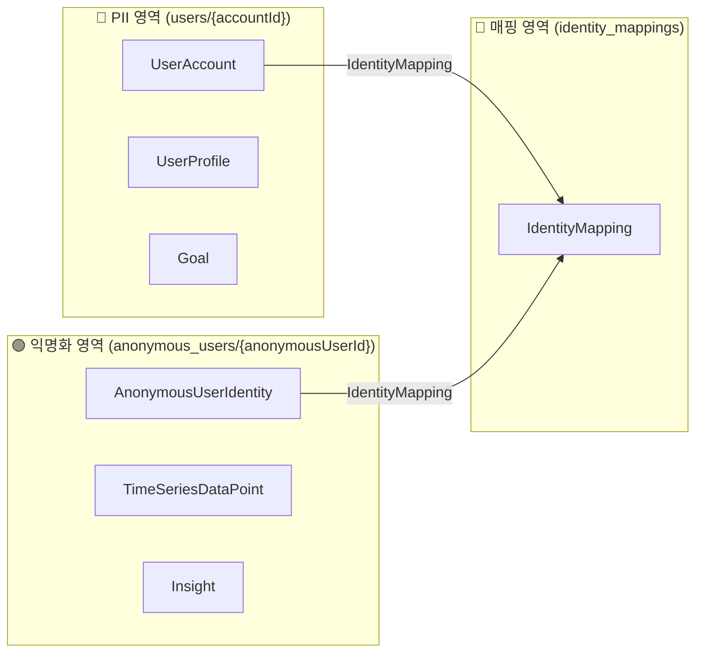
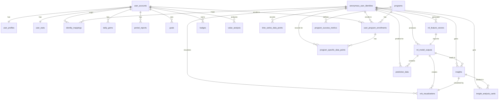
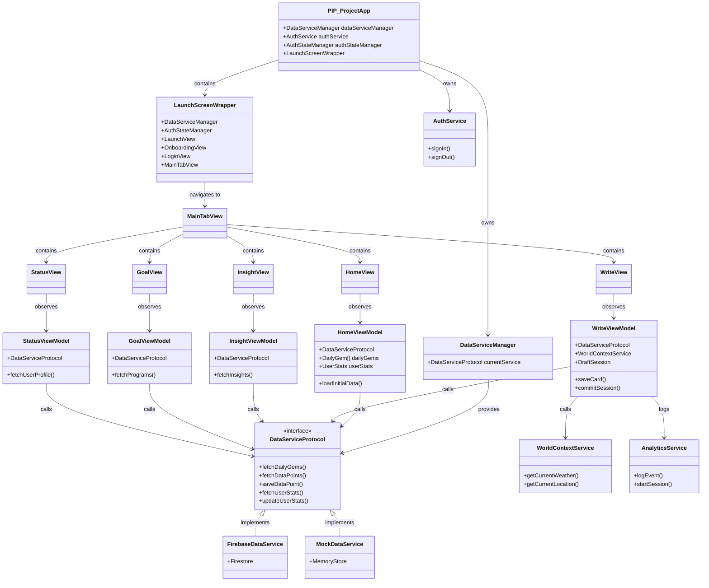

# 🏛️ 02. 정적 아키텍처 및 설계

이 문서는 NeoPIP 프로젝트의 핵심 아키텍처와 설계에 대한 정적인 문서들을 통합한 것입니다. (DB 모델, 온보딩, View/ViewModel 구현 계획 등)

---

## 목차

1.  [DB 모델 설계](#1-db-모델-설계) (`DB_MODEL_DESIGN.md`)
2.  [온보딩 플로우 설계](#2-온보딩-플로우-설계) (`ONBOARDING_FLOW_DESIGN.md`)
3.  [Views 및 ViewModels 구현 기획안](#3-views-및-viewmodels-구현-기획안) (`VIEWS_VIEWMODELS_IMPLEMENTATION_PLAN.md`)
4.  [소스코드 위상적 연결관계](#6-소스코드-위상적-연결관계) (Source Code Topology)
5.  [Analytics 아키텍처](#6-analytics-아키텍처) (`ANALYTICS_STRATEGY.md`)

---

## 1. DB 모델 설계

(Source: `01_Planning/DB_MODEL_DESIGN.md`)

# 🗄️ NeoPIP 프로젝트 DB 설계 (핵심 요약)

이 문서는 NeoPIP 프로젝트의 핵심 데이터 모델과 구조를 간결하게 설명합니다. 현재 DB 스키마는 **21개의 핵심 테이블**로 구성되어 있습니다.

상세한 필드 정보와 전체 스키마는 `01_Planning/DATABASE_SCHEMA_DBDIAGRAM.sql` 파일을 참조하세요.

## 1. 핵심 아키텍처: 개인정보 보호 설계

우리 앱은 사용자의 개인정보(PII)와 분석 데이터를 물리적으로 분리하여 프라이버시를 최우선으로 보호합니다.

- **🔴 PII 영역 (User-specific):** 사용자 계정에 직접 연결되는 데이터 (프로필, 목표 등)
- **🟢 익명 영역 (Anonymous):** 개인을 식별할 수 없는 순수 분석/머신러닝용 데이터 (시계열 데이터, 인사이트 등)



## 2. 데이터 모델 ERD (21 Tables)

아래 다이어그램은 현재의 핵심 데이터 모델(21개 테이블) 간의 관계를 보여줍니다.

> **[참고]** 더 상세하고 인터랙티브한 ERD는 [dbdiagram.io](https://dbdiagram.io)에서 `DATABASE_SCHEMA_DBDIAGRAM.sql` 파일을 열어 확인하세요.



## 3. 데이터 영역 및 캐시 전략

| 계층 (Layer)                | 🔴 PII 영역 (개인식별)                                                                 | 🟢 익명 영역 (익명)                                                                                                                                     | 🌐 공유 & 🔐 보안 영역                                              |
| :-------------------------- | :------------------------------------------------------------------------------------- | :------------------------------------------------------------------------------------------------------------------------------------------------------ | :------------------------------------------------------------------ |
| **🔐 Identity**             | `user_accounts` (캐시 안 함)                                                           | `anonymous_user_identities` (서버 전용)                                                                                                                 | `identity_mappings` (서버 전용)                                     |
| **👤 User Profile**         | `user_profiles` (적극적 캐시)                                                          |                                                                                                                                                         |                                                                     |
| **🔬 Time Series Data**     |                                                                                        | `time_series_data_points` (쓰기 후 동기화)<br>`ml_feature_vectors` (서버 전용)<br>`ml_model_outputs` (서버 전용)                                        |                                                                     |
| **📊 Aggregation**          | `daily_gems` (시간 기반 캐시)<br>`period_reports` (시간 기반 캐시)                     |                                                                                                                                                         |                                                                     |
| **💡 Insight & Viz**        |                                                                                        | `insights` (서버 우선 조회)<br>`orb_visualizations` (서버 우선 조회)<br>`insight_analysis_cards` (서버 우선 조회)<br>`prediction_data` (서버 우선 조회) |                                                                     |
| **🎯 Goal & Program**       | `goals` (상태 기반 캐시)<br>`user_program_enrollments` (상태 기반 캐시)                | `program_specific_data_points` (쓰기 후 동기화)                                                                                                         | `programs` (적극적 캐시)<br>`program_success_metrics` (적극적 캐시) |
| **🏆 Achievement & Status** | `user_stats` (적극적 캐시)<br>`badges` (적극적 캐시)<br>`value_analysis` (적극적 캐시) |                                                                                                                                                         |                                                                     |

## 4. 주요 모델 설명 (21개)

- **user_accounts**: 사용자 인증 및 계정 정보
- **anonymous_user_identities**: 개인 식별이 불가능한 익명 ID
- **identity_mappings**: `user_accounts`와 `anonymous_user_identities`를 연결하는 보안 매핑
- **user_profiles**: 이름, 사진 등 사용자 프로필 및 개인 설정
- **time_series_data_points**: 모든 측정 데이터(마음, 행동, 신체)가 기록되는 핵심 시계열 데이터
- **ml_feature_vectors**: 시계열 데이터로부터 추출된 머신러닝 특징 벡터
- **ml_model_outputs**: ML 모델 실행 결과 (재생성 성능, 예측 정확도 등)
- **daily_gems**: 하루의 데이터를 요약하여 보여주는 시각적 요소
- **period_reports**: 주간/월간 등 기간별 리포트
- **insights**: 시계열 데이터를 분석하여 도출된 통찰 또는 패턴
- **orb_visualizations**: 주간/월간 데이터 패턴을 시각화하는 요소
- **insight_analysis_cards**: 인사이트를 스토리 형식으로 보여주는 카드뉴스
- **prediction_data**: 특정 지표에 대한 미래 예측 데이터
- **goals**: 사용자가 설정한 개인 목표
- **programs**: 목표 달성을 돕는 추천 프로그램 (글로벌 카탈로그)
- **user_program_enrollments**: 사용자가 참여중인 프로그램의 진행 상태
- **program_specific_data_points**: 특정 프로그램 진행 중에만 수집되는 데이터
- **program_success_metrics**: 프로그램의 성공 여부를 판단하는 기준 지표
- **user_stats**: 총 기록 수, 연속 기록일 등 사용자의 전반적인 통계
- **badges**: 특정 조건을 달성했을 때 얻는 뱃지
- **value_analysis**: 사용자가 추구하는 가치를 월별로 분석한 데이터

## 5. 앞으로의 작업 (To-Do)

- [ ] Firestore 실제 컬렉션/도큐먼트 구조 설계 및 문서화
- [ ] 주요 엔티티별 최소 필드 정의 (UserAccount, TimeSeriesDataPoint 등)
- [ ] 데이터 수집/집계/인사이트 생성 플로우 간단 도식화
- [ ] Cloud Functions 자동화 설계 (예: 집계, 익명화, 삭제)
- [ ] 데이터 마이그레이션/초기화 전략 수립
- [ ] (선택) dbdiagram.io 등 외부 ERD 툴로 시각화

---

## 2. 온보딩 플로우 설계

(Source: `01_Planning/ONBOARDING_FLOW_DESIGN.md`)

# 🎯 온보딩 플로우 설계: 목표 기반 개인화 시작

이 문서는 NeoPIP 앱의 초기 온보딩 경험을 설계합니다. 사용자가 처음 앱을 켰을 때 목표를 설정하고, 데이터 수집의 목적을 이해하며, 기대할 수 있는 인사이트를 미리 경험할 수 있도록 합니다.

---

## 1. 온보딩 플로우의 핵심 가치

### 1.1. 왜 목표 기반 온보딩인가?

**문제점:**

- 사용자가 앱의 가치를 즉시 이해하지 못함
- 어떤 데이터를 왜 수집해야 하는지 불명확
- 초기 사용 후 이탈률이 높음

**해결책:**

- **목표 설정을 통한 개인화**: 사용자의 구체적인 목표를 설정하여 앱을 "나만의 도구"로 만들기
- **데이터 수집 목적 명확화**: 수집하는 데이터가 목표 달성에 어떻게 도움이 되는지 설명
- **인사이트 가치 미리보기**: 목표 달성 후 받을 수 있는 인사이트를 시뮬레이션으로 보여주기

### 1.2. 핵심 원칙

1. **차분한 명료함 (Calm Clarity)**: 압도적이지 않으면서도 명확한 정보 제공
2. **점진적 공개**: 한 번에 모든 것을 보여주지 않고, 단계별로 정보 제공
3. **즉각적 가치 제공**: 온보딩 중에도 사용자가 "아, 이게 나에게 도움이 되겠구나"를 느낄 수 있도록
4. **게이미피케이션**: 목표 설정과 데이터 수집을 즐거운 경험으로 만들기

---

## 2. 온보딩 플로우 구조

### 2.1. 전체 플로우 다이어그램

```
LaunchView
    ↓
[온보딩 체크] → 이미 완료? → MainTabView
    ↓ 아니오
WelcomeView (1단계)
    ↓
GoalSelectionView (2단계)
    ↓
DataCollectionIntroView (3단계)
    ↓
InsightPreviewView (4단계)
    ↓
OnboardingCompleteView (5단계)
    ↓
MainTabView (첫 Gem 생성 유도)
```

### 2.2. 단계별 상세 설계

#### **1단계: WelcomeView - 환영 및 가치 제안**

**목적**: PIP가 무엇인지, 왜 사용해야 하는지 간단히 소개

**내용:**

- PIP 로고 및 브랜딩
- 핵심 가치 제안: "나를 이해하는 가장 스마트한 방법"
- 간단한 설명: "당신의 감정, 행동, 신체 데이터를 분석하여 개인화된 인사이트를 제공합니다"
- "시작하기" 버튼

**UX 특징:**

- 최소한의 텍스트
- 시각적 메타포 (Gem/Orb) 미리보기
- 부드러운 애니메이션

**소요 시간**: 약 10-15초

---

#### **2단계: GoalSelectionView - 목표 설정 (틴더 스타일)**

**목적**: 사용자의 구체적인 목표를 설정하여 개인화된 경험 제공

**UI/UX (틴더 스타일)**:

- 틴더처럼 카드를 좌우로 스와이프하여 목표 선택
- 카드 스택 형식으로 목표 카테고리 표시:
  - 🧘 웰니스 & 마음의 평온
  - 💪 생산성 향상
  - 😊 감정 관리
  - 🏃 신체 건강
  - 👥 사회적 관계
  - 📚 학습 & 성장
  - ✨ 커스텀 목표 (직접 입력)
- **좌측 스와이프**: 관심 없음 (다음 카드로)
- **우측 스와이프**: 선택 (목표에 추가)
- **상단 스와이프**: 나중에 보기
- 선택한 목표는 하단에 표시 (최대 2개)
- 한 두개의 목표 선택 후 "다음" 버튼 활성화

**인터랙션:**

- 각 카테고리를 Gem 형태의 카드로 표시
- 스와이프 시 부드러운 애니메이션
- 선택 시 Gem이 밝아지는 피드백
- 최소 1개, 최대 2개 선택 권장

**데이터 저장:**

- 선택한 목표들을 `UserProfile.initialGoals`에 저장
- 이후 Goal 뷰에서 자동으로 생성

**UX 특징:**

- 틴더처럼 직관적인 스와이프 인터랙션
- 시각적으로 매력적인 Gem 카드
- 선택 피드백이 즉각적
- 부담 없는 선택 (나중에 변경 가능 안내)

**소요 시간**: 약 30-60초

---

#### **3단계: ProgramSelectionView - 프로그램 선택**

**목적**: 선택한 목표에 맞는 구체적인 프로그램 제시 및 선택

**UI/UX:**

- 선택한 목표에 맞는 프로그램 목록 표시
- 각 프로그램 카드 클릭 시 상세 정보:
  - **간단한 설명**: 프로그램이 무엇인지
  - **기대 효과**: 어떤 효과를 기대할 수 있는지
  - **필요한 데이터 목록**: 어떤 데이터를 수집해야 하는지
- 프로그램 선택 후 "시작하기" 버튼

**소요 시간**: 약 1-2분

---

#### **4단계: DataConsentView - 민감 정보 동의**

**목적**: 필요한 데이터에 대한 명시적 동의 수집

**내용:**

- 선택한 프로그램에 필요한 데이터 목록:
  - 날씨
  - 스크린타임
  - 위치
  - 심박수
  - 걸음수
  - 건강 데이터 (수면, 활동량 등)
- 각 데이터별:
  - 수집 목적 설명
  - 사용 방법 설명
  - 개인정보 보호 정책 링크
  - 개별 동의 토글

**인터랙션:**

- 필수 데이터와 선택 데이터 구분
- 필수 데이터는 동의 필수
- 선택 데이터는 선택적 동의
- "모두 동의" 옵션 제공 (선택 데이터 포함)

**데이터 저장:**

```swift
UserDataCollectionSettings(
    accountId: accountId,
    enabledDataTypes: ["mood", "stress", "weather", "location", "heartRate", "steps"],
    permissions: DataPermissions(
        screenTime: .granted,
        healthKit: .granted,
        location: .granted,
        // ...
    ),
    // ...
)
```

**UX 특징:**

- 명확한 정보 제공
- 사용자 선택권 존중
- 투명한 데이터 사용 정책

**소요 시간**: 약 1-2분

---

#### **4단계: InsightPreviewView - 인사이트 미리보기**

**목적**: 데이터 수집 후 받을 수 있는 인사이트를 시뮬레이션으로 보여주기

**내용:**

- 목표별 맞춤 인사이트 예시:
  - 예시 1: "이번 주 감정 패턴 분석"
    - 시각화: Orb 애니메이션
    - 텍스트: "당신의 감정 점수가 평균 0.72로, 이전 주 대비 5% 상승했습니다"
  - 예시 2: "목표 달성 예측"
    - 시각화: 진행률 차트
    - 텍스트: "현재 진행 속도라면 목표 달성까지 약 3주가 소요될 것으로 예상됩니다"

- 인사이트의 가치 강조:
  - "이런 인사이트를 통해 당신만의 최적의 패턴을 발견할 수 있습니다"
  - "데이터가 쌓일수록 더 정확하고 개인화된 인사이트를 받을 수 있습니다"

**UX 특징:**

- 실제 인사이트 뷰와 유사한 디자인
- 애니메이션으로 생동감 제공
- "이제 시작하기" 버튼으로 다음 단계 유도

**소요 시간**: 약 30-45초

---

#### **5단계: OnboardingCompleteView - 완료 및 첫 기록 유도**

**목적**: 온보딩 완료를 축하하고, 첫 저널 기록을 유도

**내용:**

- 축하 메시지: "준비가 완료되었습니다!"
- 첫 Gem 생성 유도:
  - "지금 바로 첫 번째 저널을 작성하고 당신만의 Gem을 만들어보세요"
  - "매일의 기록이 모여 당신을 이해하는 데이터가 됩니다"
- 빠른 시작 가이드:
  - "하단 탭바의 Write 탭에서 카드를 스와이프하여 감정을 기록하세요"
  - "기록이 완료되면 오늘의 Gem이 생성됩니다"

**인터랙션:**

- "첫 기록 시작하기" 버튼 → MainTabView로 이동 (Write 탭 자동 활성화)
- "나중에 하기" 버튼 → MainTabView로 이동 (Home 탭 표시)

**UX 특징:**

- 성취감을 주는 디자인
- 명확한 다음 액션 제시
- 부담 없는 선택권 제공

**소요 시간**: 약 15-20초

---

## 3. 데이터 모델

### 3.1. OnboardingState

```swift
struct OnboardingState: Codable {
    var isCompleted: Bool
    var completedSteps: [OnboardingStep]
    var selectedGoals: [GoalCategory]
    var completedAt: Date?
    var skippedSteps: [OnboardingStep]
}

enum OnboardingStep: String, Codable {
    case welcome
    case goalSelection
    case dataCollectionIntro
    case insightPreview
    case onboardingComplete
}
```

### 3.2. UserProfile 확장

```swift
// 기존 UserProfile에 추가
struct UserProfile: Codable {
    // ... 기존 필드들

    // 온보딩 관련
    var onboardingState: OnboardingState
    var initialGoals: [GoalCategory]  // 온보딩에서 선택한 초기 목표
    var firstJournalDate: Date?        // 첫 저널 작성 날짜
}
```

### 3.3. OnboardingGoal (임시 목표)

```swift
struct OnboardingGoal: Identifiable, Codable {
    let id: UUID
    var category: GoalCategory
    var title: String
    var description: String
    var iconName: String
    var isSelected: Bool
}
```

---

## 4. 구현 전략

### 4.1. 앱 진입점 수정

**현재 구조:**

```
LaunchView → MainTabView
```

**수정 후 구조:**

```
LaunchView → OnboardingCheck → OnboardingFlow 또는 MainTabView
```

### 4.2. OnboardingCheck 로직

```swift
struct OnboardingCheckView: View {
    @StateObject private var viewModel = OnboardingViewModel()

    var body: some View {
        Group {
            if viewModel.shouldShowOnboarding {
                OnboardingFlowView()
            } else {
                MainTabView()
            }
        }
        .onAppear {
            viewModel.checkOnboardingStatus()
        }
    }
}
```

### 4.3. OnboardingFlowView

```swift
struct OnboardingFlowView: View {
    @State private var currentStep: OnboardingStep = .welcome
    @State private var selectedGoals: [GoalCategory] = []

    var body: some View {
        ZStack {
            PrimaryBackground()
                .ignoresSafeArea()

            switch currentStep {
            case .welcome:
                WelcomeView(onNext: { currentStep = .goalSelection })
            case .goalSelection:
                GoalSelectionView(
                    selectedGoals: $selectedGoals,
                    onNext: { currentStep = .dataCollectionIntro }
                )
            case .dataCollectionIntro:
                DataCollectionIntroView(
                    selectedGoals: selectedGoals,
                    onNext: { currentStep = .insightPreview }
                )
            case .insightPreview:
                InsightPreviewView(
                    selectedGoals: selectedGoals,
                    onNext: { currentStep = .onboardingComplete }
                )
            case .onboardingComplete:
                OnboardingCompleteView(
                    onStart: {
                        // 온보딩 완료 처리
                        // MainTabView로 이동 + 첫 저널 유도
                    }
                )
            }
        }
    }
}
```

---

## 5. UX 고려사항

### 5.1. 진행률 표시

- 상단에 진행 바 또는 단계 인디케이터 표시
- 예: "1 / 5" 또는 점으로 표시

### 5.2. 뒤로가기 처리

- 각 단계에서 뒤로가기 가능
- 단, WelcomeView에서는 뒤로가기 없음 (앱 종료 또는 건너뛰기)

### 5.3. 건너뛰기 옵션

- DataCollectionIntroView와 InsightPreviewView에서 "건너뛰기" 제공
- 건너뛴 단계는 나중에 다시 볼 수 있도록 설정에 옵션 제공

### 5.4. 애니메이션

- 단계 전환 시 부드러운 페이드/슬라이드 애니메이션
- Gem/Orb 시각화 시 미묘한 애니메이션으로 생동감 제공

### 5.5. 접근성

- VoiceOver 지원
- 다이나믹 타입 지원
- 색상 대비 준수

---

## 6. 온보딩 완료 후 첫 경험

### 6.1. MainTabView 첫 진입 시

- **Write 탭 자동 활성화** (선택한 경우): 온보딩에서 "첫 기록 시작하기" 선택 시 바로 Write 탭으로 이동
- **Write 탭 강조**: 처음 사용자를 위해 Write 탭 버튼에 시각적 강조 (예: 맥박 애니메이션)
- **튜토리얼 툴팁**: Write 탭에서 "카드를 스와이프하여 감정을 기록하세요" 가이드 제공

### 6.2. 첫 저널 작성 후

- **축하 애니메이션**: 첫 저널 작성 완료 시 특별한 애니메이션
- **자동 이동**: Home 탭으로 자동 이동하여 생성된 첫 Gem 표시
- **뱃지 부여**: "첫 Gem" 뱃지 자동 부여
- **인사이트 안내**: "데이터가 쌓이면 더 많은 인사이트를 받을 수 있습니다"

### 6.3. 5개 탭의 역할

- **Home**: 일일 기록된 Gem 확인 (Railroad 뷰)
- **Insight**: 데이터 분석 및 인사이트 조회
- **Write**: 카드 스와이프를 통한 일일 감정/신체/행동 기록 (新)
- **Goal**: 목표 설정 및 진행도 추적
- **Status**: 전체 현황 및 설정

---

## 7. 온보딩 재진입

### 7.1. 설정에서 다시 보기

- Status 탭 → Settings → "온보딩 다시 보기" 옵션
- 선택한 단계부터 다시 시작 가능

### 7.2. 목표 변경

- GoalView에서 온보딩에서 설정한 초기 목표 수정 가능
- 목표 추가/삭제 시 관련 인사이트도 업데이트

---

## 8. 측정 지표 (Analytics)

온보딩의 효과를 측정하기 위한 지표:

- **온보딩 완료율**: 시작한 사용자 중 완료한 비율
- **목표 선택 분포**: 어떤 목표가 가장 많이 선택되는지
- **첫 저널 작성율**: 온보딩 완료 후 첫 저널을 작성한 비율
- **온보딩 완료 후 7일 리텐션**: 온보딩 완료 후 7일 후에도 사용하는 비율
- **건너뛴 단계**: 어떤 단계가 가장 많이 건너뛰어지는지

---

## 9. 향후 개선 사항

### 9.1. 개인화 강화

- 사용자의 응답에 따라 온보딩 플로우 동적 조정
- 더 많은 목표 카테고리 추가
- 목표별 맞춤 인사이트 예시 확대

### 9.2. 게이미피케이션 강화

- 온보딩 중에도 작은 성취감 제공
- 진행률에 따른 시각적 보상

### 9.3. 소셜 요소

- 친구 초대 기능 (온보딩 완료 후)
- 목표 공유 기능

---

## 10. 구현 우선순위

### Phase 1 (MVP) - ✅ 완료 (2026.01.09)

- [x] OnboardingState 모델 생성
- [x] WriteViewModel 핵심 로직 구현 (카드 입력, 저장)
- [x] HomeViewModel 구현 (DailyGems, UserStats 조회)
- [x] TimeSlotBarChart MVP 구현

### Phase 2 - 🔄 진행 중 (예상 완료: 2026.01.15)

- [ ] HomeView "Today" 버그 수정
- [ ] WriteView UX 개선 및 완성
- [ ] OnboardingFlow UI 구현 (WelcomeView → GoalSelectionView)
- [ ] InsightView 기본 구현

### Phase 3 - 예정 (2026.01.20 이후)

- [ ] 애니메이션 및 시각화 개선
- [ ] 접근성 개선
- [ ] Analytics 연동
- [ ] 온보딩 재진입 기능

**마지막 업데이트**: 2026.01.09  
**버전**: 1.1  
**상태**: 진행 중 (Phase 2)

---

---

## 3. Views 및 ViewModels 구현 기획안

(Source: `01_Planning/VIEWS_VIEWMODELS_IMPLEMENTATION_PLAN.md`)

# 📱 Views 및 ViewModels 구현 기획안

**작성일**: 2025.12  
**버전**: 1.0  
**상태**: 기획 완료

---

## 📋 목차

1. [전체 구조](#1-전체-구조)
2. [HomeView 및 ViewModel](#2-homeview-및-viewmodel)
3. [InsightView 및 ViewModel](#3-insightview-및-viewmodel)
4. [GoalView 및 ViewModel](#4-goalview-및-viewmodel)
5. [StatusView 및 ViewModel](#5-statusview-및-viewmodel)
6. [온보딩 Views](#6-온보딩-views)
7. [공통 컴포넌트](#7-공통-컴포넌트)
8. [구현 우선순위](#8-구현-우선순위)

---

## 1. 전체 구조

### 1.1. 디렉토리 구조

```
PIP_Project/
├── Views/
│   ├── Home/
│   │   ├── HomeView.swift
│   │   ├── WriteSheet.swift (카드 기반 입력)
│   │   ├── RailroadView.swift (타임라인)
│   │   └── GemCardView.swift (Gem 시각화)
│   ├── Insight/
│   │   ├── InsightView.swift
│   │   ├── OrbView.swift (Orb 시각화)
│   │   ├── DashboardView.swift (예측 대시보드)
│   │   └── AnalysisCardView.swift (카드뉴스)
│   ├── Goal/
│   │   ├── GoalView.swift
│   │   ├── ProgramListView.swift
│   │   ├── ProgressView.swift (BarLineChart, RadarChart)
│   │   └── ProgramDetailView.swift (인스타 스토리 형식)
│   ├── Status/
│   │   ├── StatusView.swift
│   │   ├── ProfileView.swift
│   │   ├── AchievementView.swift
│   │   └── ValueAnalysisView.swift
│   └── Onboarding/
│       ├── GoalSelectionView.swift (틴더 스타일)
│       ├── ProgramSelectionView.swift
│       └── DataConsentView.swift
├── ViewModels/
│   ├── HomeViewModel.swift
│   ├── InsightViewModel.swift
│   ├── GoalViewModel.swift
│   ├── StatusViewModel.swift
│   └── OnboardingViewModel.swift
└── Components/
    ├── Gem/
    │   ├── GemView.swift (오픈소스 gem 애셋)
    │   └── Gem3DView.swift
    ├── Charts/
    │   ├── BarLineChartView.swift
    │   ├── RadarChartView.swift
    │   └── LineChartView.swift
    └── Cards/
        ├── SwipeableCardView.swift (틴더 스타일)
        └── AnalysisCardPageView.swift
```

### 1.2. MVVM 아키텍처

```
View (SwiftUI)
  ↓ @StateObject, @ObservedObject
ViewModel (ObservableObject)
  ↓ Service Layer
Service (Repository Pattern)
  ↓ Firebase / MockData
Models
```

---

## 2. HomeView, WriteView 및 ViewModels

### 2.1. HomeView & WriteView 연동 (✅ 2026.01.09 완성)

**구조:**

- **HomeView**: 홈 화면 (RailRoad + DailyGems 표시)
- **WriteView**: 카드 기반 데이터 입력 (Sheet로 표시)
- **WriteViewModel**: 카드 생성, 저장, UserStats 업데이트

**주요 기능:**

```swift
// HomeView: 기록 버튼 클릭 → WriteView 표시
Button { showWriteSheet = true } { Image(systemName: "plus.circle.fill") }
    .sheet(isPresented: $showWriteSheet) { WriteView(viewModel: writeViewModel) }

// WriteView: 카드 스와이프 입력 후 저장
SwipeableCardView(
    card: card,
    onCheck: {
        await viewModel.saveCard(card, inputs: inputs, textInput: notes)
        // ↓ 자동으로 updateUserStats() 호출
        // ↓ HomeView 새로고침 (NotificationCenter)
    }
)
```

### 2.2. WriteViewModel (✅ 2026.01.09 완성)

**완성 사항:**

- ✅ generateCards(): 카테고리별 카드 생성 (TimeSlotChart 포함)
- ✅ saveCard(): TimeSeriesDataPoint + DailyGem 저장
- ✅ updateUserStats(): totalDataPoints, totalGemsCreated, totalDaysActive 자동 증가
- ✅ calculateAndUpdateStreak(): currentStreak/longestStreak 정확 계산
- ✅ TimeSlotBarChart MVP: 6구간 바 차트, 드래그 입력

**Streak 계산 로직:**

```
1. saveCard() 호출 시 isNewGem 플래그 생성 (새로운 날짜인지 판별)
2. updateUserStats()에서 isNewGem 기반으로 카운트 증가
3. calculateAndUpdateStreak(): 로컬 데이터의 unique 날짜에서 streak 계산
   - 어제부터 시작하여 과거로 거슬러감
   - 데이터 있는 날 카운트 → currentStreak
   - longestStreak보다 크면 업데이트
```

**데이터 흐름:**

```
WriteView.saveCard()
    ↓
WriteViewModel.saveCard()
    ├─ TimeSeriesDataPoint 생성 & 저장
    ├─ DailyGem 생성/업데이트 & 저장
    └─ updateUserStats() 호출 ← 자동!
        ├─ totalDataPoints += 1
        ├─ isNewGem? totalGemsCreated & totalDaysActive += 1
        ├─ calculateAndUpdateStreak()
        └─ Firebase 업데이트

    ↓ NotificationCenter 발송
HomeView 자동 새로고침
```

### 2.3. HomeView 구조

```swift
struct HomeView: View {
    @StateObject private var viewModel = HomeViewModel()
    @State private var showWriteSheet = false

    var body: some View {
        ZStack {
            // 배경
            Color.black.ignoresSafeArea()

            ScrollView {
                VStack(spacing: 20) {
                    // 상단: 통계
                    StatsHeaderView(
                        totalRecords: viewModel.totalDataPoints,
                        currentStreak: viewModel.currentStreak
                    )

                    // RailRoad: 타임라인
                    RailroadView(
                        gems: viewModel.dailyGems,
                        onGemTap: { gem in
                            // Gem 상세 보기
                        }
                    )
                }
            }

            // 우측 하단: 기록 버튼
            VStack {
                Spacer()
                HStack {
                    Spacer()
                    Button(action: {
                        showWriteSheet = true
                    }) {
                        Image(systemName: "plus.circle.fill")
                            .font(.system(size: 60))
                            .foregroundColor(.teal)
                    }
                    .padding()
                }
            }
        }
        .sheet(isPresented: $showWriteSheet) {
            WriteSheet(viewModel: viewModel)
        }
    }
}
```

### 2.2. WriteSheet (카드 기반 입력)

```swift
struct WriteSheet: View {
    @ObservedObject var viewModel: HomeViewModel
    @Environment(\.dismiss) var dismiss

    @State private var currentCardIndex = 0
    @State private var cardData: [CardData] = []

    var body: some View {
        ZStack {
            Color.black.ignoresSafeArea()

            // 카드 스택
            ZStack {
                ForEach(Array(cardData.enumerated()), id: \.offset) { index, card in
                    if index >= currentCardIndex && index < currentCardIndex + 3 {
                        SwipeableCardView(
                            card: card,
                            index: index - currentCardIndex,
                            onSwipeLeft: {
                                // 다음 카드로
                                withAnimation {
                                    currentCardIndex += 1
                                }
                            },
                            onSwipeRight: {
                                // 이전 카드로
                                withAnimation {
                                    currentCardIndex = max(0, currentCardIndex - 1)
                                }
                            },
                            onCheck: {
                                // 저장하고 다음 카드로
                                viewModel.saveCardData(card)
                                withAnimation {
                                    currentCardIndex += 1
                                }
                            }
                        )
                        .offset(x: CGFloat(index - currentCardIndex) * 20)
                        .scaleEffect(1.0 - CGFloat(abs(index - currentCardIndex)) * 0.05)
                    }
                }
            }

            // 되돌리기 버튼
            if currentCardIndex > 0 {
                VStack {
                    HStack {
                        Button("되돌리기") {
                            withAnimation {
                                currentCardIndex -= 1
                            }
                        }
                        .padding()
                        Spacer()
                    }
                    Spacer()
                }
            }
        }
        .onAppear {
            cardData = viewModel.generateCards()
        }
    }
}
```

### 2.3. HomeViewModel (✅ 2025.12.23 완성)

### 2.4. HomeViewModel (✅ 2026.01.09 완성)

**완성 사항:**

- ✅ DailyGems 조회 및 last7Days 계산
- ✅ UserStats 조회 (totalGemsCreated, currentStreak 등)
- ✅ Streak 계산 로직 (DailyGems 기반)
- ✅ 자정 자동 새로고침 기능 (setupDailyRefresh)
- ✅ NotificationCenter를 통한 실시간 갱신 (didSaveCardData)
- ✅ Combine 기반 반응형 데이터 바인딩

**주요 기능:**

```swift
@MainActor
class HomeViewModel: ObservableObject {
    @Published var dailyGems: [DailyGem] = []
    @Published var userStats: UserStats?
    @Published var last7Days: [GemRecord] = []
    @Published var userName: String?

    // Computed properties (DailyGems 기반)
    var totalGemsCreated: Int { Set(dailyGems.map { startOfDay($0.date) }).count }
    var currentStreak: Int { /* 어제부터 연속 기록 일수 */ }

    func loadInitialData() async { /* Firebase/MockData 조회 */ }
    func setupDailyRefresh() { /* 자정마다 새로고침 */ }
}
```

**Streak 계산 알고리즘:**

- DailyGems 배열에서 unique한 날짜 추출
- 어제(yesterday)부터 시작하여 과거로 거슬러감
- 데이터가 있는 날을 연속으로 카운트
- 데이터가 없는 날을 만나면 중단 → currentStreak 결정

**다음 과제:**

- ⚠️ HomeView "Today" 버그 수정 필요 (Gem이 없어도 표시됨)
  dataService.fetchDailyGems(from: startDate, to: endDate)
  .receive(on: DispatchQueue.main)
  .sink(
  receiveCompletion: { [weak self] completion in
  self?.isLoading = false
  if case .failure(let error) = completion {
  self?.errorMessage = error.localizedDescription
  }
  },
  receiveValue: { [weak self] gems in
  self?.dailyGems = gems
  self?.updateLast7Days()
  }
  )
  .store(in: &cancellables)
  // UserStats 로드 (currentStreak 포함)
  dataService.fetchUserStats()
  .receive(on: DispatchQueue.main)
  .sink(
  receiveCompletion: { [weak self] completion in
  if case .failure(let error) = completion {
  self?.errorMessage = error.localizedDescription
  }
  },
  receiveValue: { [weak self] stats in
  self?.userStats = stats
  }
  )
  .store(in: &cancellables)
  }

      private func updateLast7Days() {
          let calendar = Calendar.current
          let today = calendar.startOfDay(for: Date())

          var last7: [GemRecord] = []
          for dayOffset in 0..<7 {
              guard let date = calendar.date(byAdding: .day, value: -dayOffset, to: today) else { continue }

              if let gem = dailyGems.first(where: { calendar.isDate($0.date, inSameDayAs: date) }) {
                  last7.append(GemRecord(from: gem))
              } else {
                  last7.append(GemRecord(date: date, isIncomplete: true))
              }
          }

          self.last7Days = last7
      }

      func generateCards() -> [CardData] {
          // 목표에 따라 카드 생성
          // 마음, 행동, 신체 카드 + 프로그램 카드
          var cards: [CardData] = []

          // 마음 카드
          cards.append(CardData(
              type: .mind,
              title: "오늘 기분은 어땠나요?",
              inputs: [
                  .slider(key: "mood", label: "기분", range: 0...100),
                  .slider(key: "stress", label: "스트레스", range: 0...100),
                  .slider(key: "energy", label: "에너지", range: 0...100),
                  .slider(key: "focus", label: "집중도", range: 0...100)
              ],
              textInput: .optional(key: "notes", placeholder: "오늘의 한 줄")
          ))

          // 행동 카드
          cards.append(CardData(
              type: .behavior,
              title: "오늘의 행동은?",
              inputs: [
                  .slider(key: "productivity", label: "생산성", range: 0...100),
                  .slider(key: "socialActivity", label: "사회적 활동", range: 0...100)
              ],
              textInput: .optional(key: "notes", placeholder: "메모")
          ))

          // 신체 카드
          cards.append(CardData(
              type: .physical,
              title: "오늘의 신체 상태는?",
              inputs: [
                  .slider(key: "sleepScore", label: "수면 점수", range: 0...100),
                  .slider(key: "fatigue", label: "피로도", range: 0...100)
              ],
              textInput: .optional(key: "notes", placeholder: "메모")
          ))

          return cards
      }

      func saveCardData(_ card: CardData) async {
          // TimeSeriesDataPoint 생성
          let dataPoint = TimeSeriesDataPoint(
              // ... cardData 기반으로 생성
          )

          await dataService.saveDataPoint(dataPoint)

          // DailyGem 업데이트
          await updateDailyGem(for: Date())
      }

      private func updateDailyGem(for date: Date) async {
          // 해당 날짜의 DailyGem 생성/업데이트
      }

  }

````

---

## 3. InsightView 및 ViewModel

### 3.1. InsightView 구조

```swift
struct InsightView: View {
    @StateObject private var viewModel = InsightViewModel()

    var body: some View {
        ScrollView {
            VStack(spacing: 30) {
                // Orb (최상단)
                OrbView(orb: viewModel.currentOrb)
                    .frame(height: 300)

                // Dashboard (예측 대시보드)
                DashboardView(
                    predictions: viewModel.predictions,
                    onCategoryChange: { category in
                        viewModel.selectedCategory = category
                    }
                )

                // Analysis (카드뉴스)
                ForEach(viewModel.analysisCards) { card in
                    AnalysisCardView(card: card)
                }
            }
        }
        .background(Color.black)
        .onAppear {
            Task {
                await viewModel.loadData()
            }
        }
    }
}
````

### 3.2. OrbView

```swift
struct OrbView: View {
    let orb: OrbVisualization?

    var body: some View {
        ZStack {
            // Orb 내부 (고유 Feature 기반 색상)
            Circle()
                .fill(
                    LinearGradient(
                        colors: orb?.colorGradient.map { Color(hex: $0) } ?? [.teal, .blue],
                        startPoint: .topLeading,
                        endPoint: .bottomTrailing
                    )
                )
                .opacity(orb?.brightness ?? 0.5)  // brightness = 재생성 성능
                .frame(width: 200, height: 200)

            // Orb 테두리 (예측 정확도)
            Circle()
                .stroke(
                    Color.white,
                    lineWidth: 4
                )
                .opacity(orb?.borderBrightness ?? 0.5)  // borderBrightness = 예측 정확도
                .frame(width: 200, height: 200)
        }
    }
}
```

### 3.3. DashboardView

```swift
struct DashboardView: View {
    let predictions: [PredictionData]
    let onCategoryChange: (DataCategory) -> Void

    @State private var selectedCategory: DataCategory = .mind

    var body: some View {
        VStack(alignment: .leading, spacing: 20) {
            // 카테고리 선택 (슬라이딩)
            CategoryPicker(
                selectedCategory: $selectedCategory,
                onCategoryChange: onCategoryChange
            )

            // 예측 값 및 신뢰도
            ForEach(filteredPredictions) { prediction in
                PredictionCard(
                    prediction: prediction,
                    category: selectedCategory
                )
            }
        }
        .padding()
    }

    private var filteredPredictions: [PredictionData] {
        predictions.filter { /* 카테고리별 필터링 */ }
    }
}
```

### 3.4. AnalysisCardView (인스타 스토리 형식)

```swift
struct AnalysisCardView: View {
    let card: InsightAnalysisCard
    @State private var currentPage = 0

    var body: some View {
        TabView(selection: $currentPage) {
            ForEach(Array(card.pages.enumerated()), id: \.offset) { index, page in
                AnalysisCardPageView(page: page)
                    .tag(index)
            }
        }
        .tabViewStyle(.page)
        .frame(height: 500)

        // 하단: 하트 버튼, 수락 버튼
        HStack {
            Button(action: {
                // 좋아요
            }) {
                Image(systemName: card.isLiked ? "heart.fill" : "heart")
                    .foregroundColor(card.isLiked ? .red : .white)
            }

            Spacer()

            ForEach(card.actionProposals) { proposal in
                Button(action: {
                    // 행동 수락 (캘린더, 알람 등)
                }) {
                    Text("수락")
                }
            }
        }
        .padding()
    }
}
```

### 3.5. InsightViewModel

```swift
@MainActor
class InsightViewModel: ObservableObject {
    @Published var currentOrb: OrbVisualization?
    @Published var predictions: [PredictionData] = []
    @Published var analysisCards: [InsightAnalysisCard] = []
    @Published var selectedCategory: DataCategory = .mind
    @Published var isLoading = false

    private let insightService: InsightServiceProtocol

    init(insightService: InsightServiceProtocol = InsightService.shared) {
        self.insightService = insightService
    }

    func loadData() async {
        isLoading = true
        defer { isLoading = false }

        // Orb 로드
        currentOrb = await insightService.fetchCurrentOrb()

        // 예측 데이터 로드
        predictions = await insightService.fetchPredictions()

        // 분석 카드 로드
        analysisCards = await insightService.fetchAnalysisCards()
    }

    func likeCard(_ cardId: UUID) async {
        await insightService.likeAnalysisCard(cardId)
        // UI 업데이트
    }

    func acceptAction(_ actionId: UUID) async {
        await insightService.acceptActionProposal(actionId)
        // 캘린더, 알람 등 실행
    }
}
```

---

## 4. GoalView 및 ViewModel

### 4.1. GoalView 구조

```swift
struct GoalView: View {
    @StateObject private var viewModel = GoalViewModel()

    var body: some View {
        ScrollView {
            VStack(spacing: 30) {
                // Program List (3D 일러스트)
                if let currentProgram = viewModel.currentProgram {
                    Program3DView(program: currentProgram)
                        .frame(height: 200)
                }

                // Progress (BarLineChart, RadarChart)
                ProgressView(
                    progress: viewModel.progress,
                    baselineProgress: viewModel.baselineProgress
                )

                // Programs (카드뉴스)
                ForEach(viewModel.availablePrograms) { program in
                    ProgramCardView(program: program)
                        .onTapGesture {
                            viewModel.selectedProgram = program
                        }
                }
            }
        }
        .background(Color.black)
        .sheet(item: $viewModel.selectedProgram) { program in
            ProgramDetailView(program: program)
        }
        .onAppear {
            Task {
                await viewModel.loadData()
            }
        }
    }
}
```

### 4.2. ProgramDetailView (인스타 스토리 형식)

```swift
struct ProgramDetailView: View {
    let program: Program
    @Environment(\.dismiss) var dismiss
    @State private var currentPage = 0

    var body: some View {
        TabView(selection: $currentPage) {
            // 페이지 1: 프로그램 설명
            ProgramDescriptionPage(program: program)
                .tag(0)

            // 페이지 2: 인기도
            ProgramPopularityPage(program: program)
                .tag(1)

            // 페이지 3: 사용자 평가
            ProgramReviewsPage(program: program)
                .tag(2)
        }
        .tabViewStyle(.page)
    }
}
```

### 4.3. GoalViewModel

```swift
@MainActor
class GoalViewModel: ObservableObject {
    @Published var currentProgram: Program?
    @Published var progress: GoalProgress?
    @Published var baselineProgress: GoalProgress?
    @Published var availablePrograms: [Program] = []
    @Published var selectedProgram: Program?
    @Published var isLoading = false

    private let goalService: GoalServiceProtocol

    init(goalService: GoalServiceProtocol = GoalService.shared) {
        self.goalService = goalService
    }

    func loadData() async {
        isLoading = true
        defer { isLoading = false }

        // 현재 진행 중 프로그램
        currentProgram = await goalService.fetchCurrentProgram()

        // 진행 상황
        progress = await goalService.fetchProgress()
        baselineProgress = await goalService.fetchBaselineProgress()

        // 사용 가능한 프로그램 목록
        availablePrograms = await goalService.fetchAvailablePrograms()
    }
}
```

---

## 5. StatusView 및 ViewModel

### 5.1. StatusView 구조

```swift
struct StatusView: View {
    @StateObject private var viewModel = StatusViewModel()
    @State private var showSettings = false

    var body: some View {
        ScrollView {
            VStack(spacing: 30) {
                // Profile (상단)
                ProfileView(
                    profile: viewModel.userProfile,
                    stats: viewModel.userStats,
                    onSettingsTap: {
                        showSettings = true
                    }
                )

                // Achievement (중간)
                AchievementView(achievements: viewModel.achievements)

                // Value (하단)
                ValueAnalysisView(analysis: viewModel.valueAnalysis)
            }
        }
        .background(Color.black)
        .sheet(isPresented: $showSettings) {
            SettingsView()
        }
        .onAppear {
            Task {
                await viewModel.loadData()
            }
        }
    }
}
```

### 5.2. StatusViewModel

```swift
@MainActor
class StatusViewModel: ObservableObject {
    @Published var userProfile: UserProfile?
    @Published var userStats: UserStats?
    @Published var achievements: [Achievement] = []
    @Published var valueAnalysis: ValueAnalysis?
    @Published var isLoading = false

    private let statusService: StatusServiceProtocol

    init(statusService: StatusServiceProtocol = StatusService.shared) {
        self.statusService = statusService
    }

    func loadData() async {
        isLoading = true
        defer { isLoading = false }

        userProfile = await statusService.fetchUserProfile()
        userStats = await statusService.fetchUserStats()
        achievements = await statusService.fetchAchievements()
        valueAnalysis = await statusService.fetchValueAnalysis()
    }
}
```

---

## 6. 온보딩 Views

### 6.1. GoalSelectionView (틴더 스타일)

```swift
struct GoalSelectionView: View {
    @ObservedObject var viewModel: OnboardingViewModel
    @State private var cardStack: [GoalCard] = []
    @State private var selectedGoals: [GoalCategory] = []

    var body: some View {
        ZStack {
            Color.black.ignoresSafeArea()

            // 카드 스택
            ZStack {
                ForEach(Array(cardStack.enumerated()), id: \.offset) { index, card in
                    if index < 3 {
                        SwipeableCardView(
                            card: card,
                            index: index,
                            onSwipeLeft: {
                                // 다음 카드로
                                withAnimation {
                                    cardStack.removeFirst()
                                }
                            },
                            onSwipeRight: {
                                // 선택
                                selectedGoals.append(card.category)
                                withAnimation {
                                    cardStack.removeFirst()
                                }
                            }
                        )
                    }
                }
            }

            // 선택된 목표 표시
            VStack {
                Spacer()
                HStack {
                    ForEach(selectedGoals, id: \.self) { goal in
                        Text(goal.rawValue)
                            .padding()
                            .background(Color.teal)
                    }
                }
            }
        }
    }
}
```

---

## 7. 공통 컴포넌트

### 7.1. GemView (오픈소스 gem 애셋)

```swift
struct GemView: View {
    let gem: DailyGem

    var body: some View {
        // 오픈소스 gem 애셋 사용
        // gemType에 따라 다른 형태 표시
        switch gem.gemType {
        case .sphere:
            SphereGemView(brightness: gem.brightness, colorTheme: gem.colorTheme)
        case .crystal:
            CrystalGemView(brightness: gem.brightness, colorTheme: gem.colorTheme)
        case .diamond:
            DiamondGemView(brightness: gem.brightness, colorTheme: gem.colorTheme)
        // ...
        }
    }
}
```

### 7.2. SwipeableCardView (틴더 스타일)

```swift
struct SwipeableCardView: View {
    let card: CardData
    let index: Int
    let onSwipeLeft: () -> Void
    let onSwipeRight: () -> Void
    let onCheck: () -> Void

    @State private var dragOffset = CGSize.zero

    var body: some View {
        CardContentView(card: card)
            .offset(dragOffset)
            .rotationEffect(.degrees(Double(dragOffset.width / 20)))
            .gesture(
                DragGesture()
                    .onChanged { value in
                        dragOffset = value.translation
                    }
                    .onEnded { value in
                        if abs(value.translation.width) > 100 {
                            if value.translation.width > 0 {
                                onSwipeRight()
                            } else {
                                onSwipeLeft()
                            }
                        } else {
                            withAnimation {
                                dragOffset = .zero
                            }
                        }
                    }
            )
    }
}
```

---

## 8. 구현 우선순위

### Phase 1: 기본 구조 (1주)

- [ ] 프로젝트 구조 설정
- [ ] 기본 ViewModels 생성
- [ ] MockData 서비스 구현
- [ ] 공통 컴포넌트 (GemView, Charts)

### Phase 2: HomeView (2주)

- [ ] HomeView 기본 레이아웃
- [ ] RailroadView 구현
- [ ] WriteSheet (카드 기반 입력)
- [ ] SwipeableCardView 구현
- [ ] 데이터 저장 로직

### Phase 3: InsightView (2주)

- [ ] OrbView 구현
- [ ] DashboardView 구현
- [ ] AnalysisCardView (인스타 스토리 형식)
- [ ] 예측 데이터 표시

### Phase 4: GoalView (1주)

- [ ] ProgramListView
- [ ] ProgressView (Charts)
- [ ] ProgramDetailView

### Phase 5: StatusView (1주)

- [ ] ProfileView
- [ ] AchievementView
- [ ] ValueAnalysisView

### Phase 6: 온보딩 (1주)

- [ ] GoalSelectionView (틴더 스타일)
- [ ] ProgramSelectionView
- [ ] DataConsentView

### Phase 7: 통합 및 최적화 (1주)

- [ ] Firebase 연동
- [ ] 성능 최적화
- [ ] 애니메이션 개선
- [ ] 테스트

---

**작성일**: 2025.12

---

## 6. 소스코드 위상적 연결관계 (Source Code Topology)

이 섹션은 NeoPIP 프로젝트의 소스코드 간 **구조적 연결 관계(Topology)**를 시각화합니다.
MVVM(Model-View-ViewModel) 패턴을 기반으로, UI 컴포넌트와 비즈니스 로직, 그리고 데이터 서비스 간의 의존성을 보여줍니다.

### 6.1. 핵심 모듈 의존성 그래프



### 6.2. 계층별 역할 설명

| 계층 (Layer)        | 주요 컴포넌트                               | 역할 및 책임                                                                                                        |
| :------------------ | :------------------------------------------ | :------------------------------------------------------------------------------------------------------------------ |
| **App Layer**       | `PIP_ProjectApp`, `LaunchScreenWrapper`     | 앱의 진입점, 전역 상태(Auth, DataManager) 주입, 초기 라우팅 처리                                                    |
| **View Layer**      | `HomeView`, `WriteView` 등                  | SwiftUI 기반 UI 렌더링. 비즈니스 로직은 ViewModel에 위임하고 상태 변화를 관찰(`@ObservedObject`)합니다.             |
| **ViewModel Layer** | `HomeViewModel`, `WriteViewModel` 등        | View를 위한 데이터 가공, 상태 관리, Service 호출 담당. `@MainActor`로 UI 스레드 안전성 보장.                        |
| **Service Layer**   | `DataServiceManager`, `DataServiceProtocol` | 실제 데이터 소스(Firebase/Mock) 추상화. ViewModel은 구체적인 구현체(Firebase)를 알 필요 없이 프로토콜만 의존합니다. |
| **Utility/Infra**   | `AnalyticsService`, `WorldContextService`   | 로깅, 날씨/위치 정보 등 인프라성 기능 제공                                                                          |

### 6.3. 데이터 흐름 예시 (Write Flow)

1. **User Action**: 사용자 `WriteView`에서 카드 작성 완료 및 저장 버튼 클릭
2. **View -> ViewModel**: `WriteView`가 `WriteViewModel.commitSession()` 호출
3. **ViewModel Processing**:
   - `WorldContextService`에서 현재 날씨/위치 정보 가져옴
   - `DraftSession` 데이터를 `TimeSeriesDataPoint` 모델로 변환
4. **ViewModel -> Service**: `DataServiceProtocol.saveDataPoint()` 호출
5. **Service -> DB**: `FirebaseDataService`가 Firestore에 저장
6. **Feedback Loop**: 저장이 완료되면 `NotificationCenter(.didSaveCardData)` 발송 -> `HomeViewModel`이 이를 감지하고 데이터 새로고침
   **버전**: 1.0  
   **상태**: 기획 완료  
   **다음 단계**: Phase 1 시작

---

## 4. Analytics 아키텍처

(Source: `01_Planning/05_Analytics_Strategy.md` merged)

## 4.1. 분석 전략: Session-Based Batching

Firebase 비용 절감(Write 최소화)과 UX 저해 방지(Non-blocking)를 위해 **Session-Based Batching** 전략을 사용합니다.
개별 이벤트마다 로그를 남기는 대신, 하나의 세션(예: 네비게이션, 글쓰기 등)이 끝날 때 묶어서 하나의 Document로 저장합니다.

### 핵심 지표 (North Star Metrics)

1.  **네비게이션 및 체류**: 화면별 체류 시간, 경로 이탈률 (Bounce Rate)
2.  **퍼널 전환**: 온보딩 완료율, WriteView 저장 완료율
3.  **리텐션**: 코호트 재방문율, Stickiness (DAU/MAU)
4.  **인게이지먼트**: 세션당 유효 이벤트 수

## 4.2. Log Document 구조 (`analytic_logs` collection)

모든 로그는 `analytic_logs/{log_id}` 경로에 저장되며, `subject_id`로 익명화됩니다.

```json
{
  "id": "UUID",
  "subject_id": "UUID (IdentityMapping verified)",
  "category": "navigation" | "write_view" | "onboarding" | "general",
  "sessionType": "navigation_session" | "write_flow_morning" | ...,
  "startTime": Timestamp,
  "endTime": Timestamp,
  "status": "completed" | "aborted",
  "device_model": "iPhone14,3",
  "device_region": "KR",
  "network_type": "wifi" | "cellular" | "none",
  "metrics": {
    "total_duration": 120.5,
    "screen_view_count": 5,
    "steps": [
        { "type": "screen_view", "screen_name": "home", "timestamp": ... },
        { "to_tab": "insight", "duration": 5.2 }
    ]
  }
}
```

## 4.3. 개인정보 보호 정책 (Privacy Compliance)

iOS App Store 심사 지침을 준수하며, 개인정보와 분석 데이터를 철저히 분리합니다.

1.  **IDFA 미사용**: 광고 추적을 하지 않으며 ATT 팝업 없음. `IDFV` 또는 자체 `UUID` 사용.
2.  **데이터 최소화**: 이름, 이메일 등 PII는 `analytic_logs`에 저장하지 않음.
3.  **HealthKit 분리**: 건강 데이터는 마케팅 목적으로 사용하지 않음.
