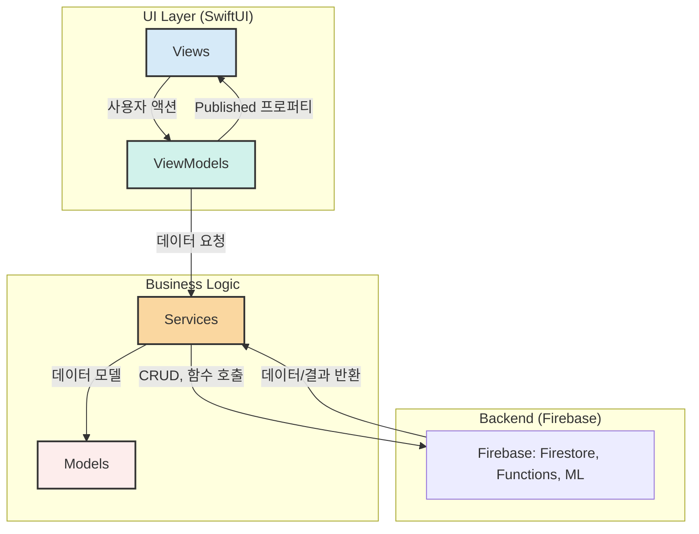
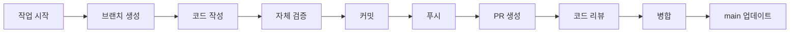

# 🤖 AI 워크플로우 및 컨텍스트 가이드

**"AI와 함께하는 효율적인 개발을 위한 단일 진실 공급원"**

이 문서는 PIP 프로젝트에서 AI와 협업할 때 필요한 모든 컨텍스트와 워크플로우 프로토콜을 통합한 가이드입니다. 새로운 AI 세션이 시작될 때 이 문서를 참조하면 프로젝트의 전체 맥락을 빠르게 파악할 수 있습니다.

---

## 📑 목차

1. [프로젝트 핵심 컨텍스트](#1-프로젝트-핵심-컨텍스트)
2. [아키텍처 및 코드 구조](#2-아키텍처-및-코드-구조)
3. [워크플로우 프로토콜](#3-워크플로우-프로토콜)
4. [디자인 시스템 핵심 가이드라인](#4-디자인-시스템-핵심-가이드라인)
5. [Git 및 버전 관리](#5-git-및-버전-관리)

---

## 1. 프로젝트 핵심 컨텍스트

### 1.1. 프로젝트 비전 및 목표

**프로젝트명:** PIP (Personal Intelligence Platform)  
**슬로건:** "나를 이해하는 가장 스마트한 방법, PIP"

**핵심 목표:**
- 개인 데이터 기반의 **PIP Score** 제공
- AI 기반 **딥 인사이트**를 통한 맞춤형 웰니스/생산성 솔루션 제공
- 심리, 행동, 신체 데이터를 통합 분석하여 웰니스 증진과 생산성 향상 지원

**개발 대상:** iOS (주력) 및 Android (확장 고려)  
**콘셉트:** Black & Platinum 기반의 **지적인 미니멀리즘** (Accent: Amber Flame, Tiger Flame, French Blue)

### 1.2. 기술 스택

| 영역 | 도구/기술 | 역할 |
| :--- | :--- | :--- |
| **버전 관리** | GitHub (Git) | 모든 코드 및 기획 문서의 시계열적 기록 및 CI/CD 연동 허브 |
| **프론트엔드** | **SwiftUI** (Native iOS) | 네이티브 성능 극대화 및 최신 iOS 기능 활용 |
| **백엔드/DB** | **Firebase Firestore & Storage** | 사용자 데이터 저장, 오디오/미디어 파일 저장 |
| **인텔리전스 엔진** | **Firebase Cloud Functions** (Node.js/TypeScript) | PIP Score 계산 및 딥 인사이트 분석 로직 실행 |
| **디자인/UI/UX** | **Figma** | 디자인 시스템 구축, 와이어프레임, 최종 화면 디자인 |
| **CI/CD** | GitHub Actions, Xcode Cloud | 코드 푸시 시 자동 테스트 및 App Store Connect 연동 |

### 1.3. 현재 프로젝트 상태 (2025.12 기준)

**완료된 작업:**
- ✅ 기본 프로젝트 구조 완성 (01_Planning, 02_Design_Assets, 03_Development, 04_Distribution)
- ✅ Xcode 프로젝트 생성 및 초기 설정 완료
- ✅ 디자인 시스템: 컬러 팔레트 (`00_1`), 폰트 스타일 (`00_2`) 정의 완료
- ✅ DesignSystem.swift에 폰트/컬러/레이아웃 상수 정의됨
- ✅ 기본 View 구조 (MainTabView, HomeView, InsightView, GoalView, StatusView) 존재
- ✅ Models/JournalEntry.swift 기본 모델 존재
- ✅ Assets.xcassets에 디자인 에셋 정리 완료

**진행 중/예정 작업:**
- 🔄 아이콘 세트 정의 (`00_3`)
- 📋 Services, ViewModels 폴더 구현 (MVVM 아키텍처 완성)
  - ✅ HomeViewModel 완성
  - ✅ WriteViewModel 완성
  - 📋 InsightViewModel, GoalViewModel, StatusViewModel 예정
- 🔗 Firebase 연동
- 🎨 Gems, Orbs 컴포넌트 구현
- 📝 온보딩 플로우 구현 (5개 탭 기반)

### 1.4. 주요 설계 결정 (ADR 요약)

**아키텍처 패턴:** MVVM (Model-View-ViewModel)
- **이유:** UI와 비즈니스 로직 분리, 테스트 용이성, 코드 재사용성

**네이티브 iOS 선택:**
- **이유:** 네이티브 성능 극대화 및 최신 iOS 기능과의 완벽한 통합

**Firebase 선택:**
- **이유:** 1인 개발에 최적화된 BaaS, 복잡한 PIP Score 분석은 Cloud Functions로 분리하여 효율성 확보

**GitHub 중심 관리:**
- **이유:** 모든 기획/코드의 시계열적 기록 및 CI/CD 연동 허브 역할

---

## 2. 아키텍처 및 코드 구조

### 2.1. MVVM 아키텍처 패턴

PIP 앱은 **MVVM (Model-View-ViewModel)** 패턴을 따릅니다.



**역할 분리:**
- **View (메뉴판):** 사용자가 보고 상호작용하는 화면. UI만 담당, 비즈니스 로직 없음
- **ViewModel (셰프):** View와 Model 사이의 중재자. 사용자 액션을 처리하고 데이터를 가공하여 View에 전달
- **Model (식자재):** 순수한 데이터 구조 정의
- **Service (창고 관리자):** Firebase와의 통신, 데이터 CRUD 작업 담당

### 2.2. 디렉토리 구조

**프로젝트 루트 구조:**
```
PIP_Project/
├── 01_Planning/              # 기획 문서 및 설계 결정 기록
│   ├── PRD/                  # 제품 요구사항 명세서
│   ├── Research/              # 시장 조사, 경쟁 분석
│   ├── User_Stories/          # 사용자 스토리 및 요구사항
│   ├── PROJECT_HANDOVER.md    # ADR 및 현재 상태
│   └── AI_WORKFLOW_AND_CONTEXT.md  # 이 문서
├── 02_Design_Assets/          # 디자인 마스터 소스
│   ├── Branding/              # 로고, 컬러 팔레트, 폰트
│   ├── Figma_Exports/         # Figma에서 추출된 UI 컴포넌트
│   └── BRANDING_GUIDE.md      # 디자인 시스템 가이드
├── 03_Development/            # AI/ML 모델 개발 (Python 스크립트 등)
│   └── DEVELOPMENT_GUIDE.md   # 개발 가이드
├── 04_Distribution/           # 배포 및 심사 자료
│   ├── AppStore_Metadata/
│   ├── Release_Notes/
│   └── RELEASE_PLAN.md
└── PIP_Project/               # iOS 앱 소스 코드
    └── PIP_Project/
        ├── Application/       # 앱의 시작점
        ├── Views/              # SwiftUI 화면 코드
        ├── ViewModels/         # 화면의 로직/두뇌
        ├── Models/             # 데이터의 모양 정의
        ├── Services/           # Firebase 연동 등
        ├── Components/         # 재사용 가능한 부품
        ├── Extensions/         # Swift 확장
        └── Resources/          # Assets, DesignSystem 등
```

**Xcode 프로젝트 내부 구조 (`PIP_Project/PIP_Project/`):**
```
├── Application/
│   └── PIP_ProjectApp.swift          # 앱 진입점
├── Views/
│   ├── MainTabView.swift             # 메인 탭 네비게이션 (5개 탭)
│   ├── LaunchView.swift              # 런치 스크린
│   ├── HomeView.swift                # 홈 (저널링/Gem 조회) 페이지
│   ├── InsightView.swift             # 인사이트 페이지
│   ├── WriteView.swift               # 쓰기 (카드 입력) 페이지 (新)
│   ├── GoalView.swift                # 목표 페이지
│   └── StatusView.swift              # 현황 페이지
├── ViewModels/
│   ├── HomeViewModel.swift           # Home 탭 로직
│   ├── WriteViewModel.swift          # Write 탭 로직 (카드 생성/저장)
│   ├── InsightViewModel.swift        # Insight 탭 로직 (예정)
│   ├── GoalViewModel.swift           # Goal 탭 로직 (예정)
│   └── StatusViewModel.swift         # Status 탭 로직 (예정)
├── Models/
│   └── JournalEntry.swift            # 저널 엔트리 모델
├── Services/                         # (현재 비어있음, 구현 예정)
├── Components/
│   ├── PrimaryBackground.swift       # 배경 그라데이션
│   └── TabBar.swift                  # 하단 탭바
├── Extensions/                       # (현재 비어있음)
└── Resources/
    ├── DesignSystem.swift            # 디자인 시스템 상수 정의
    ├── LicenseData.swift
    └── Assets.xcassets/              # 이미지, 색상, 폰트 에셋
```

### 2.3. 파일 네이밍 컨벤션

**Swift 파일:**
- **View:** `[PageName]View.swift` (예: `HomeView.swift`, `InsightView.swift`)
- **ViewModel:** `[PageName]ViewModel.swift` (예: `HomeViewModel.swift`)
- **Model:** `[ModelName].swift` (예: `JournalEntry.swift`, `UserProfile.swift`)
- **Component:** `[ComponentName].swift` (예: `TabBar.swift`, `GemView.swift`)
- **Service:** `[ServiceName]Service.swift` (예: `FirebaseService.swift`, `AnalyticsService.swift`)
- **Extension:** `[Type]+[Purpose].swift` (예: `Color+PIP.swift`, `View+Modifiers.swift`)

**에셋 네이밍:**
- **아이콘:** `icon_[name][_state].imageset` (예: `icon_home.imageset`, `icon_home_deactivated.imageset`)
- **이미지:** `[category]_[name].imageset` (예: `gem_1.imageset`, `railroad_front.imageset`)
- **컬러:** `[category]_[name].colorset` (예: `bg_grad_1.colorset`, `text_intro.colorset`)

### 2.4. DesignSystem 사용법

**DesignSystem.swift** 파일에 모든 디자인 상수가 정의되어 있습니다.

**폰트 사용:**
```swift
Text("Hello")
    .font(.pip.hero)        // 34pt, Bold, Rounded
    .font(.pip.title1)      // 24pt, SemiBold
    .font(.pip.title2)      // 18pt, Medium
    .font(.pip.body)        // 16pt, Regular
    .font(.pip.caption)     // 12pt, Regular
```

**컬러 사용:**
```swift
// 기본 배경
Color.pip.bgGrad1
Color.pip.bgGrad2

// 페이지별 컬러
Color.pip.home.buttonAddGrad1
Color.pip.insight.bgAnalsGrad1
Color.pip.goal.shadowGemGrad
Color.pip.status.numRecords
```

**레이아웃 상수 사용:**
```swift
// 탭바
CGFloat.PIPLayout.tabbarHeight
CGFloat.PIPLayout.tabbarHorizontalPadding
CGFloat.PIPLayout.tabbarCornerRadius

// 홈 레일로드
CGFloat.PIPLayout.railroadWidth
CGFloat.PIPLayout.railroadHeight

// Write View
CGFloat.PIPLayout.writeSheetWidth
CGFloat.PIPLayout.writeSheetHeight
```

### 2.5. 컴포넌트 작성 가이드

**Gems, Orbs 컴포넌트 구현 원칙:**

1. **데이터 기반 렌더링:** 이미지가 아닌 SwiftUI로 동적 생성
2. **파라미터화:** 밝기, 형태, 불확실성 등을 파라미터로 받음
3. **재사용성:** 다양한 컨텍스트에서 사용 가능하도록 설계

**예시 구조 (OrbView):**
```swift
import SwiftUI

struct OrbView: View {
    let brightness: Double      // 데이터 완성도 (0.0 ~ 1.0)
    let complexity: Int         // 데이터 특성 (기하학적 다양성)
    let uncertainty: Double     // 모델 불확실성 (네온 섀도우)
    
    var body: some View {
        ZStack {
            // 1. 기본 도형: complexity 값에 따라 다른 모양
            // 2. 글래스 효과 적용
            // 3. 밝기 조절: .brightness(brightness)
            // 4. 네온 섀도우: .shadow(color: .teal.opacity(uncertainty), radius: 20)
        }
    }
}
```

**컴포넌트 작성 체크리스트:**
- [ ] DesignSystem의 컬러/폰트/레이아웃 상수 사용
- [ ] Preview 제공 (#Preview 사용)
- [ ] 명확한 파라미터 문서화 (주석)
- [ ] 재사용 가능한 구조로 설계
- [ ] 애니메이션 고려 (필요시)

---

## 3. 워크플로우 프로토콜

### 3.1. 작업 시작 전 필수 체크리스트

새로운 기능 개발이나 버그 수정을 시작하기 전에 다음을 확인하세요:

**컨텍스트 확인:**
- [ ] 이 문서 (`AI_WORKFLOW_AND_CONTEXT.md`)를 읽고 프로젝트 맥락 파악
- [ ] 관련 기존 문서 확인 (README.md, PROJECT_HANDOVER.md, BRANDING_GUIDE.md, DEVELOPMENT_GUIDE.md)
- [ ] 현재 프로젝트 상태 확인 (완료된 작업, 진행 중인 작업)
- [ ] 관련 기존 코드 파일 검토

**환경 설정:**
- [ ] Xcode 프로젝트가 정상적으로 빌드되는지 확인
- [ ] 필요한 Firebase 설정 확인 (GoogleService-Info.plist 존재 여부)
- [ ] 최신 코드 상태 확인 (git pull)

**작업 범위 정의:**
- [ ] 작업 목표 명확화
- [ ] 관련 파일 목록 파악
- [ ] 예상되는 변경사항 정리

### 3.2. AI 요청 시 제공할 컨텍스트 템플릿

AI에게 작업을 요청할 때 다음 정보를 포함하세요:

```
[작업 유형] 작업 제목

[목표]
- 무엇을 만들거나 수정하려는지 명확히 설명

[현재 상태]
- 관련된 기존 파일 경로
- 현재 구현된 내용 (있는 경우)
- 문제점이나 개선이 필요한 부분

[요구사항]
- 기능적 요구사항
- 디자인 요구사항 (Figma 참조 필요시)
- 기술적 제약사항

[참조 파일]
- 관련 문서 경로
- 참고할 기존 코드 파일 경로
- Figma 디자인 링크 (있는 경우)

[예상 결과]
- 완료 후 기대되는 동작
- 테스트 방법
```

**예시:**
```
[기능 개발] HomeView에 저널링 카드 스와이프 기능 추가

[목표]
- 사용자가 카드를 좌우로 스와이프하여 감정을 기록할 수 있도록 구현

[현재 상태]
- HomeView.swift는 기본 구조만 있음 (텍스트만 표시)
- JournalEntry.swift 모델은 이미 정의됨
- DesignSystem.swift에 필요한 컬러/레이아웃 상수 정의됨

[요구사항]
- 틴더(Tinder) 스타일의 카드 스와이프 인터페이스
- 좌측 스와이프: 부정 감정 기록
- 우측 스와이프: 긍정 감정 기록
- 애니메이션: 부드러운 스프링 애니메이션

[참조 파일]
- 02_Design_Assets/BRANDING_GUIDE.md (UX 전략 참조)
- PIP_Project/PIP_Project/Views/HomeView.swift
- PIP_Project/PIP_Project/Models/JournalEntry.swift
- PIP_Project/PIP_Project/Resources/DesignSystem.swift

[예상 결과]
- 카드를 스와이프하면 JournalEntry가 생성되고 다음 카드가 나타남
- 스와이프 방향에 따라 emotionScore 값이 설정됨
```

### 3.3. 코드 작성 표준

**Swift/SwiftUI 스타일 가이드:**

1. **네이밍:**
   - 타입: PascalCase (`HomeView`, `JournalEntry`)
   - 변수/함수: camelCase (`selectedTab`, `startLoadingProcess()`)
   - 상수: camelCase 또는 UPPER_CASE (상황에 따라)

2. **파일 구조:**
   ```swift
   // MARK: - Imports
   import SwiftUI
   
   // MARK: - Main View
   struct HomeView: View {
       // Properties
       @State private var selectedTab: Int = 0
       
       // Body
       var body: some View {
           // ...
       }
       
       // Private Methods
       private func someMethod() {
           // ...
       }
   }
   
   // MARK: - Preview
   #Preview {
       HomeView()
   }
   ```

3. **주석:**
   - 복잡한 로직에는 설명 주석 추가
   - MARK 주석으로 섹션 구분
   - Public API는 문서화 주석 (`///`) 사용

4. **MVVM 패턴 준수:**
   - View는 UI만 담당, 비즈니스 로직 없음
   - ViewModel에서 `@Published` 프로퍼티로 상태 관리
   - Service에서 Firebase 통신 처리

5. **DesignSystem 사용:**
   - 하드코딩된 값 대신 DesignSystem 상수 사용
   - 컬러는 `Color.pip.*` 사용
   - 폰트는 `.pip.*` 사용
   - 레이아웃은 `CGFloat.PIPLayout.*` 사용

### 3.4. 코드 리뷰 및 검증 프로세스

**자체 검증 체크리스트:**
- [ ] 코드가 빌드되고 실행되는가?
- [ ] DesignSystem을 올바르게 사용하는가?
- [ ] MVVM 패턴을 준수하는가?
- [ ] 불필요한 하드코딩이 없는가?
- [ ] Preview가 정상 작동하는가?
- [ ] 주석과 문서화가 충분한가?

**테스트 고려사항:**
- ViewModel의 로직은 단위 테스트 가능하도록 작성
- Service는 Mock 객체로 테스트 가능하도록 설계
- UI 컴포넌트는 Preview로 시각적 검증

### 3.5. 문서 업데이트 규칙

**다음 경우에 문서를 업데이트하세요:**

1. **새로운 기능 추가 시:**
   - `PROJECT_HANDOVER.md`에 완료된 작업 기록
   - 관련 가이드 문서 업데이트 (필요시)

2. **아키텍처 변경 시:**
   - `PROJECT_HANDOVER.md`의 ADR 섹션에 결정 사유 기록
   - `DEVELOPMENT_GUIDE.md` 업데이트

3. **디자인 시스템 변경 시:**
   - `BRANDING_GUIDE.md` 업데이트
   - `DesignSystem.swift` 변경 시 관련 문서 동기화

4. **이 문서 업데이트:**
   - 프로젝트 상태가 변경되면 "현재 프로젝트 상태" 섹션 업데이트
   - 새로운 워크플로우나 프로토콜 추가 시 해당 섹션 업데이트

---

## 4. 디자인 시스템 핵심 가이드라인

### 4.1. 브랜드 철학

**브랜드 페르소나:** 이타적인 딥테크 기술자 (Altruistic Deep-Tech Technician)
- 냉철한 데이터 분석 (팔란티어처럼)
- 따뜻하고 친절한 정보 제공 (스포티파이처럼)
- 지적인 선배로서의 동반자 (로버트 기요사키처럼)

**핵심 UX 원칙:** 차분한 명료함 (Calm Clarity)
- 1분 내외의 짧은 저널링으로 통제감과 평온함 제공
- 복잡한 수치 대신 직관적인 지표 제안

### 4.2. 시각적 메타포: Glass Gems & Orbs

**Gems/Orbs의 의미:**
- **밝기 (Brightness):** 데이터 수집의 완성도 (데이터가 많을수록 밝음)
- **기하학적 형태 (Geometry):** 데이터의 고유한 특성 (감정, 신체, 행동 등)
- **네온 그림자 (Neon Shadow):** AI 모델의 불확실성 (확신이 높을수록 그림자 옅음)

### 4.3. 컬러 팔레트

**배경:**
- 그라데이션: 상단 `#000000` → 하단 `#202020`
- 코드: `Color.pip.bgGrad1`, `Color.pip.bgGrad2`

**주조색 (Teal System):**
- `#82EBEB` (Brightest) - 로고 및 강조
- `#40DBDB` (Bright)
- `#31B0B0` (Default)
- `#248888` (Medium)
- `#176161` (Dark)
- `#0B3D3D` (Darkest)

**중립색:**
- Primary Text & Icons: `#FFFFFF` (White)
- Secondary Text: `#A0A0A0` (Light Gray)

**페이지별 컬러:**
- Home: `Color.pip.home.*`
- Insight: `Color.pip.insight.*`
- Goal: `Color.pip.goal.*`
- Status: `Color.pip.status.*`

### 4.4. 타이포그래피

**폰트:** Pretendard

| 역할 | 크기/굵기 | 코드 | 사용 목적 |
| :--- | :--- | :--- | :--- |
| **Display/H1** | 34pt / Bold | `.pip.hero` | PIP Score 등 가장 강조할 핵심 수치 |
| **Headline/H2** | 24pt / SemiBold | `.pip.title1` | 주요 섹션 제목 |
| **Title/H3** | 18pt / Medium | `.pip.title2` | 카드 및 내비게이션 바 제목 |
| **Body/Default** | 16pt / Regular | `.pip.body` | 일반 본문 텍스트 |
| **Caption/Small** | 12pt / Regular | `.pip.caption` | 보조 설명 및 레이블 |

### 4.5. 레이아웃 상수

**탭바:**
- 높이: `CGFloat.PIPLayout.tabbarHeight` (Safe Area + 44pt + 패딩)
- 수평 패딩: `CGFloat.PIPLayout.tabbarHorizontalPadding` (32pt)
- 코너 반경: `CGFloat.PIPLayout.tabbarCornerRadius` (40pt)

**홈 레일로드:**
- 너비: `CGFloat.PIPLayout.railroadWidth` (402pt)
- 높이: `CGFloat.PIPLayout.railroadHeight` (700pt)

**Write View:**
- 너비: `CGFloat.PIPLayout.writeSheetWidth` (380pt)
- 높이: `CGFloat.PIPLayout.writeSheetHeight` (715pt)
- 코너 반경: `CGFloat.PIPLayout.writeSheetCornerRadius` (33pt)

### 4.6. 아이콘 및 에셋 사용법

**아이콘 네이밍 규칙:**
- 활성화: `icon_[name]` (예: `icon_home`)
- 비활성화: `icon_[name]_deactivated` (예: `icon_home_deactivated`)

**사용 예시:**
```swift
Image("icon_home")
    .resizable()
    .aspectRatio(contentMode: .fit)
    .frame(width: 44, height: 44)
```

**에셋 위치:**
- `Assets.xcassets/00_Basic/04_Icons/` - 기본 아이콘
- `Assets.xcassets/01_Home/00_Home_icons/` - 홈 페이지 아이콘
- `Assets.xcassets/02_Insight/00_Insights_icons/` - 인사이트 아이콘

---

## 5. Git 및 버전 관리

### 5.1. 브랜치 전략

**메인 브랜치:**
- `main`: 프로덕션 준비 코드 (안정적인 버전)

**작업 브랜치:**
- `feature/[기능명]`: 새 기능 개발 (예: `feature/journaling-swipe`)
- `fix/[버그명]`: 버그 수정 (예: `fix/tabbar-layout`)
- `refactor/[대상]`: 리팩토링 (예: `refactor/viewmodel-structure`)

**브랜치 네이밍 규칙:**
- 소문자 사용
- 하이픈(-)으로 단어 구분
- 명확하고 간결한 이름

### 5.2. 커밋 메시지 컨벤션

**형식:**
```
[타입] 간단한 제목 (50자 이내)

상세 설명 (선택사항, 72자마다 줄바꿈)
- 변경 사항 1
- 변경 사항 2
```

**타입:**
- `feat`: 새 기능 추가
- `fix`: 버그 수정
- `refactor`: 코드 리팩토링
- `style`: 코드 포맷팅, 세미콜론 누락 등
- `docs`: 문서 수정
- `test`: 테스트 추가/수정
- `chore`: 빌드 업무 수정, 패키지 매니저 설정 등

**예시:**
```
feat: HomeView에 카드 스와이프 기능 추가

- 좌우 스와이프로 감정 기록 가능
- JournalEntry 모델과 연동
- 스프링 애니메이션 적용
```

### 5.3. 작업 흐름



**단계별 체크리스트:**

1. **작업 시작:**
   - [ ] 최신 main 브랜치에서 시작 (`git checkout main && git pull`)
   - [ ] 새 브랜치 생성 (`git checkout -b feature/[기능명]`)

2. **코드 작성:**
   - [ ] 이 문서의 "코드 작성 표준" 준수
   - [ ] DesignSystem 사용
   - [ ] MVVM 패턴 준수

3. **커밋:**
   - [ ] 논리적 단위로 커밋 분리
   - [ ] 명확한 커밋 메시지 작성
   - [ ] 불필요한 파일 커밋하지 않기 (.gitignore 확인)

4. **푸시 및 PR:**
   - [ ] 브랜치 푸시 (`git push origin feature/[기능명]`)
   - [ ] Pull Request 생성
   - [ ] PR 설명에 작업 내용, 테스트 방법 명시

### 5.4. 에러 발생 시 디버깅 프로토콜

**1단계: 에러 분석**
- [ ] 에러 메시지 전체 확인
- [ ] 관련 파일 및 라인 번호 확인
- [ ] 최근 변경사항 검토

**2단계: 컨텍스트 수집**
- [ ] Xcode 콘솔 로그 확인
- [ ] Firebase 콘솔 확인 (Firebase 관련 에러인 경우)
- [ ] 관련 문서 확인 (DesignSystem, 가이드 등)

**3단계: 해결 시도**
- [ ] 간단한 해결책 시도 (빌드 클린, 시뮬레이터 재시작 등)
- [ ] 관련 코드 검토 및 수정
- [ ] 필요시 AI에게 컨텍스트와 함께 질문

**4단계: 문서화**
- [ ] 해결 방법이 있다면 문서에 기록
- [ ] 재발 방지를 위한 가이드라인 추가 (필요시)

**AI에게 에러 리포트할 때 포함할 정보:**
```
[에러 유형] 에러 제목

[에러 메시지]
- 전체 에러 메시지 복사

[재현 방법]
- 에러를 재현하는 단계

[환경]
- Xcode 버전
- iOS 시뮬레이터 버전
- 관련 파일 경로

[시도한 해결책]
- 이미 시도한 방법들

[관련 파일]
- 에러가 발생한 파일 경로
- 관련 코드 스니펫
```

---

## 6. 빠른 참조 인덱스

### 주요 파일 경로
- **프로젝트 루트:** `/Users/neo/ACCEL/PIP_Project/`
- **iOS 앱 코드:** `PIP_Project/PIP_Project/`
- **디자인 에셋:** `02_Design_Assets/`
- **기획 문서:** `01_Planning/`

### 주요 문서
- **README.md:** 프로젝트 개요 및 전체 워크플로우
- **PROJECT_HANDOVER.md:** ADR 및 현재 상태
- **BRANDING_GUIDE.md:** 디자인 시스템 상세 가이드
- **DEVELOPMENT_GUIDE.md:** 개발 가이드 (MVVM 설명 등)
- **이 문서:** AI 워크플로우 및 컨텍스트 통합 가이드

### 주요 코드 파일
- **DesignSystem.swift:** `PIP_Project/PIP_Project/Resources/DesignSystem.swift`
- **MainTabView.swift:** `PIP_Project/PIP_Project/Views/MainTabView.swift` (5개 탭 라우팅)
- **WriteView.swift:** `PIP_Project/PIP_Project/Views/WriteView.swift` (카드 입력 UI)
- **HomeViewModel.swift:** `PIP_Project/PIP_Project/ViewModels/HomeViewModel.swift` (Home 탭 로직)
- **WriteViewModel.swift:** `PIP_Project/PIP_Project/ViewModels/WriteViewModel.swift` (카드 생성/저장 로직)
- **TabBar.swift:** `PIP_Project/PIP_Project/Components/TabBar.swift`

### DesignSystem 빠른 참조
- **폰트:** `.pip.hero`, `.pip.title1`, `.pip.title2`, `.pip.body`, `.pip.caption`
- **컬러:** `Color.pip.bgGrad1`, `Color.pip.home.*`, `Color.pip.insight.*`
- **레이아웃:** `CGFloat.PIPLayout.tabbarHeight`, `CGFloat.PIPLayout.railroadWidth`

---

## 7. 업데이트 이력

- **2025.12.XX:** 초기 문서 작성
  - 프로젝트 핵심 컨텍스트 통합
  - 워크플로우 프로토콜 정의
  - 디자인 시스템 가이드라인 정리

---

**이 문서는 프로젝트의 "단일 진실 공급원"입니다. 새로운 정보나 변경사항이 있으면 이 문서를 우선 업데이트하세요.**

