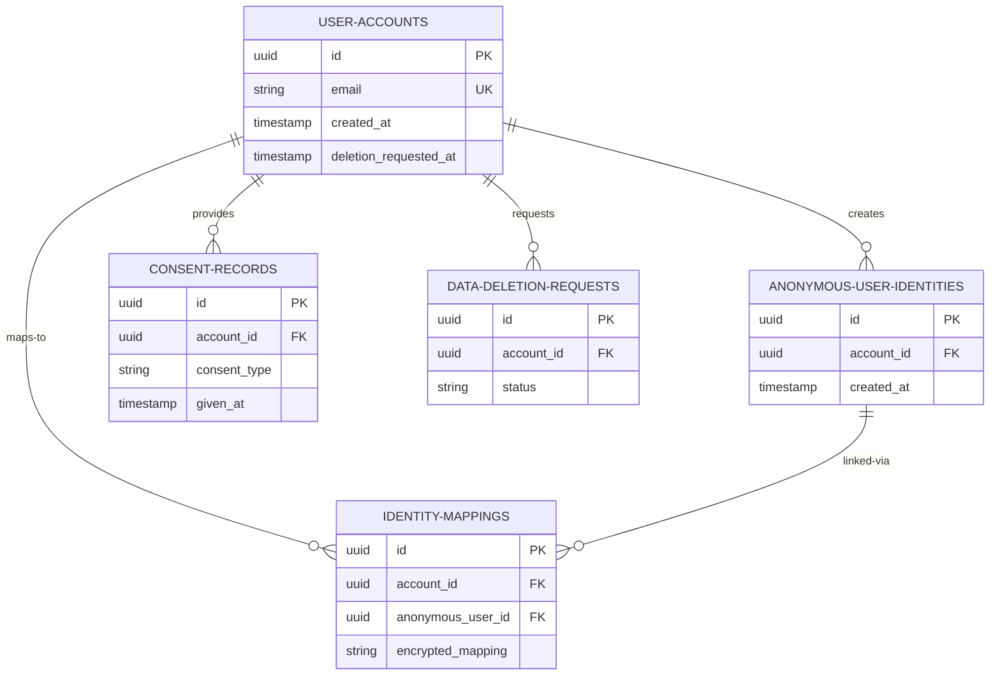
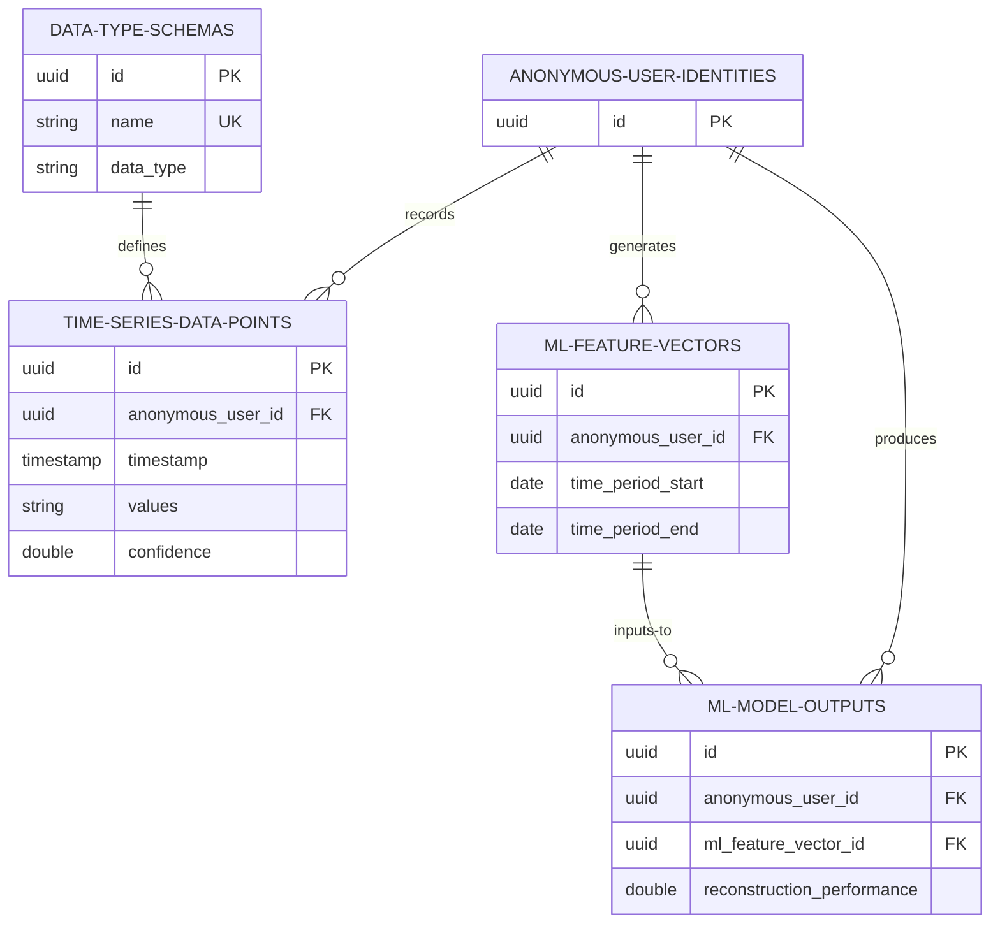
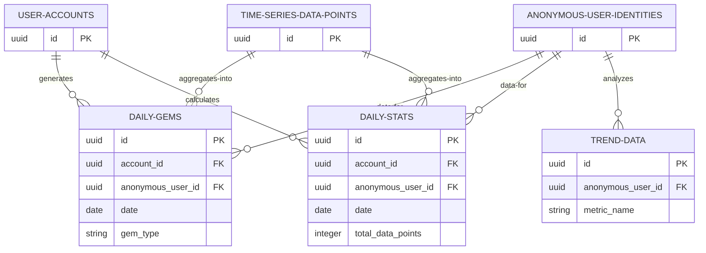
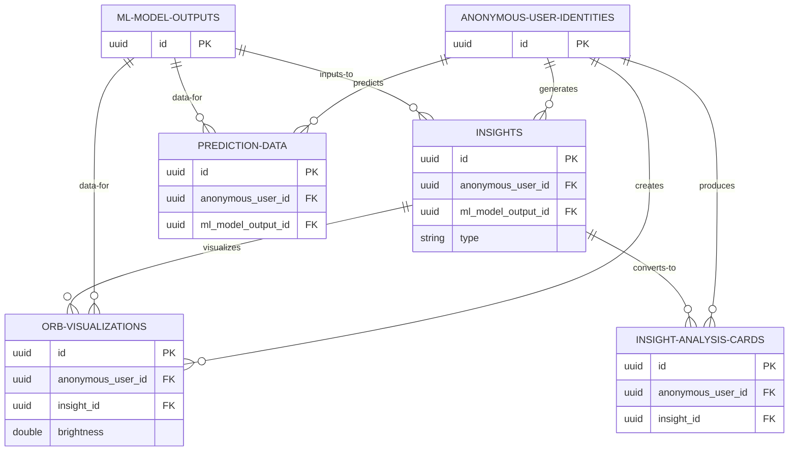
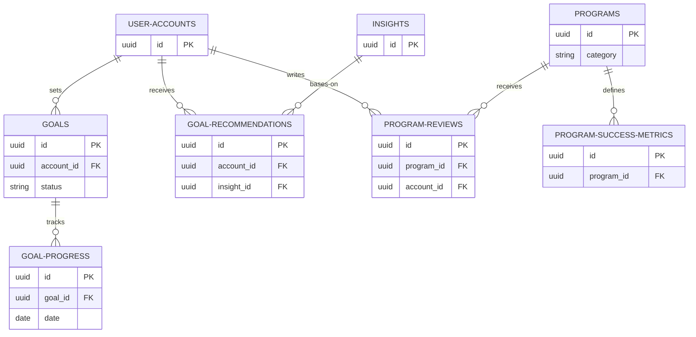
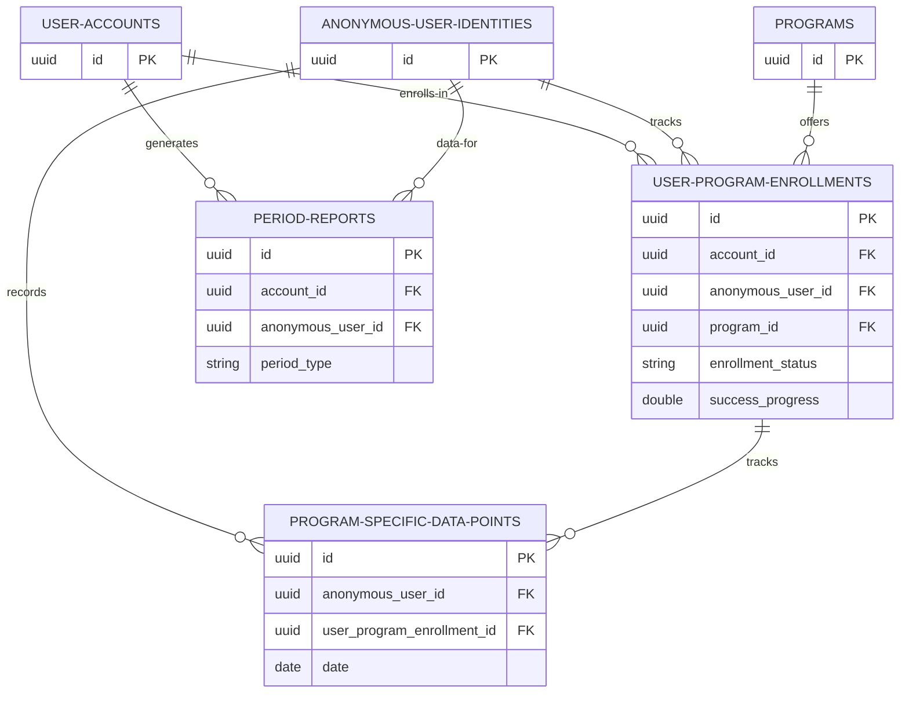

# PIP Project - Mermaid ERD (Entity Relationship Diagram)

Version: 1.0  
Last Updated: 2026.01.05  
Format: Mermaid ER Diagram

---

## Full Database ERD

```mermaid
erDiagram
    %% ==================== 1. IDENTITY LAYER ====================
    USER-ACCOUNTS ||--o{ ANONYMOUS-USER-IDENTITIES : creates
    USER-ACCOUNTS ||--o{ IDENTITY-MAPPINGS : "mapped-to"
    USER-ACCOUNTS ||--o{ CONSENT-RECORDS : provides
    USER-ACCOUNTS ||--o{ DATA-DELETION-REQUESTS : requests
    
    ANONYMOUS-USER-IDENTITIES ||--o{ IDENTITY-MAPPINGS : "linked-via"
    
    %% ==================== 2. USER PROFILE LAYER ====================
    USER-ACCOUNTS ||--|| USER-PROFILES : has
    USER-ACCOUNTS ||--|| USER-DATA-COLLECTION-SETTINGS : configures
    USER-ACCOUNTS ||--|| ONBOARDING-STATES : tracks
    USER-ACCOUNTS ||--|| PIP-SCORES : calculates
    
    %% ==================== 3. TIME SERIES DATA LAYER ====================
    ANONYMOUS-USER-IDENTITIES ||--o{ TIME-SERIES-DATA-POINTS : records
    ANONYMOUS-USER-IDENTITIES ||--o{ ML-FEATURE-VECTORS : generates
    ANONYMOUS-USER-IDENTITIES ||--o{ ML-MODEL-OUTPUTS : produces
    
    ML-FEATURE-VECTORS ||--o{ ML-MODEL-OUTPUTS : inputs-to
    DATA-TYPE-SCHEMAS ||--o{ TIME-SERIES-DATA-POINTS : defines
    
    %% ==================== 4. AGGREGATION LAYER ====================
    USER-ACCOUNTS ||--o{ DAILY-GEMS : generates
    USER-ACCOUNTS ||--o{ DAILY-STATS : calculates
    ANONYMOUS-USER-IDENTITIES ||--o{ DAILY-GEMS : "data-for"
    ANONYMOUS-USER-IDENTITIES ||--o{ DAILY-STATS : "data-for"
    ANONYMOUS-USER-IDENTITIES ||--o{ TREND-DATA : analyzes
    
    TIME-SERIES-DATA-POINTS ||--o{ DAILY-GEMS : "aggregates-into"
    TIME-SERIES-DATA-POINTS ||--o{ DAILY-STATS : "aggregates-into"
    
    %% ==================== 5. INSIGHT LAYER ====================
    ANONYMOUS-USER-IDENTITIES ||--o{ INSIGHTS : generates
    ANONYMOUS-USER-IDENTITIES ||--o{ ORB-VISUALIZATIONS : creates
    ANONYMOUS-USER-IDENTITIES ||--o{ INSIGHT-ANALYSIS-CARDS : produces
    ANONYMOUS-USER-IDENTITIES ||--o{ PREDICTION-DATA : predicts
    
    ML-MODEL-OUTPUTS ||--o{ INSIGHTS : "inputs-to"
    ML-MODEL-OUTPUTS ||--o{ ORB-VISUALIZATIONS : "data-for"
    ML-MODEL-OUTPUTS ||--o{ PREDICTION-DATA : "data-for"
    
    INSIGHTS ||--o{ ORB-VISUALIZATIONS : visualizes
    INSIGHTS ||--o{ INSIGHT-ANALYSIS-CARDS : "converts-to"
    
    %% ==================== 6. GOAL & PROGRAM LAYER ====================
    USER-ACCOUNTS ||--o{ GOALS : sets
    USER-ACCOUNTS ||--o{ GOAL-RECOMMENDATIONS : receives
    USER-ACCOUNTS ||--o{ PROGRAM-REVIEWS : writes
    
    GOALS ||--o{ GOAL-PROGRESS : tracks
    INSIGHTS ||--o{ GOAL-RECOMMENDATIONS : "bases-on"
    
    PROGRAMS ||--o{ PROGRAM-REVIEWS : receives
    PROGRAMS ||--o{ PROGRAM-SUCCESS-METRICS : defines
    
    %% ==================== 6-1. HOME VIEW - PROGRAM ENROLLMENT ====================
    USER-ACCOUNTS ||--o{ USER-PROGRAM-ENROLLMENTS : enrolls-in
    ANONYMOUS-USER-IDENTITIES ||--o{ USER-PROGRAM-ENROLLMENTS : "tracks"
    PROGRAMS ||--o{ USER-PROGRAM-ENROLLMENTS : offers
    
    ANONYMOUS-USER-IDENTITIES ||--o{ PROGRAM-SPECIFIC-DATA-POINTS : "records"
    USER-PROGRAM-ENROLLMENTS ||--o{ PROGRAM-SPECIFIC-DATA-POINTS : "tracks"
    
    USER-ACCOUNTS ||--o{ PERIOD-REPORTS : generates
    ANONYMOUS-USER-IDENTITIES ||--o{ PERIOD-REPORTS : "data-for"
    
    %% ==================== 7. ACHIEVEMENT & STATUS LAYER ====================
    USER-ACCOUNTS ||--|| USER-STATS : maintains
    USER-ACCOUNTS ||--o{ BADGES : earns
    USER-ACCOUNTS ||--o{ VALUE-ANALYSIS : analyzes


    %% ==================== TABLE DEFINITIONS ====================
    
    USER-ACCOUNTS {
        uuid id PK
        string email UK
        timestamp created_at
        timestamp deletion_requested_at
        boolean is_active
    }
    
    ANONYMOUS-USER-IDENTITIES {
        uuid id PK
        uuid account_id FK
        timestamp created_at
        boolean is_active
    }
    
    IDENTITY-MAPPINGS {
        uuid id PK
        uuid account_id FK
        uuid anonymous_user_id FK
        string encrypted_mapping
        timestamp created_at
        boolean is_active
    }
    
    CONSENT-RECORDS {
        uuid id PK
        uuid account_id FK
        string consent_type
        timestamp given_at
        string version
    }
    
    DATA-DELETION-REQUESTS {
        uuid id PK
        uuid account_id FK
        timestamp requested_at
        timestamp completed_at
        string status
    }
    
    USER-PROFILES {
        uuid id PK
        uuid account_id FK UK
        string profile_image_url
        string background_image_url
        string feature_color
        string onboarding_state
        timestamp created_at
        timestamp updated_at
    }
    
    USER-DATA-COLLECTION-SETTINGS {
        uuid id PK
        uuid account_id FK UK
        string enabled_data_types
        string anonymization_level
        string permissions
        timestamp created_at
        timestamp updated_at
    }
    
    ONBOARDING-STATES {
        uuid id PK
        uuid account_id FK UK
        string completed_steps
        string selected_goals
        boolean is_completed
        timestamp created_at
        timestamp updated_at
    }
    
    PIP-SCORES {
        uuid id PK
        uuid account_id FK UK
        double overall_score
        double mind_score
        double behavior_score
        double physical_score
        timestamp calculated_at
        timestamp updated_at
    }
    
    DATA-TYPE-SCHEMAS {
        uuid id PK
        string name UK
        string data_type
        double min_value
        double max_value
        string description
        timestamp created_at
    }
    
    TIME-SERIES-DATA-POINTS {
        uuid id PK
        uuid anonymous_user_id FK
        timestamp timestamp
        date date
        string values
        string notes
        string category
        string source
        double confidence
        double completeness
        string features
        string predictions
        string anomalies
        timestamp created_at
        timestamp updated_at
    }
    
    ML-FEATURE-VECTORS {
        uuid id PK
        uuid anonymous_user_id FK
        date time_period_start
        date time_period_end
        string features
        string normalization_params
        timestamp created_at
    }
    
    ML-MODEL-OUTPUTS {
        uuid id PK
        uuid anonymous_user_id FK
        uuid ml_feature_vector_id FK
        string model_version
        double reconstruction_performance
        double prediction_accuracy
        string predictions
        string anomaly_scores
        timestamp executed_at
    }
    
    DAILY-GEMS {
        uuid id PK
        uuid account_id FK
        uuid anonymous_user_id FK
        date date
        string gem_type
        double brightness
        double uncertainty
        string color_theme
        string data_point_ids
        timestamp created_at
    }
    
    DAILY-STATS {
        uuid id PK
        uuid account_id FK
        uuid anonymous_user_id FK
        date date
        integer total_data_points
        integer notes_count
        double mind_score
        double behavior_score
        double physical_score
        double completeness_ratio
        double confidence_ratio
        string notes_by_category
        string data_source_counts
        timestamp created_at
    }
    
    TREND-DATA {
        uuid id PK
        uuid anonymous_user_id FK
        string metric_name
        string time_period
        string values
        string trend_direction
        double trend_strength
        timestamp calculated_at
    }
    
    INSIGHTS {
        uuid id PK
        uuid anonymous_user_id FK
        uuid ml_model_output_id FK
        string type
        string title
        string description
        string findings
        string recommendations
        double confidence
        boolean is_actionable
        timestamp created_at
    }
    
    ORB-VISUALIZATIONS {
        uuid id PK
        uuid anonymous_user_id FK
        uuid ml_model_output_id FK
        uuid insight_id FK
        double brightness
        double border_brightness
        string color_gradient
        string data_point_ids
        string unique_features
        timestamp created_at
    }
    
    INSIGHT-ANALYSIS-CARDS {
        uuid id PK
        uuid anonymous_user_id FK
        uuid insight_id FK
        string title
        string description
        string pages
        string action_proposals
        boolean is_shared
        timestamp shared_at
        timestamp created_at
    }
    
    PREDICTION-DATA {
        uuid id PK
        uuid anonymous_user_id FK
        uuid ml_model_output_id FK
        string metric_name
        string predicted_values
        string confidence_intervals
        integer prediction_horizon
        timestamp created_at
    }
    
    GOALS {
        uuid id PK
        uuid account_id FK
        string title
        string description
        string category
        string status
        double progress
        date start_date
        date target_date
        string related_data_point_ids
        timestamp created_at
        timestamp updated_at
    }
    
    GOAL-PROGRESS {
        uuid id PK
        uuid goal_id FK
        date date
        double progress_value
        string notes
        timestamp created_at
    }
    
    GOAL-RECOMMENDATIONS {
        uuid id PK
        uuid account_id FK
        uuid insight_id FK
        string recommended_goal
        string reason
        double relevance_score
        boolean is_accepted
        timestamp accepted_at
        timestamp created_at
    }
    
    PROGRAMS {
        uuid id PK
        string title
        string description
        string category
        integer duration_weeks
        string difficulty
        string illustration_3d_url
        double popularity
        double rating
        integer review_count
        timestamp created_at
    }
    
    PROGRAM-REVIEWS {
        uuid id PK
        uuid program_id FK
        uuid account_id FK
        double rating
        string review_text
        integer helpful_count
        timestamp created_at
    }
    
    PROGRAM-SUCCESS-METRICS {
        uuid id PK
        uuid program_id FK
        string metric_name
        double target_value
        string metric_type
        double weight
        string description
        timestamp created_at
    }
    
    USER-PROGRAM-ENROLLMENTS {
        uuid id PK
        uuid account_id FK
        uuid anonymous_user_id FK
        uuid program_id FK
        string enrollment_status
        date start_date
        date target_completion_date
        date actual_completion_date
        string initial_metrics
        double success_progress
        double success_rate
        timestamp created_at
        timestamp updated_at
    }
    
    PROGRAM-SPECIFIC-DATA-POINTS {
        uuid id PK
        uuid anonymous_user_id FK
        uuid user_program_enrollment_id FK
        timestamp timestamp
        date date
        string values
        string notes
        double confidence
        double completeness
        timestamp created_at
        timestamp updated_at
    }
    
    PERIOD-REPORTS {
        uuid id PK
        uuid account_id FK
        uuid anonymous_user_id FK
        string period_type
        date period_start_date
        date period_end_date
        string summary_metrics
        string insight_ids
        timestamp created_at
    }
    
    USER-STATS {
        uuid id PK
        uuid account_id FK UK
        integer total_data_points
        integer total_gems
        integer streak_days
        timestamp last_recorded_at
        timestamp updated_at
    }
    
    BADGES {
        uuid id PK
        uuid account_id FK
        string name
        string description
        string badge_type
        string illustration_3d_url
        string color_scheme
        string condition
        string unlock_rule
        timestamp unlocked_at
    }
    
    VALUE-ANALYSIS {
        uuid id PK
        uuid account_id FK
        string value_name
        double value_score
        integer supporting_data_points
        timestamp analyzed_at
    }
```

---

## Layer-by-Layer Breakdown

### Layer 1: Identity Layer


### Layer 2: User Profile Layer
```mermaid
erDiagram
    USER-ACCOUNTS ||--|| USER-PROFILES : has
    USER-ACCOUNTS ||--|| USER-DATA-COLLECTION-SETTINGS : configures
    USER-ACCOUNTS ||--|| ONBOARDING-STATES : tracks
    USER-ACCOUNTS ||--|| PIP-SCORES : calculates

    USER-ACCOUNTS {
        uuid id PK
    }

    USER-PROFILES {
        uuid id PK
        uuid account_id FK UK
        string feature_color
        timestamp updated_at
    }

    USER-DATA-COLLECTION-SETTINGS {
        uuid id PK
        uuid account_id FK UK
        string enabled_data_types
    }

    ONBOARDING-STATES {
        uuid id PK
        uuid account_id FK UK
        boolean is_completed
    }

    PIP-SCORES {
        uuid id PK
        uuid account_id FK UK
        double overall_score
    }
```

### Layer 3: Time Series Data Layer


### Layer 4: Aggregation Layer


### Layer 5: Insight Layer


### Layer 6: Goal & Program Layer


### Layer 6-1: Home View - Program Enrollment


### Layer 7: Achievement & Status Layer
```mermaid
erDiagram
    USER-ACCOUNTS ||--|| USER-STATS : maintains
    USER-ACCOUNTS ||--o{ BADGES : earns
    USER-ACCOUNTS ||--o{ VALUE-ANALYSIS : analyzes

    USER-ACCOUNTS {
        uuid id PK
    }

    USER-STATS {
        uuid id PK
        uuid account_id FK UK
        integer total_data_points
        integer streak_days
    }

    BADGES {
        uuid id PK
        uuid account_id FK
        string badge_type
        timestamp unlocked_at
    }

    VALUE-ANALYSIS {
        uuid id PK
        uuid account_id FK
        string value_name
        double value_score
    }
```

---

## Key Relationships Summary

| Source | Target | Relationship | Cardinality |
|--------|--------|--------------|-------------|
| user_accounts | anonymous_user_identities | creates | 1:Many |
| user_accounts | user_profiles | has | 1:1 |
| anonymous_user_identities | time_series_data_points | records | 1:Many |
| time_series_data_points | daily_gems | aggregates-into | Many:1 |
| ml_model_outputs | insights | inputs-to | 1:Many |
| insights | insight_analysis_cards | converts-to | 1:Many |
| user_accounts | goals | sets | 1:Many |
| programs | user_program_enrollments | offers | 1:Many |
| user_program_enrollments | program_specific_data_points | tracks | 1:Many |
| user_accounts | badges | earns | 1:Many |

---

## Notes

- **PK (Primary Key)**: Unique identifier for the table
- **FK (Foreign Key)**: References to another table
- **UK (Unique Key)**: Unique constraint on the field
- **1:1**: One-to-One relationship (each record has exactly one related record)
- **1:Many**: One-to-Many relationship (one record has many related records)
- **Many:1**: Many-to-One relationship (many records point to one record)

This ERD can be visualized in tools that support Mermaid syntax:
- GitHub (renders automatically in markdown)
- Notion
- Obsidian (with plugin)
- Mermaid Live Editor: https://mermaid.live
- VS Code (with Markdown Preview Mermaid Support extension)
