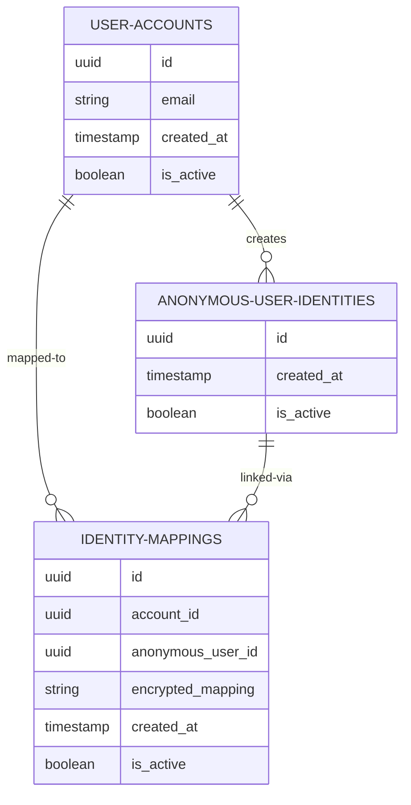
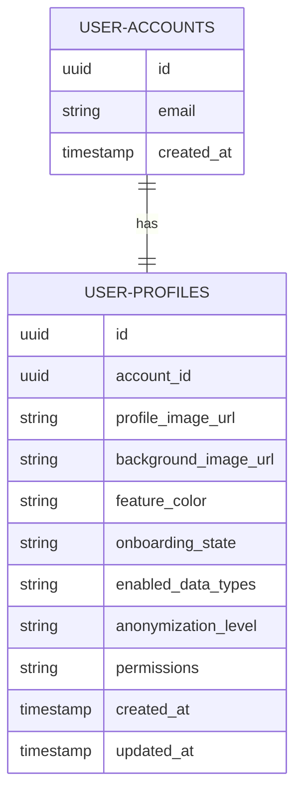
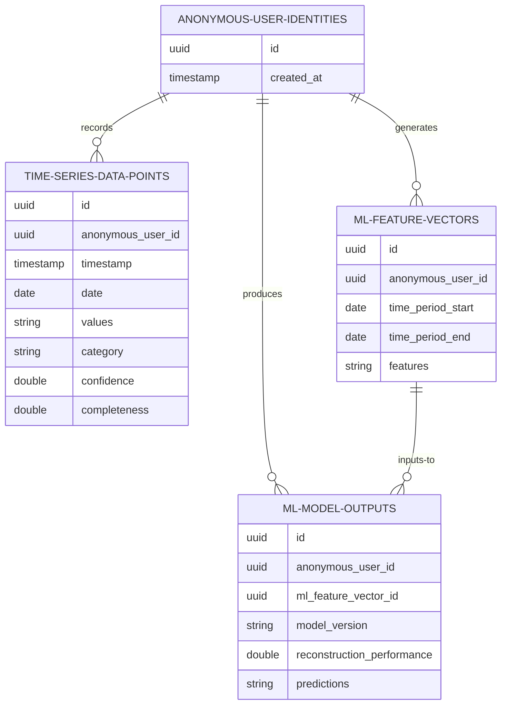
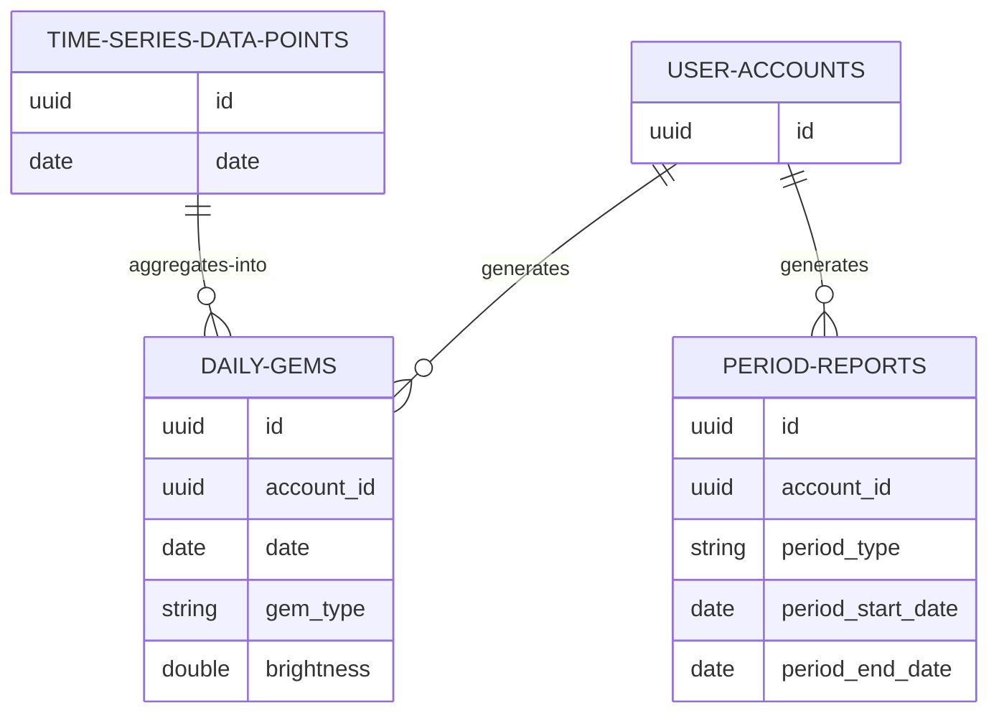
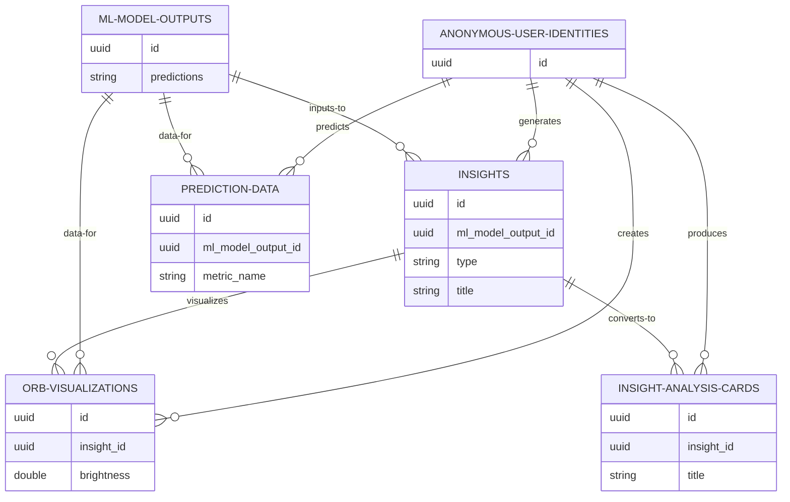
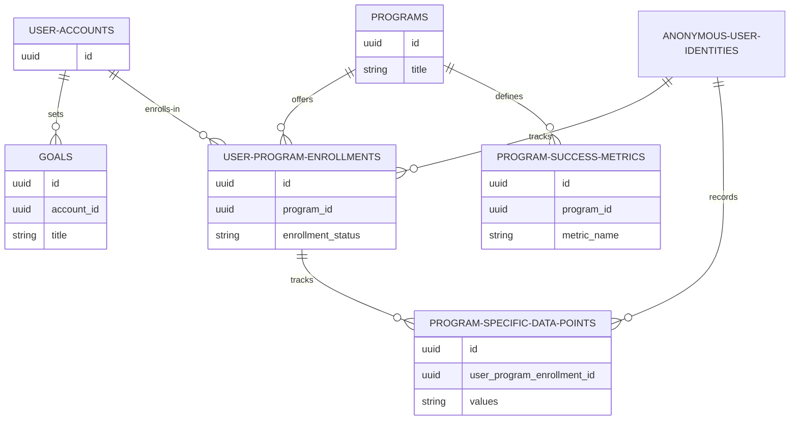
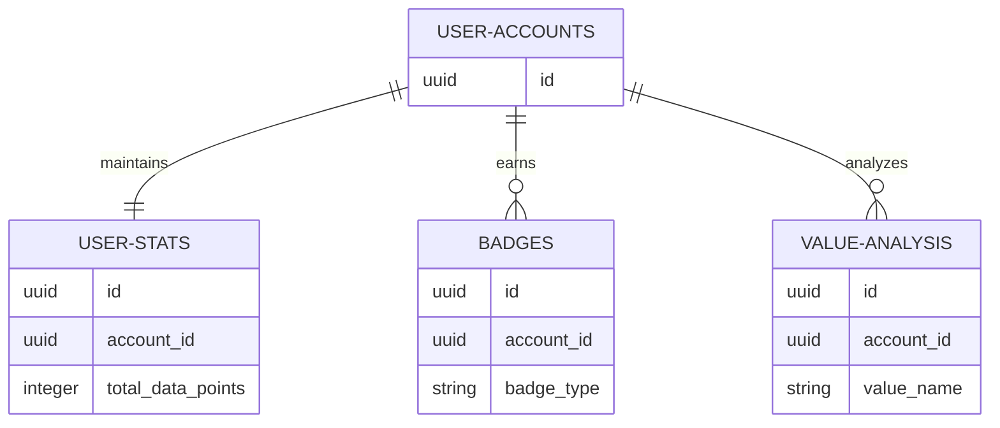

# PIP Project - Mermaid ERD (Entity Relationship Diagram)

Version: 2.0 - Minimal Schema (21 tables)
Last Updated: 2026.01.05  
Format: Mermaid ER Diagram

---

## Full Database ERD (21 tables - Minimal Schema)

```mermaid
erDiagram
    %% ==================== 1. IDENTITY LAYER ====================
    USER-ACCOUNTS ||--o{ ANONYMOUS-USER-IDENTITIES : creates
    USER-ACCOUNTS ||--o{ IDENTITY-MAPPINGS : "mapped-to"
    ANONYMOUS-USER-IDENTITIES ||--o{ IDENTITY-MAPPINGS : "linked-via"
    
    %% ==================== 2. USER PROFILE LAYER ====================
    USER-ACCOUNTS ||--|| USER-PROFILES : has
    
    %% ==================== 3. TIME SERIES DATA LAYER ====================
    ANONYMOUS-USER-IDENTITIES ||--o{ TIME-SERIES-DATA-POINTS : records
    ANONYMOUS-USER-IDENTITIES ||--o{ ML-FEATURE-VECTORS : generates
    ANONYMOUS-USER-IDENTITIES ||--o{ ML-MODEL-OUTPUTS : produces
    
    ML-FEATURE-VECTORS ||--o{ ML-MODEL-OUTPUTS : inputs-to
    
    %% ==================== 4. AGGREGATION LAYER ====================
    USER-ACCOUNTS ||--o{ DAILY-GEMS : generates
    TIME-SERIES-DATA-POINTS ||--o{ DAILY-GEMS : "aggregates-into"
    
    USER-ACCOUNTS ||--o{ PERIOD-REPORTS : generates
    
    %% ==================== 5. INSIGHT LAYER ====================
    ANONYMOUS-USER-IDENTITIES ||--o{ INSIGHTS : generates
    ANONYMOUS-USER-IDENTITIES ||--o{ ORB-VISUALIZATIONS : creates
    ANONYMOUS-USER-IDENTITIES ||--o{ INSIGHT-ANALYSIS-CARDS : produces
    ANONYMOUS-USER-IDENTITIES ||--o{ PREDICTION-DATA : predicts
    
    ML-MODEL-OUTPUTS ||--o{ INSIGHTS : "inputs-to"
    ML-MODEL-OUTPUTS ||--o{ ORB-VISUALIZATIONS : "data-for"
    ML-MODEL-OUTPUTS ||--o{ PREDICTION-DATA : "data-for"
    
    INSIGHTS ||--o{ ORB-VISUALIZATIONS : visualizes
    INSIGHTS ||--o{ INSIGHT-ANALYSIS-CARDS : "converts-to"
    
    %% ==================== 6. GOAL & PROGRAM LAYER ====================
    USER-ACCOUNTS ||--o{ GOALS : sets
    PROGRAMS ||--o{ USER-PROGRAM-ENROLLMENTS : offers
    USER-ACCOUNTS ||--o{ USER-PROGRAM-ENROLLMENTS : enrolls-in
    ANONYMOUS-USER-IDENTITIES ||--o{ USER-PROGRAM-ENROLLMENTS : "tracks"
    
    ANONYMOUS-USER-IDENTITIES ||--o{ PROGRAM-SPECIFIC-DATA-POINTS : "records"
    USER-PROGRAM-ENROLLMENTS ||--o{ PROGRAM-SPECIFIC-DATA-POINTS : "tracks"
    
    PROGRAMS ||--o{ PROGRAM-SUCCESS-METRICS : defines
    
    %% ==================== 7. ACHIEVEMENT & STATUS LAYER ====================
    USER-ACCOUNTS ||--|| USER-STATS : maintains
    USER-ACCOUNTS ||--o{ BADGES : earns
    USER-ACCOUNTS ||--o{ VALUE-ANALYSIS : analyzes

    %% ==================== TABLE DEFINITIONS ====================
    
    USER-ACCOUNTS {
        uuid id
        string email
        timestamp created_at
        boolean is_active
    }
    
    ANONYMOUS-USER-IDENTITIES {
        uuid id
        timestamp created_at
        boolean is_active
    }
    
    IDENTITY-MAPPINGS {
        uuid id
        uuid account_id
        uuid anonymous_user_id
        string encrypted_mapping
        timestamp created_at
        boolean is_active
    }
    
    USER-PROFILES {
        uuid id
        uuid account_id
        string profile_image_url
        string background_image_url
        string feature_color
        string onboarding_state
        string enabled_data_types
        string anonymization_level
        string permissions
        timestamp created_at
        timestamp updated_at
    }
    
    TIME-SERIES-DATA-POINTS {
        uuid id
        uuid anonymous_user_id
        timestamp timestamp
        date date
        string values
        string notes
        string category
        string source
        double confidence
        double completeness
        string features
        string predictions
        string anomalies
        timestamp created_at
        timestamp updated_at
    }
    
    ML-FEATURE-VECTORS {
        uuid id
        uuid anonymous_user_id
        date time_period_start
        date time_period_end
        string features
        string normalization_params
        timestamp created_at
    }
    
    ML-MODEL-OUTPUTS {
        uuid id
        uuid anonymous_user_id
        uuid ml_feature_vector_id
        string model_version
        double reconstruction_performance
        double prediction_accuracy
        string predictions
        string anomaly_scores
        timestamp executed_at
    }
    
    DAILY-GEMS {
        uuid id
        uuid account_id
        date date
        string gem_type
        double brightness
        double uncertainty
        string color_theme
        string data_point_ids
        timestamp created_at
    }
    
    PERIOD-REPORTS {
        uuid id
        uuid account_id
        string period_type
        date period_start_date
        date period_end_date
        string summary_metrics
        string insight_ids
        timestamp created_at
    }
    
    INSIGHTS {
        uuid id
        uuid anonymous_user_id
        uuid ml_model_output_id
        string type
        string title
        string description
        string findings
        string recommendations
        double confidence
        boolean is_actionable
        timestamp created_at
    }
    
    ORB-VISUALIZATIONS {
        uuid id
        uuid anonymous_user_id
        uuid ml_model_output_id
        uuid insight_id
        double brightness
        double border_brightness
        string color_gradient
        string data_point_ids
        string unique_features
        timestamp created_at
    }
    
    INSIGHT-ANALYSIS-CARDS {
        uuid id
        uuid anonymous_user_id
        uuid insight_id
        string title
        string description
        string pages
        string action_proposals
        boolean is_shared
        timestamp shared_at
        timestamp created_at
    }
    
    PREDICTION-DATA {
        uuid id
        uuid anonymous_user_id
        uuid ml_model_output_id
        string metric_name
        string predicted_values
        string confidence_intervals
        integer prediction_horizon
        timestamp created_at
    }
    
    GOALS {
        uuid id
        uuid account_id
        string title
        string description
        string category
        string status
        double progress
        date start_date
        date target_date
        string related_data_point_ids
        timestamp created_at
        timestamp updated_at
    }
    
    PROGRAMS {
        uuid id
        string title
        string description
        string category
        integer duration_weeks
        string difficulty
        string illustration_3d_url
        double popularity
        double rating
        integer review_count
        timestamp created_at
    }
    
    USER-PROGRAM-ENROLLMENTS {
        uuid id
        uuid account_id
        uuid anonymous_user_id
        uuid program_id
        string enrollment_status
        date start_date
        date target_completion_date
        date actual_completion_date
        string initial_metrics
        double success_progress
        double success_rate
        timestamp created_at
        timestamp updated_at
    }
    
    PROGRAM-SPECIFIC-DATA-POINTS {
        uuid id
        uuid anonymous_user_id
        uuid user_program_enrollment_id
        timestamp timestamp
        date date
        string values
        string notes
        double confidence
        double completeness
        timestamp created_at
        timestamp updated_at
    }
    
    PROGRAM-SUCCESS-METRICS {
        uuid id
        uuid program_id
        string metric_name
        double target_value
        string metric_type
        double weight
        string description
        timestamp created_at
    }
    
    USER-STATS {
        uuid id
        uuid account_id
        integer total_data_points
        integer total_gems
        integer streak_days
        timestamp last_recorded_at
        timestamp updated_at
    }
    
    BADGES {
        uuid id
        uuid account_id
        string name
        string description
        string badge_type
        string illustration_3d_url
        string color_scheme
        string condition
        string unlock_rule
        timestamp unlocked_at
    }
    
    VALUE-ANALYSIS {
        uuid id
        uuid account_id
        string value_name
        double value_score
        integer supporting_data_points
        timestamp analyzed_at
    }
```

---

## Layer-by-Layer ERD Breakdown

### Layer 1: Identity Layer (3 tables)

**Purpose:** User identity isolation and privacy preservation

---

### Layer 2: User Profile Layer (1 table - Consolidated)

**Key Changes (v2.0 - Minimal Schema):**
- Consolidated `ONBOARDING-STATES`, `USER-DATA-COLLECTION-SETTINGS`, `PIP-SCORES` into single `USER-PROFILES` table
- Reduced from 4 tables to 1 table
- All profile-related data now centralized
- `onboarding_state`, `enabled_data_types`, `anonymization_level`, `permissions` fields added to `USER-PROFILES`

---

### Layer 3: Time Series Data Layer (3 tables)

**Key Changes (v2.0 - Minimal Schema):**
- Removed `DATA-TYPE-SCHEMAS` table (hard-coded in application)
- Time series data validation moved to application level

---

### Layer 4: Aggregation Layer (2 tables)

**Key Changes (v2.0 - Minimal Schema):**
- Removed `DAILY-STATS` table (calculated in real-time from daily_gems)
- Removed `TREND-DATA` table (computed from insights analysis)
- Kept core aggregation tables: daily_gems and period_reports

---

### Layer 5: Insight Layer (4 tables)

**Purpose:** ML-driven insights visualization and analysis for Insights View

---

### Layer 6: Goal & Program Layer (5 tables)

**Key Changes (v2.0 - Minimal Schema):**
- Removed `GOAL-PROGRESS` table (tracked via user_program_enrollments.success_progress)
- Removed `GOAL-RECOMMENDATIONS` table (integrated into insights with type='recommendation')
- Removed `PROGRAM-REVIEWS` table (deferred to MVP+1)
- Kept core goal & program tracking tables

---

### Layer 7: Achievement & Status Layer (3 tables)

**Purpose:** User achievements, badges, and value analysis tracking

---

## Key Relationships Summary

| Source | Target | Relationship | Cardinality | Purpose |
|--------|--------|--------------|-------------|---------|
| user_accounts | anonymous_user_identities | creates | 1:Many | User identity isolation |
| user_accounts | user_profiles | has | 1:1 | Profile consolidation |
| user_accounts | daily_gems | generates | 1:Many | Home View gem visualization |
| user_accounts | period_reports | generates | 1:Many | Home View periodic summaries |
| anonymous_user_identities | time_series_data_points | records | 1:Many | WriteView data collection |
| time_series_data_points | daily_gems | aggregates-into | Many:1 | Daily aggregation |
| ml_model_outputs | insights | inputs-to | 1:Many | ML-driven insights |
| insights | insight_analysis_cards | converts-to | 1:Many | Insights View cards |
| insights | orb_visualizations | visualizes | 1:1 | Orb visualization |
| user_accounts | goals | sets | 1:Many | Goal View management |
| programs | user_program_enrollments | offers | 1:Many | Program enrollment |
| user_program_enrollments | program_specific_data_points | tracks | 1:Many | Goal View program tracking |

---

## Minimal Schema Changes (v1.0 → v2.0)

### Removed Tables (15 → Consolidated or Deferred)

| Removed Table | Reason | Alternative |
|---------------|--------|-------------|
| `daily_stats` | Redundant calculation | Real-time from daily_gems |
| `goal_progress` | Tracking redundancy | user_program_enrollments.success_progress |
| `goal_recommendations` | Insight integration | insights (type='recommendation') |
| `trend_data` | Derived from insights | Computed from insights analysis |
| `program_reviews` | MVP+1 feature | Deferred to Phase 2 |
| `data_type_schemas` | Hardcoded config | Application constants |
| `consent_records` | GDPR Phase 2 | Deferred implementation |
| `data_deletion_requests` | GDPR Phase 2 | Deferred implementation |
| `onboarding_states` | Profile merge | user_profiles.onboarding_state |
| `user_data_collection_settings` | Profile merge | user_profiles.enabled_data_types, anonymization_level, permissions |
| `pip_scores` | Calculated metric | Derived from insights analysis |

### Consolidated Tables

**user_profiles (was 4 tables)**
- Merged: USER-DATA-COLLECTION-SETTINGS, ONBOARDING-STATES, PIP-SCORES
- Fields added: onboarding_state, enabled_data_types, anonymization_level, permissions

---

## Schema Statistics

| Metric | v1.0 | v2.0 | Change |
|--------|------|------|--------|
| Total Tables | 36 | 21 | -42% |
| Identity Layer | 3 | 3 | - |
| Profile Layer | 4 | 1 | -75% |
| Time Series Layer | 3 | 3 | - |
| Aggregation Layer | 3 | 2 | -33% |
| Insight Layer | 4 | 4 | - |
| Goal & Program Layer | 8 | 5 | -37% |
| Achievement Layer | 3 | 3 | - |
| Relationships | 32 | 22 | -31% |

