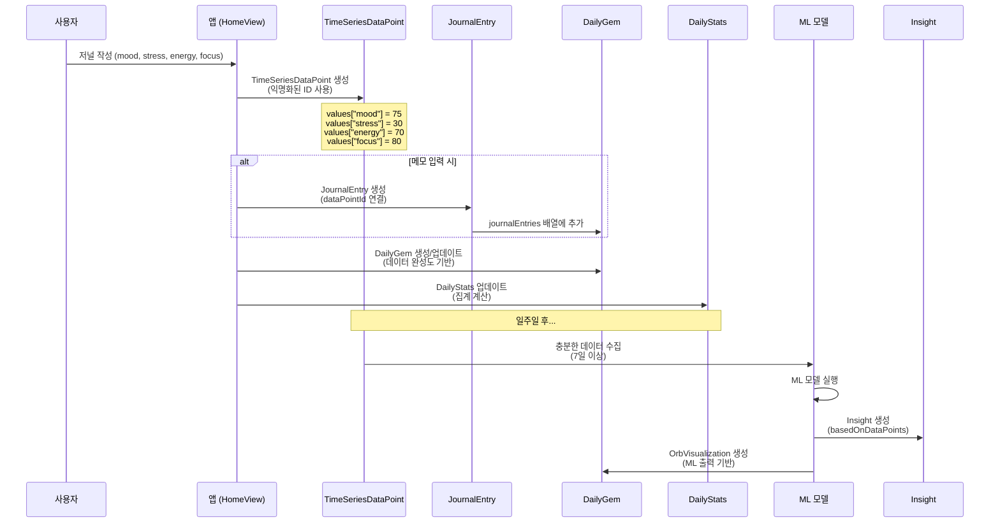
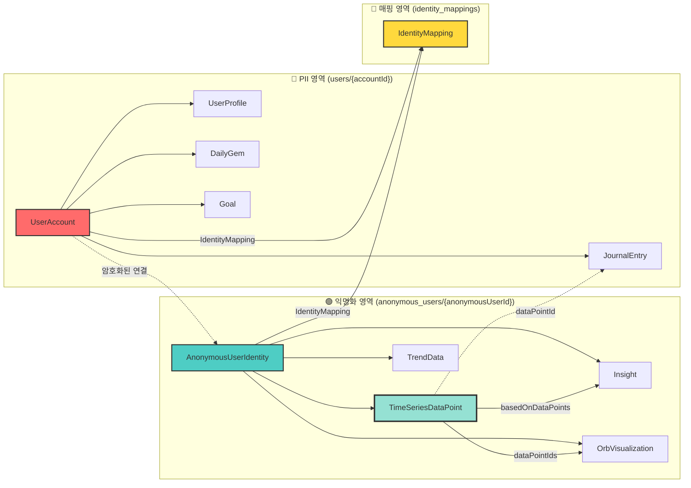
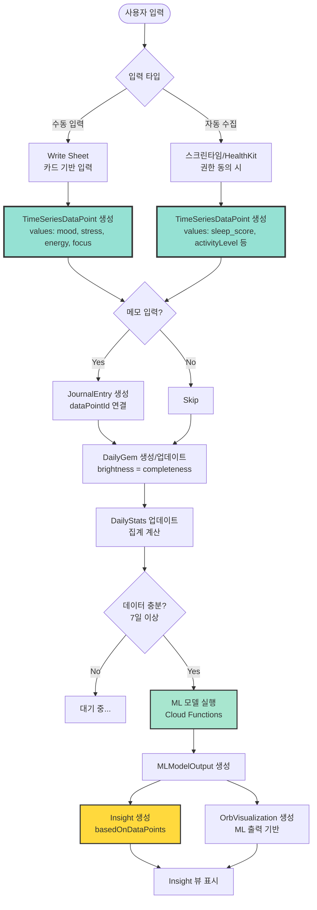
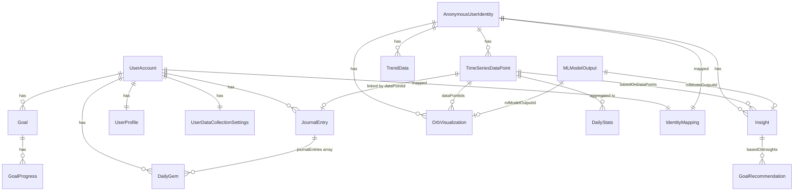
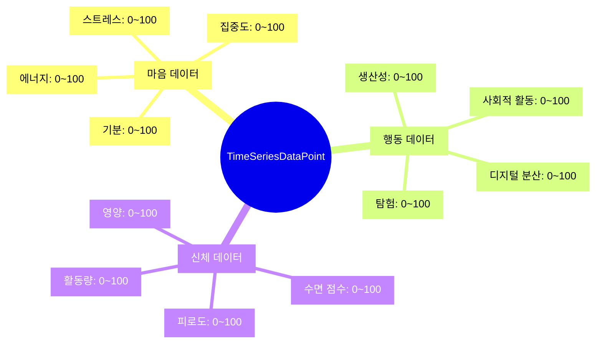
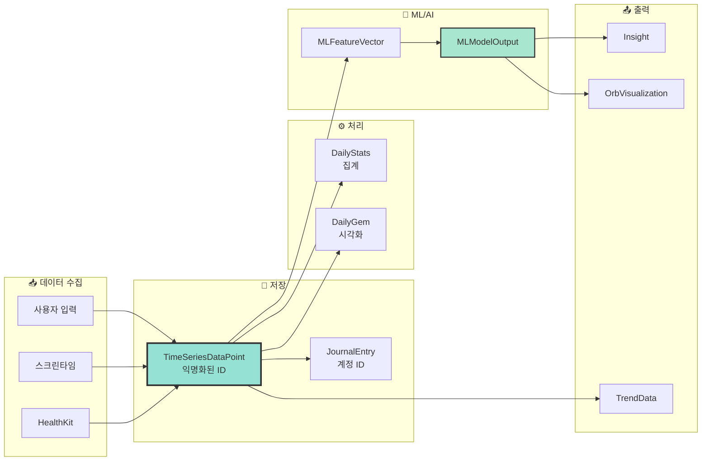

# 📊 데이터 스키마 및 예제 데이터 가이드

이 문서는 PIP 앱의 4개 주요 뷰(Home, Insight, Goal, Status)를 구현하기 위해 필요한 데이터 구조와 예제 데이터를 정의합니다.

---

## 목차

1. [데이터 모델 관계도](#데이터-모델-관계도)
2. [Home View 데이터](#1-home-view-데이터)
3. [Insight View 데이터](#2-insight-view-데이터)
4. [Goal View 데이터](#3-goal-view-데이터)
5. [Status View 데이터](#4-status-view-데이터)
6. [공통 데이터 구조](#5-공통-데이터-구조)

---

## 데이터 모델 관계도

### 전체 데이터 모델 아키텍처

```mermaid
graph TB
    subgraph Identity["🔐 Identity Layer (프라이버시 분리)"]
        UA[UserAccount<br/>PII 포함]
        AUI[AnonymousUserIdentity<br/>익명화된 ID]
        IM[IdentityMapping<br/>ID 매핑 테이블]
        CR[ConsentRecord<br/>동의 기록]
        
        UA -->|1:1| IM
        AUI -->|1:1| IM
        UA -->|1:N| CR
    end
    
    subgraph User["👤 User Layer (사용자 정보)"]
        UP[UserProfile<br/>프로필]
        UDCS[UserDataCollectionSettings<br/>수집 설정]
        OBS[OnboardingState<br/>온보딩 상태]
        PS[PIPScore<br/>종합 점수]
        
        UA -->|1:1| UP
        UA -->|1:1| UDCS
        UP -->|1:1| OBS
        UP -->|1:1| PS
    end
    
    subgraph Data["📊 Data Layer (시계열 데이터)"]
        TSP[TimeSeriesDataPoint<br/>시계열 데이터 포인트]
        DTS[DataTypeSchema<br/>데이터 타입 스키마]
        MLFV[MLFeatureVector<br/>ML 특징 벡터]
        MLMO[MLModelOutput<br/>ML 모델 출력]
        
        AUI -->|1:N| TSP
        DTS -->|스키마 정의| TSP
        TSP -->|특징 추출| MLFV
        MLFV -->|모델 입력| MLMO
    end
    
    subgraph Journal["📝 Journal Layer (저널링)"]
        JE[JournalEntry<br/>저널 엔트리]
        DG[DailyGem<br/>일일 Gem]
        DS[DailyStats<br/>일일 통계]
        
        UA -->|1:N| JE
        TSP -->|dataPointId| JE
        UA -->|1:N| DG
        JE -->|journalEntries 배열| DG
        TSP -->|집계| DS
        UA -->|1:N| DS
    end
    
    subgraph Insight["💡 Insight Layer (인사이트)"]
        INS[Insight<br/>인사이트]
        OV[OrbVisualization<br/>Orb 시각화]
        TD[TrendData<br/>트렌드 데이터]
        PD[PredictionData<br/>예측 데이터]
        
        AUI -->|1:N| INS
        TSP -->|basedOnDataPoints| INS
        MLMO -->|mlModelOutputId| INS
        AUI -->|1:N| OV
        TSP -->|dataPointIds| OV
        MLMO -->|mlModelOutputId| OV
        AUI -->|1:N| TD
        TSP -->|집계| TD
        AUI -->|1:N| PD
        MLMO -->|예측| PD
    end
    
    subgraph Goal["🎯 Goal Layer (목표)"]
        G[Goal<br/>목표]
        GP[GoalProgress<br/>진행 상황]
        P[Program<br/>프로그램]
        GR[GoalRecommendation<br/>목표 추천]
        
        UA -->|1:N| G
        G -->|1:N| GP
        INS -->|basedOnInsights| GR
        UA -->|1:N| GR
    end
    
    subgraph Status["📈 Status Layer (통계)"]
        US[UserStats<br/>사용자 통계]
        B[Badge<br/>뱃지]
        A[Achievement<br/>성취]
        VA[ValueAnalysis<br/>가치관 분석]
        
        UA -->|1:1| US
        UA -->|1:N| B
        UA -->|1:N| A
        UA -->|1:N| VA
        TSP -->|분석| VA
    end
    
    style UA fill:#ff6b6b,stroke:#333,stroke-width:2px
    style AUI fill:#4ecdc4,stroke:#333,stroke-width:2px
    style TSP fill:#95e1d3,stroke:#333,stroke-width:3px
    style JE fill:#f38181,stroke:#333,stroke-width:2px
    style INS fill:#a8e6cf,stroke:#333,stroke-width:2px
    style G fill:#ffd93d,stroke:#333,stroke-width:2px
```



### 데이터 수집 플로우



### Identity Separation 구조



### 데이터 수집 → 인사이트 생성 플로우



### 모델 간 참조 관계



### 데이터 카테고리별 구조



---

---

## 1. Home View 데이터

### 1.1. 핵심 기능
- 일일 저널링 기록 (스와이프 방식)
- Gem 시각화 (매일의 기록을 보석으로 표현)
- 레일로드(Railroad) 타임라인 표시

### 1.2. 데이터 모델

#### JournalEntry (기존 모델 확장)
```swift
struct JournalEntry: Identifiable, Codable {
    let id: UUID
    var date: Date
    var title: String?
    var content: String
    var emotionScore: Double  // 0.0 ~ 1.0 (감정 점수)
    
    // 추가 필드
    var category: JournalCategory  // 감정, 신체, 행동 등
    var tags: [String]            // 태그 배열
    var gemId: String?            // 생성된 Gem의 고유 ID
    var createdAt: Date
    var updatedAt: Date
}

enum JournalCategory: String, Codable {
    case emotion    // 감정
    case physical   // 신체
    case behavior   // 행동
    case thought    // 생각
}
```

#### DailyGem (일일 Gem 데이터)
```swift
struct DailyGem: Identifiable, Codable {
    let id: UUID
    var date: Date
    var gemType: GemType           // Gem의 기하학적 형태
    var brightness: Double         // 0.0 ~ 1.0 (데이터 완성도)
    var uncertainty: Double        // 0.0 ~ 1.0 (AI 모델 불확실성)
    var journalEntries: [UUID]     // 해당 날짜의 JournalEntry ID 배열
    var colorTheme: ColorTheme      // Gem의 색상 테마
    var createdAt: Date
}

enum GemType: String, Codable {
    case sphere      // 구체
    case diamond     // 다이아몬드
    case crystal     // 수정
    case prism       // 프리즘
    case custom      // 커스텀 형태
}

enum ColorTheme: String, Codable {
    case teal        // 기본 Teal
    case amber       // Amber Flame
    case tiger       // Tiger Flame
    case blue        // French Blue
}
```

#### DailyStats (일일 통계)
```swift
struct DailyStats: Codable {
    var date: Date
    var totalEntries: Int          // 해당 날짜의 총 기록 수
    var averageEmotionScore: Double // 평균 감정 점수
    var categories: [JournalCategory: Int] // 카테고리별 기록 수
    var completionRate: Double     // 0.0 ~ 1.0 (데이터 수집 완성도)
}
```

### 1.3. 예제 데이터

```swift
// 예제 JournalEntry
let exampleJournalEntry = JournalEntry(
    id: UUID(),
    date: Date(),
    title: "오늘의 감정",
    content: "오늘은 프로젝트가 잘 진행되어 기분이 좋았다.",
    emotionScore: 0.75,
    category: .emotion,
    tags: ["긍정", "성취", "프로젝트"],
    gemId: nil,
    createdAt: Date(),
    updatedAt: Date()
)

// 예제 DailyGem
let exampleDailyGem = DailyGem(
    id: UUID(),
    date: Calendar.current.startOfDay(for: Date()),
    gemType: .crystal,
    brightness: 0.85,
    uncertainty: 0.15,
    journalEntries: [UUID()],
    colorTheme: .teal,
    createdAt: Date()
)

// 예제 DailyStats
let exampleDailyStats = DailyStats(
    date: Calendar.current.startOfDay(for: Date()),
    totalEntries: 3,
    averageEmotionScore: 0.72,
    categories: [.emotion: 2, .physical: 1],
    completionRate: 0.75
)
```

---

## 2. Insight View 데이터

### 2.1. 핵심 기능
- 일/주/월 단위 트렌드 분석
- Orb 시각화 (데이터 완성도, 불확실성 표현)
- 예측 대시보드 (마음/행동/신체 점수)
- 스토리 형식 리포트

### 2.2. 데이터 모델

#### TrendData (트렌드 데이터)
```swift
struct TrendData: Identifiable, Codable {
    let id: UUID
    var period: TimePeriod         // 일/주/월
    var startDate: Date
    var endDate: Date
    var mindScore: Double          // 0.0 ~ 1.0 (마음 점수)
    var behaviorScore: Double      // 0.0 ~ 1.0 (행동 점수)
    var physicalScore: Double     // 0.0 ~ 1.0 (신체 점수)
    var overallScore: Double      // 0.0 ~ 1.0 (종합 점수)
    var dataCompleteness: Double   // 0.0 ~ 1.0 (데이터 완성도)
    var trendDirection: TrendDirection // 증가/감소/유지
    var createdAt: Date
}

enum TimePeriod: String, Codable {
    case daily    // 일간
    case weekly   // 주간
    case monthly  // 월간
}

enum TrendDirection: String, Codable {
    case increasing  // 증가
    case decreasing  // 감소
    case stable      // 유지
}
```

#### OrbData (Orb 시각화 데이터)
```swift
struct OrbData: Identifiable, Codable {
    let id: UUID
    var date: Date
    var brightness: Double         // 0.0 ~ 1.0 (데이터 완성도)
    var complexity: Int            // 1 ~ 10 (기하학적 다양성)
    var uncertainty: Double        // 0.0 ~ 1.0 (AI 모델 불확실성)
    var colorGradient: [String]    // 색상 그라데이션 배열 (Hex)
    var size: Double               // 0.5 ~ 2.0 (상대적 크기)
    var associatedTrendId: UUID?   // 연결된 TrendData ID
    var createdAt: Date
}
```

#### PredictionData (예측 데이터)
```swift
struct PredictionData: Identifiable, Codable {
    let id: UUID
    var targetDate: Date           // 예측 대상 날짜
    var predictedMindScore: Double  // 0.0 ~ 1.0
    var predictedBehaviorScore: Double
    var predictedPhysicalScore: Double
    var confidence: Double         // 0.0 ~ 1.0 (예측 신뢰도)
    var uncertainty: Double        // 0.0 ~ 1.0 (불확실성)
    var trendContext: String?      // 트렌드 맥락 설명
    var createdAt: Date
}
```

#### InsightReport (인사이트 리포트)
```swift
struct InsightReport: Identifiable, Codable {
    let id: UUID
    var title: String
    var subtitle: String?
    var reportType: ReportType
    var content: ReportContent
    var visualData: VisualData?    // 차트, 그래프 데이터
    var actionableInsights: [String] // 실행 가능한 인사이트
    var createdAt: Date
    var period: TimePeriod
}

enum ReportType: String, Codable {
    case trendAnalysis      // 트렌드 분석
    case patternDetection   // 패턴 감지
    case correlation        // 상관관계
    case recommendation     // 추천
    case achievement        // 성취
}

struct ReportContent: Codable {
    var summary: String
    var details: [String]
    var highlights: [String]
}

struct VisualData: Codable {
    var chartType: ChartType
    var dataPoints: [DataPoint]
    var labels: [String]
}

enum ChartType: String, Codable {
    case line
    case bar
    case pie
    case radar
}

struct DataPoint: Codable {
    var x: Double
    var y: Double
    var label: String?
}
```

### 2.3. 예제 데이터

```swift
// 예제 TrendData (주간)
let exampleWeeklyTrend = TrendData(
    id: UUID(),
    period: .weekly,
    startDate: Calendar.current.date(byAdding: .day, value: -7, to: Date())!,
    endDate: Date(),
    mindScore: 0.68,
    behaviorScore: 0.72,
    physicalScore: 0.65,
    overallScore: 0.68,
    dataCompleteness: 0.85,
    trendDirection: .increasing,
    createdAt: Date()
)

// 예제 OrbData
let exampleOrb = OrbData(
    id: UUID(),
    date: Date(),
    brightness: 0.80,
    complexity: 7,
    uncertainty: 0.20,
    colorGradient: ["#82EBEB", "#31B0B0", "#0B3D3D"],
    size: 1.2,
    associatedTrendId: UUID(),
    createdAt: Date()
)

// 예제 PredictionData
let examplePrediction = PredictionData(
    id: UUID(),
    targetDate: Calendar.current.date(byAdding: .day, value: 7, to: Date())!,
    predictedMindScore: 0.70,
    predictedBehaviorScore: 0.75,
    predictedPhysicalScore: 0.68,
    confidence: 0.75,
    uncertainty: 0.25,
    trendContext: "최근 일주일간 상승 추세를 보이고 있어, 다음 주에도 긍정적인 상태가 예상됩니다.",
    createdAt: Date()
)

// 예제 InsightReport
let exampleReport = InsightReport(
    id: UUID(),
    title: "이번 주 감정 패턴 분석",
    subtitle: "주간 리포트",
    reportType: .trendAnalysis,
    content: ReportContent(
        summary: "이번 주는 전반적으로 긍정적인 감정이 증가했습니다.",
        details: [
            "월요일부터 수요일까지 감정 점수가 상승했습니다.",
            "목요일과 금요일에 약간의 하락이 있었지만, 주말에 다시 회복되었습니다."
        ],
        highlights: [
            "평균 감정 점수: 0.72 (이전 주 대비 +0.05)",
            "가장 긍정적인 날: 수요일",
            "데이터 완성도: 85%"
        ]
    ),
    visualData: VisualData(
        chartType: .line,
        dataPoints: [
            DataPoint(x: 0, y: 0.65, label: "월"),
            DataPoint(x: 1, y: 0.70, label: "화"),
            DataPoint(x: 2, y: 0.75, label: "수"),
            DataPoint(x: 3, y: 0.68, label: "목"),
            DataPoint(x: 4, y: 0.70, label: "금"),
            DataPoint(x: 5, y: 0.72, label: "토"),
            DataPoint(x: 6, y: 0.74, label: "일")
        ],
        labels: ["월", "화", "수", "목", "금", "토", "일"]
    ),
    actionableInsights: [
        "수요일의 긍정적인 패턴을 유지하기 위해 비슷한 활동을 계획해보세요.",
        "목요일과 금요일의 하락 원인을 분석하여 대비책을 마련하세요."
    ],
    createdAt: Date(),
    period: .weekly
)
```

---

## 3. Goal View 데이터

### 3.1. 핵심 기능
- 목표/프로그램 관리
- 진행 상황 시각화
- Gem 형태로 프로그램 시각화
- 검색 및 추천

### 3.2. 데이터 모델

#### Goal (목표)
```swift
struct Goal: Identifiable, Codable {
    let id: UUID
    var title: String
    var description: String?
    var category: GoalCategory
    var targetDate: Date?         // 목표 달성 목표 날짜
    var startDate: Date
    var status: GoalStatus
    var progress: Double           // 0.0 ~ 1.0 (진행률)
    var gemVisualization: GemVisualization
    var milestones: [Milestone]
    var relatedJournalEntries: [UUID] // 관련 JournalEntry ID
    var createdAt: Date
    var updatedAt: Date
}

enum GoalCategory: String, Codable {
    case wellness      // 웰니스
    case productivity  // 생산성
    case emotional     // 감정 관리
    case physical      // 신체 건강
    case social        // 사회적 관계
    case learning      // 학습
    case custom        // 커스텀
}

enum GoalStatus: String, Codable {
    case active       // 진행 중
    case paused       // 일시 정지
    case completed    // 완료
    case cancelled    // 취소
}

struct GemVisualization: Codable {
    var gemType: GemType
    var colorTheme: ColorTheme
    var brightness: Double         // 진행률에 따라 조절
    var size: Double
    var customShape: String?       // 커스텀 형태 ID
}

struct Milestone: Identifiable, Codable {
    let id: UUID
    var title: String
    var description: String?
    var targetDate: Date?
    var completedDate: Date?
    var isCompleted: Bool
    var progress: Double
}
```

#### Program (프로그램)
```swift
struct Program: Identifiable, Codable {
    let id: UUID
    var name: String
    var description: String
    var category: GoalCategory
    var duration: Int              // 일 단위
    var difficulty: DifficultyLevel
    var gemVisualization: GemVisualization
    var steps: [ProgramStep]
    var prerequisites: [String]?   // 선행 조건
    var tags: [String]
    var isRecommended: Bool        // AI 추천 여부
    var createdAt: Date
}

enum DifficultyLevel: String, Codable {
    case beginner
    case intermediate
    case advanced
}

struct ProgramStep: Identifiable, Codable {
    let id: UUID
    var order: Int
    var title: String
    var description: String
    var duration: Int?             // 분 단위
    var isCompleted: Bool
    var completedDate: Date?
}
```

#### GoalProgress (목표 진행 상황)
```swift
struct GoalProgress: Identifiable, Codable {
    let id: UUID
    var goalId: UUID
    var date: Date
    var progress: Double           // 0.0 ~ 1.0
    var activitiesCompleted: Int
    var activitiesTotal: Int
    var notes: String?
    var createdAt: Date
}
```

### 3.3. 예제 데이터

```swift
// 예제 Goal
let exampleGoal = Goal(
    id: UUID(),
    title: "매일 명상하기",
    description: "하루 10분씩 명상을 통해 마음의 평온을 찾기",
    category: .wellness,
    targetDate: Calendar.current.date(byAdding: .day, value: 30, to: Date()),
    startDate: Calendar.current.date(byAdding: .day, value: -7, to: Date())!,
    status: .active,
    progress: 0.23,
    gemVisualization: GemVisualization(
        gemType: .crystal,
        colorTheme: .teal,
        brightness: 0.23,
        size: 1.0,
        customShape: nil
    ),
    milestones: [
        Milestone(
            id: UUID(),
            title: "1주차 완료",
            description: "7일 연속 명상",
            targetDate: Calendar.current.date(byAdding: .day, value: 7, to: Date()),
            completedDate: nil,
            isCompleted: false,
            progress: 0.85
        )
    ],
    relatedJournalEntries: [UUID()],
    createdAt: Date(),
    updatedAt: Date()
)

// 예제 Program
let exampleProgram = Program(
    id: UUID(),
    name: "스트레스 관리 프로그램",
    description: "일상의 스트레스를 효과적으로 관리하는 4주 프로그램",
    category: .emotional,
    duration: 28,
    difficulty: .intermediate,
    gemVisualization: GemVisualization(
        gemType: .prism,
        colorTheme: .amber,
        brightness: 0.5,
        size: 1.2,
        customShape: nil
    ),
    steps: [
        ProgramStep(
            id: UUID(),
            order: 1,
            title: "호흡법 익히기",
            description: "4-7-8 호흡법을 배우고 실천하기",
            duration: 10,
            isCompleted: false,
            completedDate: nil
        )
    ],
    prerequisites: nil,
    tags: ["스트레스", "명상", "웰니스"],
    isRecommended: true,
    createdAt: Date()
)

// 예제 GoalProgress
let exampleProgress = GoalProgress(
    id: UUID(),
    goalId: UUID(),
    date: Date(),
    progress: 0.23,
    activitiesCompleted: 7,
    activitiesTotal: 30,
    notes: "오늘도 성공적으로 명상을 완료했습니다.",
    createdAt: Date()
)
```

---

## 4. Status View 데이터

### 4.1. 핵심 기능
- 핵심 지표 요약 (총 기록, 연속 기록 등)
- 뱃지 시스템
- 가치관 분석
- 성과 시각화

### 4.2. 데이터 모델

#### UserStats (사용자 통계)
```swift
struct UserStats: Codable {
    var totalJournalEntries: Int
    var totalDaysActive: Int
    var currentStreak: Int         // 현재 연속 기록 일수
    var longestStreak: Int         // 최장 연속 기록 일수
    var totalGoalsCompleted: Int
    var totalProgramsCompleted: Int
    var averageEmotionScore: Double
    var totalGemsCreated: Int
    var lastUpdated: Date
}
```

#### Badge (뱃지)
```swift
struct Badge: Identifiable, Codable {
    let id: UUID
    var name: String
    var description: String
    var iconName: String           // 아이콘 이름
    var category: BadgeCategory
    var rarity: BadgeRarity
    var unlockedDate: Date?
    var isUnlocked: Bool
    var progress: Double           // 0.0 ~ 1.0 (뱃지 달성 진행률)
    var requirement: BadgeRequirement
    var createdAt: Date
}

enum BadgeCategory: String, Codable {
    case consistency   // 일관성
    case achievement   // 성취
    case milestone     // 마일스톤
    case special       // 특별
}

enum BadgeRarity: String, Codable {
    case common
    case rare
    case epic
    case legendary
}

struct BadgeRequirement: Codable {
    var type: RequirementType
    var targetValue: Int
    var currentValue: Int
}

enum RequirementType: String, Codable {
    case totalEntries      // 총 기록 수
    case streakDays        // 연속 기록 일수
    case goalsCompleted    // 완료한 목표 수
    case programsCompleted // 완료한 프로그램 수
    case custom            // 커스텀
}
```

#### ValueAnalysis (가치관 분석)
```swift
struct ValueAnalysis: Identifiable, Codable {
    let id: UUID
    var analysisDate: Date
    var topValues: [ValueItem]
    var valueDistribution: [ValueCategory: Double] // 0.0 ~ 1.0
    var comparisonData: ComparisonData?
    var insights: [String]
    var createdAt: Date
}

struct ValueItem: Identifiable, Codable {
    let id: UUID
    var name: String
    var score: Double              // 0.0 ~ 1.0
    var description: String?
    var trend: TrendDirection
}

enum ValueCategory: String, Codable {
    case health
    case relationships
    case career
    case personalGrowth
    case leisure
    case spirituality
}

struct ComparisonData: Codable {
    var userPercentile: Double    // 0.0 ~ 100.0 (사용자 백분위)
    var averageScore: Double      // 전체 평균 점수
    var uniqueAspects: [String]   // 사용자만의 고유한 특성
}
```

#### Achievement (성취)
```swift
struct Achievement: Identifiable, Codable {
    let id: UUID
    var title: String
    var description: String
    var category: AchievementCategory
    var unlockedDate: Date?
    var isUnlocked: Bool
    var iconName: String?
    var createdAt: Date
}

enum AchievementCategory: String, Codable {
    case consistency
    case growth
    case exploration
    case mastery
}
```

### 4.3. 예제 데이터

```swift
// 예제 UserStats
let exampleUserStats = UserStats(
    totalJournalEntries: 127,
    totalDaysActive: 45,
    currentStreak: 12,
    longestStreak: 18,
    totalGoalsCompleted: 5,
    totalProgramsCompleted: 2,
    averageEmotionScore: 0.68,
    totalGemsCreated: 45,
    lastUpdated: Date()
)

// 예제 Badge
let exampleBadge = Badge(
    id: UUID(),
    name: "일주일 연속 기록",
    description: "7일 연속으로 저널을 작성했습니다.",
    iconName: "flame.fill",
    category: .consistency,
    rarity: .common,
    unlockedDate: Date(),
    isUnlocked: true,
    progress: 1.0,
    requirement: BadgeRequirement(
        type: .streakDays,
        targetValue: 7,
        currentValue: 7
    ),
    createdAt: Date()
)

// 예제 ValueAnalysis
let exampleValueAnalysis = ValueAnalysis(
    id: UUID(),
    analysisDate: Date(),
    topValues: [
        ValueItem(
            id: UUID(),
            name: "개인 성장",
            score: 0.85,
            description: "자기계발과 학습에 높은 가치를 두고 있습니다.",
            trend: .increasing
        ),
        ValueItem(
            id: UUID(),
            name: "건강",
            score: 0.78,
            description: nil,
            trend: .stable
        )
    ],
    valueDistribution: [
        .personalGrowth: 0.85,
        .health: 0.78,
        .career: 0.65,
        .relationships: 0.60
    ],
    comparisonData: ComparisonData(
        userPercentile: 75.5,
        averageScore: 0.65,
        uniqueAspects: [
            "개인 성장에 대한 관심이 평균보다 높습니다.",
            "건강 관리에 일관성을 보입니다."
        ]
    ),
    insights: [
        "개인 성장에 대한 가치가 지속적으로 증가하고 있습니다.",
        "건강 관리에 대한 관심이 안정적으로 유지되고 있습니다."
    ],
    createdAt: Date()
)

// 예제 Achievement
let exampleAchievement = Achievement(
    id: UUID(),
    title: "첫 Gem 생성",
    description: "첫 번째 저널을 작성하여 Gem을 생성했습니다.",
    category: .exploration,
    unlockedDate: Date(),
    isUnlocked: true,
    iconName: "sparkles",
    createdAt: Date()
)
```

---

## 5. 공통 데이터 구조

### 5.1. PIP Score (종합 점수)
```swift
struct PIPScore: Codable {
    var overall: Double            // 0.0 ~ 1.0 (종합 점수)
    var mind: Double               // 0.0 ~ 1.0 (마음 점수)
    var behavior: Double           // 0.0 ~ 1.0 (행동 점수)
    var physical: Double           // 0.0 ~ 1.0 (신체 점수)
    var calculatedAt: Date
    var confidence: Double         // 0.0 ~ 1.0 (계산 신뢰도)
    var dataCompleteness: Double  // 0.0 ~ 1.0 (데이터 완성도)
}
```

### 5.2. User Profile (사용자 프로필)
```swift
struct UserProfile: Codable {
    var id: UUID
    var displayName: String?
    var email: String?
    var createdAt: Date
    var lastActiveAt: Date
    var preferences: UserPreferences
    var currentPIPScore: PIPScore?
}

struct UserPreferences: Codable {
    var theme: AppTheme
    var notificationsEnabled: Bool
    var language: String
    var timeZone: String
}

enum AppTheme: String, Codable {
    case dark
    case light
    case system
}
```

### 5.3. 예제 데이터

```swift
// 예제 PIPScore
let examplePIPScore = PIPScore(
    overall: 0.72,
    mind: 0.68,
    behavior: 0.75,
    physical: 0.65,
    calculatedAt: Date(),
    confidence: 0.85,
    dataCompleteness: 0.80
)

// 예제 UserProfile
let exampleUserProfile = UserProfile(
    id: UUID(),
    displayName: "사용자",
    email: "user@example.com",
    createdAt: Calendar.current.date(byAdding: .day, value: -60, to: Date())!,
    lastActiveAt: Date(),
    preferences: UserPreferences(
        theme: .dark,
        notificationsEnabled: true,
        language: "ko",
        timeZone: "Asia/Seoul"
    ),
    currentPIPScore: examplePIPScore
)
```

---

## 6. Firebase Firestore 스키마 구조

### 6.1. 컬렉션 구조 (Identity Separation 반영)

```mermaid
graph TB
    subgraph PII["🔴 PII 영역: users/{accountId}"]
        UP[profile/ - UserProfile]
        JE[journal_entries/{entryId}/ - JournalEntry]
        DG[daily_gems/{gemId}/ - DailyGem]
        DS[daily_stats/{date}/ - DailyStats]
        G[goals/{goalId}/ - Goal]
        GP[goals/{goalId}/progress/{progressId}/ - GoalProgress]
        B[badges/{badgeId}/ - Badge]
        A[achievements/{achievementId}/ - Achievement]
        US[stats/ - UserStats]
        VA[value_analysis/{analysisId}/ - ValueAnalysis]
        UDCS[settings/dataCollection/ - UserDataCollectionSettings]
        CR[consents/{consentId}/ - ConsentRecord]
    end
    
    subgraph Anonymous["🟢 익명화 영역: anonymous_users/{anonymousUserId}"]
        AUP[profile/ - AnonymousUserProfile]
        TSP[data_points/{dataPointId}/ - TimeSeriesDataPoint]
        MLFV[ml_features/{featureId}/ - MLFeatureVector]
        MLMO[ml_outputs/{outputId}/ - MLModelOutput]
        INS[insights/{insightId}/ - Insight]
        OV[orbs/{orbId}/ - OrbVisualization]
        TD[trends/{trendId}/ - TrendData]
        PD[predictions/{predictionId}/ - PredictionData]
    end
    
    subgraph Mapping["🔐 매핑: identity_mappings/{mappingId}"]
        IM[IdentityMapping]
    end
    
    subgraph Global["🌐 글로벌: programs/{programId}"]
        P[Program]
    end
    
    subgraph ML["🤖 ML: ml_datasets/{datasetId}, ml_models/{modelId}"]
        MLDS[MLTrainingDataset]
        MLMM[MLModelMetadata]
    end
```

### 6.2. 데이터 흐름 다이어그램



### 6.3. 인덱스 권장사항

**users/{accountId}/journal_entries**
- `date` (descending)
- `category`
- `createdAt` (descending)

**users/{accountId}/daily_gems**
- `date` (descending)

**users/{accountId}/goals**
- `status`
- `targetDate`
- `progress`

**anonymous_users/{anonymousUserId}/data_points**
- `timestamp` (descending)
- `date` (descending)
- `source`

**anonymous_users/{anonymousUserId}/insights**
- `type`
- `createdAt` (descending)
- `confidence`

**anonymous_users/{anonymousUserId}/trends**
- `period`
- `startDate`
- `endDate`

---

## 7. 데이터 모델 연결 요약

### 7.1. 핵심 연결 포인트

1. **Identity Separation**
   - `UserAccount` ↔ `IdentityMapping` ↔ `AnonymousUserIdentity`
   - PII 데이터와 분석 데이터 완전 분리

2. **데이터 수집**
   - `TimeSeriesDataPoint`가 모든 데이터의 중심
   - `values` 딕셔너리에 동적 데이터 저장 (mood, stress, energy, focus 등)

3. **저널링**
   - `JournalEntry.dataPointId` → `TimeSeriesDataPoint.id`
   - `DailyGem.journalEntries` → `JournalEntry.id` 배열

4. **인사이트 생성**
   - `Insight.basedOnDataPoints` → `TimeSeriesDataPoint.id` 배열
   - `OrbVisualization.dataPointIds` → `TimeSeriesDataPoint.id` 배열
   - `MLModelOutput` → `Insight.mlModelOutputId`, `OrbVisualization.mlModelOutputId`

5. **목표 추천**
   - `GoalRecommendation.basedOnInsights` → `Insight.id` 배열

### 7.2. 데이터 흐름 예시

**시나리오: 사용자가 저널 작성**

```
1. 사용자 입력 (mood: 75, stress: 30, energy: 70, focus: 80)
   ↓
2. TimeSeriesDataPoint 생성
   - anonymousUserId 사용 (익명화)
   - values["mood"] = 75
   - values["stress"] = 30
   - values["energy"] = 70
   - values["focus"] = 80
   ↓
3. JournalEntry 생성 (메모 입력 시)
   - accountId 사용 (PII 영역)
   - dataPointId = TimeSeriesDataPoint.id
   ↓
4. DailyGem 생성/업데이트
   - accountId 사용
   - journalEntries = [JournalEntry.id]
   - brightness = TimeSeriesDataPoint.completeness
   ↓
5. DailyStats 업데이트
   - accountId 사용
   - mindScore = (mood + (100-stress) + energy + focus) / 400
   - overallCompleteness 계산
```

**시나리오: 인사이트 생성 (7일 후)**

```
1. TimeSeriesDataPoint 7개 이상 수집
   ↓
2. ML 모델 실행 (Cloud Functions)
   - TimeSeriesDataPoint 배열 → MLFeatureVector
   - ML 모델 → MLModelOutput
   ↓
3. Insight 생성
   - anonymousUserId 사용
   - basedOnDataPoints = [TimeSeriesDataPoint.id 배열]
   - mlModelOutputId = MLModelOutput.id
   ↓
4. OrbVisualization 생성
   - anonymousUserId 사용
   - dataPointIds = [TimeSeriesDataPoint.id 배열]
   - mlModelOutputId = MLModelOutput.id
   - brightness, complexity, uncertainty 계산
```

---

## 8. 다음 단계

1. **모델 파일 생성**: ✅ 완료
2. **MockData 생성**: UI 검증용 샘플 데이터 생성
3. **ViewModel 구현**: 각 뷰에 맞는 ViewModel 작성
4. **Service 레이어**: Firebase 연동을 위한 Service 클래스 작성
5. **UI 컴포넌트**: Gem, Orb 등의 시각화 컴포넌트 구현

---

**작성일**: 2025.12  
**버전**: 1.0  
**상태**: 초안
