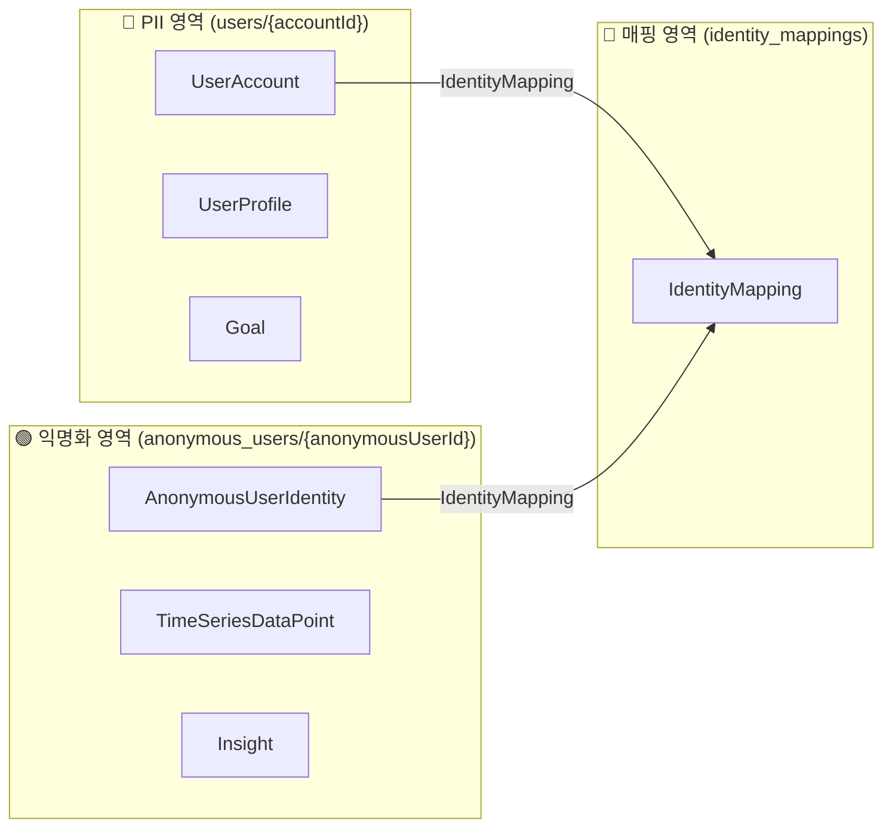

# 🗄️ PIP 프로젝트 DB 설계 (핵심 요약)

이 문서는 PIP 프로젝트의 핵심 데이터 모델과 구조를 간결하게 설명합니다. 상세한 필드 정보와 전체 스키마는 `01_Planning/DATABASE_SCHEMA_DBDIAGRAM.sql` 파일을 참조하세요.

## 1. 핵심 아키텍처: 개인정보 보호 설계

우리 앱은 사용자의 개인정보(PII)와 분석 데이터를 물리적으로 분리하여 프라이버시를 최우선으로 보호합니다.

-   **🔴 PII 영역 (User-specific):** 사용자 계정에 직접 연결되는 데이터 (프로필, 목표 등)
-   **🟢 익명 영역 (Anonymous):** 개인을 식별할 수 없는 순수 분석/머신러닝용 데이터 (시계열 데이터, 인사이트 등)

## 2. 데이터 모델 ERD

아래 다이어그램은 주요 데이터 모델(32개 테이블) 간의 관계를 보여줍니다.

> **[참고]** 더 상세하고 인터랙티브한 ERD는 [dbdiagram.io](https://dbdiagram.io)에서 `DATABASE_SCHEMA_DBDIAGRAM.sql` 파일을 열어 확인하세요.

```mermaid
erDiagram
    %% Identity Layer
    UserAccount ||--|| IdentityMapping : "accountId"
    AnonymousUserIdentity ||--|| IdentityMapping : "anonymousUserId"
    UserAccount ||--o{ ConsentRecord : "has"
    
    %% User Profile Layer
    UserAccount ||--|| UserProfile : "has"
    UserAccount ||--|| UserDataCollectionSettings : "has"
    UserAccount ||--|| UserStats : "has"
    UserProfile ||--|| OnboardingState : "has"
    UserProfile ||--|| PIPScore : "has"
    
    %% Data Collection Layer (PII 영역)
    UserAccount ||--o{ DailyGem : "accountId"
    UserAccount ||--o{ DailyStats : "accountId"
    
    %% Data Collection Layer (익명화 영역)
    AnonymousUserIdentity ||--o{ TimeSeriesDataPoint : "has"
    TimeSeriesDataPoint ||--|| DataTypeSchema : "follows"
    
    %% Aggregation Layer
    TimeSeriesDataPoint ||--o{ DailyGem : "dataPointIds"
    TimeSeriesDataPoint ||--o{ DailyStats : "aggregated to"
    
    %% ML Layer
    TimeSeriesDataPoint ||--o{ MLFeatureVector : "extracted from"
    MLFeatureVector ||--o{ MLModelOutput : "inputs to"
    
    %% Insight Layer
    AnonymousUserIdentity ||--o{ Insight : "has"
    AnonymousUserIdentity ||--o{ OrbVisualization : "has"
    AnonymousUserIdentity ||--o{ TrendData : "has"
    AnonymousUserIdentity ||--o{ InsightAnalysisCard : "has"
    
    TimeSeriesDataPoint ||--o{ Insight : "basedOnDataPoints"
    TimeSeriesDataPoint ||--o{ OrbVisualization : "dataPointIds"
    TimeSeriesDataPoint ||--o{ TrendData : "aggregated from"
    
    MLModelOutput ||--|| Insight : "mlModelOutputId"
    MLModelOutput ||--|| OrbVisualization : "mlModelOutputId"
    
    Insight ||--o{ InsightAnalysisCard : "insightId"
    Insight ||--o{ GoalRecommendation : "basedOnInsights"
    
    %% Goal Layer (PII 영역)
    UserAccount ||--o{ Goal : "accountId"
    Goal ||--o{ GoalProgress : "has"
    
    %% Program Layer (공유 영역)
    Program ||--o{ ProgramReview : "has"
    
    %% Achievement Layer (PII 영역)
    UserAccount ||--o{ Achievement : "accountId"
    UserAccount ||--o{ Badge : "accountId"
    UserAccount ||--o{ ValueAnalysis : "accountId"
    
    %% ML Training (관리자 전용)
    TimeSeriesDataPoint ||--o{ MLTrainingDataset : "training data"
```

## 3. 주요 모델 설명

-   **UserAccount**: 사용자 인증 및 계정 정보
-   **AnonymousUserIdentity**: 개인 식별이 불가능한 익명 ID
-   **IdentityMapping**: `UserAccount`와 `AnonymousUserIdentity`를 연결하는 보안 매핑
-   **UserProfile**: 이름, 사진 등 사용자 프로필 정보
-   **TimeSeriesDataPoint**: 모든 측정 데이터(마음, 행동, 신체)가 기록되는 핵심 시계열 데이터
-   **Insight**: 시계열 데이터를 분석하여 도출된 통찰 또는 패턴
-   **Goal**: 사용자가 설정한 목표
-   **Program**: 목표 달성을 돕는 추천 프로그램
-   **DailyGem**: 하루의 데이터를 요약하여 보여주는 시각적 요소
-   **OrbVisualization**: 주간/월간 데이터 패턴을 시각화하는 요소
-   **Achievement**: 목표 달성, 프로그램 완료 등을 통해 얻는 성취
-   **UserStats**: 총 기록 수, 연속 기록일 등 사용자의 전반적인 통계

## 4. 앞으로의 작업 (To-Do)

-   [ ] Firestore 실제 컬렉션/도큐먼트 구조 설계 및 문서화
-   [ ] 주요 엔티티별 최소 필드 정의 (UserAccount, TimeSeriesDataPoint 등)
-   [ ] 데이터 수집/집계/인사이트 생성 플로우 간단 도식화
-   [ ] Cloud Functions 자동화 설계 (예: 집계, 익명화, 삭제)
-   [ ] 데이터 마이그레이션/초기화 전략 수립
-   [ ] (선택) dbdiagram.io 등 외부 ERD 툴로 시각화