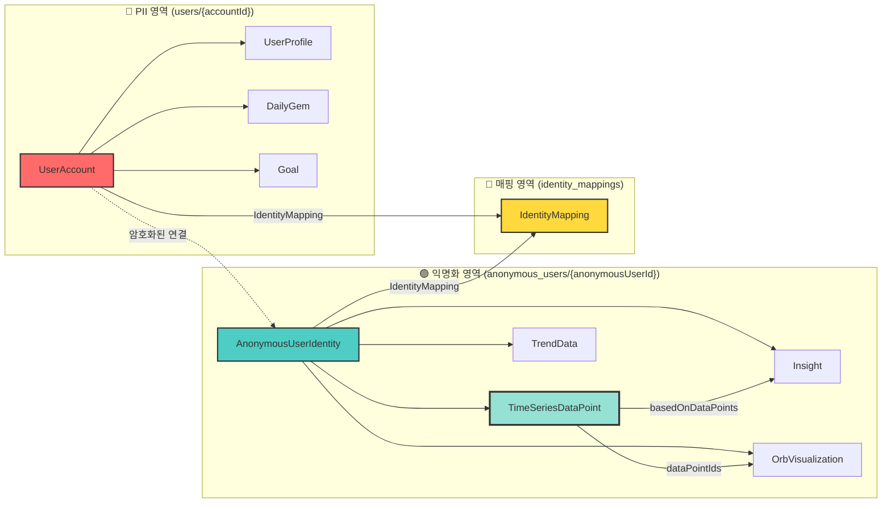
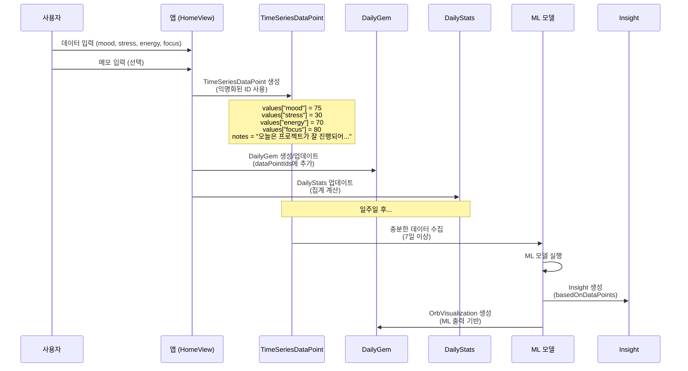
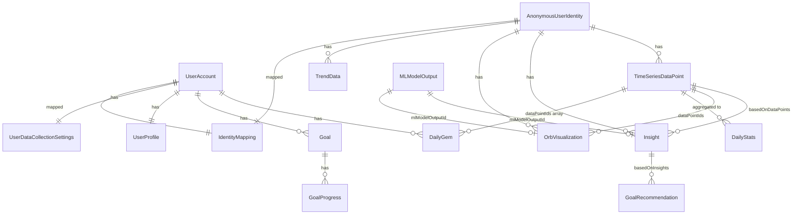
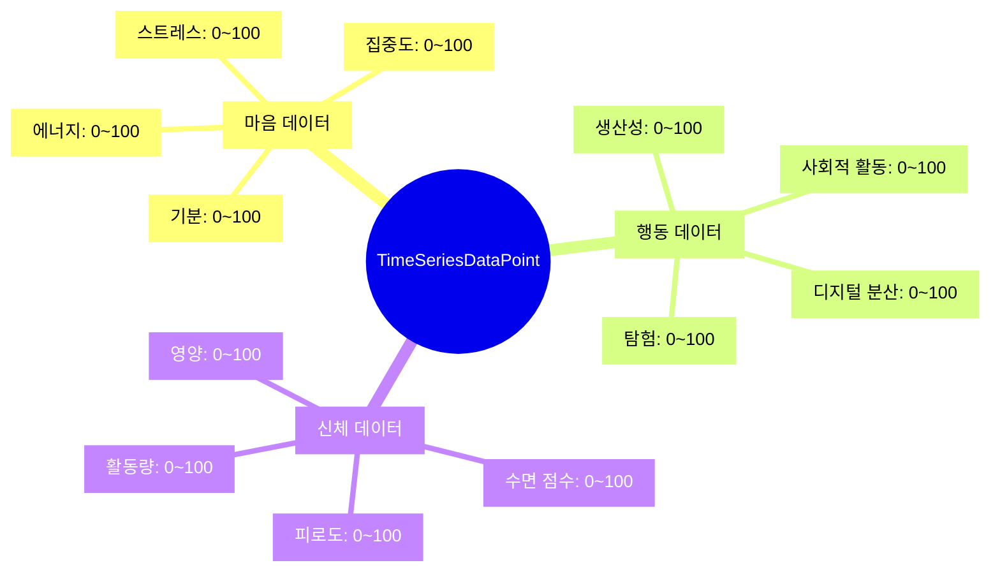

# 🗄️ PIP 프로젝트 DB 모델 설계 기획안

**작성일**: 2025.12  
**버전**: 2.0  
**상태**: 설계 완료

---

## 📋 목차

1. [개요](#1-개요)
2. [데이터 모델 아키텍처](#2-데이터-모델-아키텍처)
3. [Models 디렉토리 구조](#3-models-디렉토리-구조)
4. [핵심 데이터 모델 상세](#4-핵심-데이터-모델-상세)
5. [Firebase Firestore 통합 설계](#5-firebase-firestore-통합-설계)
6. [데이터 수집 시나리오](#6-데이터-수집-시나리오)
7. [재설계 요약](#7-재설계-요약)
8. [마이그레이션 고려사항](#8-마이그레이션-고려사항)

---

## 1. 개요

### 1.1. 설계 원칙

1. **Identity Separation (프라이버시 분리)**
   - PII (개인 식별 정보)와 분석 데이터 완전 분리
   - `UserAccount` (PII) ↔ `AnonymousUserIdentity` (익명화)
   - `IdentityMapping`으로 암호화된 연결

2. **TimeSeriesDataPoint 중심 설계**
   - 모든 데이터 수집의 핵심 엔티티
   - 동적 `values` 딕셔너리로 확장 가능
   - ML/AI 모델 입력으로 직접 사용

3. **오컴의 면도날 원칙**
   - `JournalEntry` 제거 → `TimeSeriesDataPoint.notes`로 통합
   - 불필요한 복잡성 제거

4. **Responsible & Ethical AI**
   - 데이터 최소화
   - 명시적 동의
   - 삭제 권리 보장

### 1.2. 주요 변경사항 (v2.0)

- ✅ `JournalEntry` 완전 제거
- ✅ `TimeSeriesDataPoint.notes`로 메모 통합
- ✅ `DailyGem.journalEntries` → `DailyGem.dataPointIds`
- ✅ `DailyStats.totalEntries` → `DailyStats.totalDataPoints`
- ✅ `Goal.relatedJournalEntries` → `Goal.relatedDataPointIds`

---

## 2. 데이터 모델 아키텍처

### 2.1. 전체 데이터 모델 관계도

```mermaid
graph TB
    subgraph Identity["🔐 Identity Layer (프라이버시 분리)"]
        UA[UserAccount<br/>PII 포함]
        AUI[AnonymousUserIdentity<br/>익명화된 ID]
        IM[IdentityMapping<br/>ID 매핑 테이블]
        CR[ConsentRecord<br/>동의 기록]
        
        UA -->|1:1| IM
        AUI -->|1:1| IM
        UA -->|1:N| CR
    end
    
    subgraph User["👤 User Layer (사용자 정보)"]
        UP[UserProfile<br/>프로필]
        UDCS[UserDataCollectionSettings<br/>수집 설정]
        OBS[OnboardingState<br/>온보딩 상태]
        PS[PIPScore<br/>종합 점수]
        
        UA -->|1:1| UP
        UA -->|1:1| UDCS
        UP -->|1:1| OBS
        UP -->|1:1| PS
    end
    
    subgraph Data["📊 Data Layer (시계열 데이터)"]
        TSP[TimeSeriesDataPoint<br/>시계열 데이터 포인트]
        DTS[DataTypeSchema<br/>데이터 타입 스키마]
        MLFV[MLFeatureVector<br/>ML 특징 벡터]
        MLMO[MLModelOutput<br/>ML 모델 출력]
        
        AUI -->|1:N| TSP
        DTS -->|스키마 정의| TSP
        TSP -->|특징 추출| MLFV
        MLFV -->|모델 입력| MLMO
    end
    
    subgraph Visualization["💎 Visualization Layer (시각화)"]
        DG[DailyGem<br/>일일 Gem]
        DS[DailyStats<br/>일일 통계]
        
        UA -->|1:N| DG
        TSP -->|dataPointIds 배열| DG
        TSP -->|집계| DS
        UA -->|1:N| DS
    end
    
    subgraph Insight["💡 Insight Layer (인사이트)"]
        INS[Insight<br/>인사이트]
        OV[OrbVisualization<br/>Orb 시각화]
        TD[TrendData<br/>트렌드 데이터]
        PD[PredictionData<br/>예측 데이터]
        
        AUI -->|1:N| INS
        TSP -->|basedOnDataPoints| INS
        MLMO -->|mlModelOutputId| INS
        AUI -->|1:N| OV
        TSP -->|dataPointIds| OV
        MLMO -->|mlModelOutputId| OV
        AUI -->|1:N| TD
        TSP -->|집계| TD
        AUI -->|1:N| PD
        MLMO -->|예측| PD
    end
    
    subgraph Goal["🎯 Goal Layer (목표)"]
        G[Goal<br/>목표]
        GP[GoalProgress<br/>진행 상황]
        P[Program<br/>프로그램]
        GR[GoalRecommendation<br/>목표 추천]
        
        UA -->|1:N| G
        G -->|1:N| GP
        INS -->|basedOnInsights| GR
        UA -->|1:N| GR
    end
    
    subgraph Status["📈 Status Layer (통계)"]
        US[UserStats<br/>사용자 통계]
        B[Badge<br/>뱃지]
        A[Achievement<br/>성취]
        VA[ValueAnalysis<br/>가치관 분석]
        
        UA -->|1:1| US
        UA -->|1:N| B
        UA -->|1:N| A
        UA -->|1:N| VA
        TSP -->|분석| VA
    end
    
    style UA fill:#ff6b6b,stroke:#333,stroke-width:2px
    style AUI fill:#4ecdc4,stroke:#333,stroke-width:2px
    style TSP fill:#95e1d3,stroke:#333,stroke-width:3px
    style INS fill:#a8e6cf,stroke:#333,stroke-width:2px
    style G fill:#ffd93d,stroke:#333,stroke-width:2px
```



### 2.2. Identity Separation 구조



### 2.3. 데이터 수집 → 인사이트 생성 플로우



### 2.4. 모델 간 참조 관계 (ER Diagram)



### 2.5. 데이터 카테고리별 구조



---

## 3. Models 디렉토리 구조

### 3.1. 최종 Models 구조

```
Models/
├── Identity/
│   └── IdentityModels.swift
│       - UserAccount
│       - AnonymousUserIdentity
│       - IdentityMapping
│       - ConsentRecord
│       - DataDeletionRequest
│
├── User/
│   └── UserProfileModels.swift
│       - UserProfile
│       - UserPreferences
│       - AnonymousUserProfile
│       - OnboardingState
│       - UserDataCollectionSettings
│       - PIPScore
│
├── Data/
│   ├── DataSchemaModels.swift
│   │   - DataTypeSchema
│   │   - DataValue
│   │   - ValueRange
│   │
│   ├── TimeSeriesModels.swift
│   │   - TimeSeriesDataPoint ⭐ (핵심 데이터 모델)
│   │   - MLFeatureVector
│   │   - MLModelOutput
│   │   - MLTrainingDataset
│   │   - MLModelMetadata
│   │
│   └── DataModels.swift
│       - DailyGem
│       - DailyStats
│       - GemType
│       - ColorTheme
│
└── Features/
    ├── InsightModels.swift
    │   - Insight
    │   - OrbVisualization
    │   - TrendData
    │   - PredictionData
    │
    ├── GoalModels.swift
    │   - Goal
    │   - Program
    │   - GoalProgress
    │   - GoalRecommendation
    │
    └── StatusModels.swift
        - UserStats
        - Badge
        - Achievement
        - ValueAnalysis
```

### 3.2. 주요 변경사항

**✅ 제거된 것**:
- `Journal/JournalModels.swift` (파일 삭제)
- `JournalEntry` 구조체
- `JournalCategory` enum (필요시 `DataCategory` 사용)

**✅ 변경된 것**:
- `DailyGem.journalEntries` → `DailyGem.dataPointIds`
- `DailyStats.totalEntries` → `DailyStats.totalDataPoints`
- `DailyStats.categories` → `DailyStats.notesByCategory`
- `Goal.relatedJournalEntries` → `Goal.relatedDataPointIds`
- `TimeSeriesDataPoint`에 `category` 필드 추가

**✅ 추가된 것**:
- `DataModels.swift` (DailyGem, DailyStats 포함)
- `DailyStats.notesCount` (메모가 있는 데이터 포인트 수)

---

## 4. 핵심 데이터 모델 상세

### 4.1. TimeSeriesDataPoint (핵심 모델)

```swift
struct TimeSeriesDataPoint: Identifiable, Codable {
    let id: UUID
    var anonymousUserId: UUID         // ✅ 익명화된 ID만 사용
    
    // 시계열 메타데이터
    var timestamp: Date               // 정확한 시각
    var date: Date                    // 날짜 (일자 기준)
    var timeOfDay: TimeOfDay?
    var dayOfWeek: Int?               // 1=일요일, 7=토요일
    var weekOfYear: Int?
    var month: Int?
    
    // 데이터 값 (동적 구조)
    var values: [String: DataValue]   // "mood": 75, "sleep_score": 80 등
    
    // 메타데이터 (PII 제거된)
    var notes: String?                // 사용자 메모 (PII 제거 로직 적용)
    var tags: [String]                // 일반 태그만
    var context: [String: String]?    // PII 없는 컨텍스트
    var category: DataCategory?       // 데이터 카테고리 (메모 분류용)
    
    // 데이터 소스 및 품질
    var source: DataSource
    var confidence: Double            // 0.0 ~ 1.0 (데이터 신뢰도)
    var completeness: Double          // 0.0 ~ 1.0 (해당 시점의 데이터 완성도)
    
    // ML/AI 관련
    var features: [String: Double]?   // ML 모델용 추출된 특징값
    var predictions: [String: Double]? // 예측값
    var anomalies: [String]?          // 이상 징후
    
    var createdAt: Date
    var updatedAt: Date
    
    var anonymousUserIdString: String {
        anonymousUserId.uuidString
    }
    
    var dataPointIdString: String {
        id.uuidString
    }
}
```

**주요 특징**:
- 모든 데이터 수집의 중심 엔티티
- `values` 딕셔너리로 동적 데이터 저장
- `notes` 필드로 메모 통합 (PII 제거 후)
- ML/AI 모델 입력으로 직접 사용 가능

### 4.2. DailyGem (일일 Gem 시각화)

```swift
struct DailyGem: Identifiable, Codable {
    let id: UUID
    var accountId: UUID
    var date: Date
    var gemType: GemType           // Gem의 기하학적 형태
    var brightness: Double         // 0.0 ~ 1.0 (데이터 완성도)
    var uncertainty: Double        // 0.0 ~ 1.0 (AI 모델 불확실성)
    var dataPointIds: [String]     // ✅ 해당 날짜의 TimeSeriesDataPoint ID 배열
    var colorTheme: ColorTheme      // Gem의 색상 테마
    var createdAt: Date
}
```

**변경사항**: `journalEntries` → `dataPointIds`로 변경

### 4.3. DailyStats (일일 통계)

```swift
struct DailyStats: Codable {
    var accountId: UUID
    var date: Date
    var totalDataPoints: Int        // ✅ 해당 날짜의 총 데이터 포인트 수
    var notesCount: Int             // ✅ 메모가 있는 데이터 포인트 수
    
    // 마음/행동/신체 점수
    var mindScore: Double?          // 0.0 ~ 1.0 (마음 평균 점수)
    var behaviorScore: Double?     // 0.0 ~ 1.0 (행동 평균 점수)
    var physicalScore: Double?     // 0.0 ~ 1.0 (신체 평균 점수)
    var overallScore: Double?       // 0.0 ~ 1.0 (종합 점수)
    
    // 데이터 완성도
    var mindCompleteness: Double    // 0.0 ~ 1.0 (마음 데이터 완성도)
    var behaviorCompleteness: Double // 0.0 ~ 1.0 (행동 데이터 완성도)
    var physicalCompleteness: Double // 0.0 ~ 1.0 (신체 데이터 완성도)
    var overallCompleteness: Double  // 0.0 ~ 1.0 (전체 데이터 완성도)
    
    // 카테고리별 기록 수 (TimeSeriesDataPoint의 notes 기반)
    var notesByCategory: [String: Int]  // ✅ 카테고리별 메모 수
    
    // 데이터 수집 소스별 통계
    var dataSourceCounts: [String: Int]  // DataSource.rawValue를 키로 사용
}
```

**변경사항**:
- `totalEntries` → `totalDataPoints`
- `notesCount` 추가
- `categories` → `notesByCategory`

### 4.4. Goal (목표)

```swift
struct Goal: Identifiable, Codable {
    let id: UUID
    var accountId: UUID
    var title: String
    var description: String?
    var category: GoalCategory
    var targetDate: Date?
    var startDate: Date
    var status: GoalStatus
    var progress: Double           // 0.0 ~ 1.0 (진행률)
    var gemVisualization: GemVisualization
    var milestones: [Milestone]
    var relatedDataPointIds: [String]    // ✅ 관련 TimeSeriesDataPoint ID 배열
    var createdAt: Date
    var updatedAt: Date
}
```

**변경사항**: `relatedJournalEntries` → `relatedDataPointIds`

---

## 5. Firebase Firestore 통합 설계

### 5.1. Firestore 컬렉션 구조

#### 5.1.1. 사용자 계정 (PII 포함)

```
users/
  {accountId}/
    account/
      - UserAccount
    profile/
      - UserProfile
    settings/
      dataCollection/
        - UserDataCollectionSettings
      consentStatus/
        - UserConsentStatus
    consents/
      {consentId}/
        - ConsentRecord
    daily_gems/
      {gemId}/
        - DailyGem
    daily_stats/
      {date}/
        - DailyStats
    goals/
      {goalId}/
        - Goal
        progress/
          {progressId}/
            - GoalProgress
    goal_recommendations/
      {recommendationId}/
        - GoalRecommendation
    badges/
      {badgeId}/
        - Badge
    achievements/
      {achievementId}/
        - Achievement
    stats/
      - UserStats
    value_analysis/
      {analysisId}/
        - ValueAnalysis
    deletion_requests/
      {requestId}/
        - DataDeletionRequest
```

#### 5.1.2. 익명화된 사용자 데이터 (분석용)

```
anonymous_users/
  {anonymousUserId}/
    profile/
      - AnonymousUserProfile
    data_points/
      {dataPointId}/
        - TimeSeriesDataPoint  ⭐ (notes 포함)
    ml_features/
      {featureId}/
        - MLFeatureVector
    ml_outputs/
      {outputId}/
        - MLModelOutput
    insights/
      {insightId}/
        - Insight
    orbs/
      {orbId}/
        - OrbVisualization
    trends/
      {trendId}/
        - TrendData
    predictions/
      {predictionId}/
        - PredictionData
```

#### 5.1.3. ID 매핑 (보안)

```
identity_mappings/
  {mappingId}/
    - IdentityMapping
    (보안 규칙으로 접근 제어 필요)
```

#### 5.1.4. 글로벌 데이터

```
programs/
  {programId}/
    - Program

ml_datasets/
  {datasetId}/
    - MLTrainingDataset

ml_models/
  {modelId}/
    - MLModelMetadata

data_type_schemas/
  {schemaId}/
    - DataTypeSchema
```

### 5.2. 인덱싱 전략

#### 필수 인덱스

**anonymous_users/{anonymousUserId}/data_points**
- `date` (descending)
- `timestamp` (descending)
- `category`
- `source`

**users/{accountId}/daily_gems**
- `date` (descending)

**users/{accountId}/goals**
- `status`
- `targetDate`
- `progress`

**anonymous_users/{anonymousUserId}/insights**
- `type`
- `createdAt` (descending)
- `confidence`

#### 복합 인덱스

- `date` + `category` (data_points)
- `status` + `targetDate` (goals)
- `timestamp` + `source` (data_points)
- `type` + `createdAt` (insights)

### 5.3. 보안 규칙 (Firestore Security Rules)

```javascript
rules_version = '2';
service cloud.firestore {
  match /databases/{database}/documents {
    // 사용자는 자신의 데이터만 접근 가능
    match /users/{accountId}/{document=**} {
      allow read, write: if request.auth != null && request.auth.uid == accountId;
    }
    
    // 익명화된 사용자 데이터는 본인만 접근
    match /anonymous_users/{anonymousUserId}/{document=**} {
      allow read, write: if request.auth != null && 
        get(/databases/$(database)/documents/identity_mappings/$(mappingId)).data.accountId == request.auth.uid;
    }
    
    // ID 매핑은 읽기 전용 (서버에서만 쓰기)
    match /identity_mappings/{mappingId} {
      allow read: if request.auth != null;
      allow write: if false; // Cloud Functions에서만 쓰기
    }
    
    // ML 데이터셋은 읽기 전용 (서버에서만 쓰기)
    match /ml_datasets/{datasetId} {
      allow read: if request.auth != null;
      allow write: if false; // Cloud Functions에서만 쓰기
    }
    
    // 프로그램은 모든 인증된 사용자가 읽기 가능
    match /programs/{programId} {
      allow read: if request.auth != null;
      allow write: if false; // 관리자만 쓰기
    }
  }
}
```

### 5.4. Firebase 호환성 고려사항

#### ✅ 호환되는 부분

1. **Codable 프로토콜**: 모든 모델이 `Codable` 준수
2. **Date 타입**: Firestore의 `Timestamp`로 자동 변환
3. **Enum 타입**: `String` 기반 Enum은 `.rawValue`로 저장
4. **Optional 필드**: `nil` 값은 저장되지 않음

#### ⚠️ 주의해야 할 부분

1. **UUID 타입**: Firestore는 UUID를 직접 지원하지 않음
   - **해결책**: 모든 모델에 `*String` 프로퍼티 추가
   - Firestore 문서 ID로 사용하거나, 필드에 저장할 때는 String으로 변환

2. **중첩된 Dictionary**: `[String: DataValue]` 같은 복잡한 구조는 Map으로 저장됨
   - **주의**: `DataValue` enum의 커스텀 인코딩 필요

3. **배열 크기 제한**: Firestore는 배열 크기에 제한이 없지만, 성능 고려 필요
   - 큰 배열은 서브컬렉션으로 분리 고려

---

## 6. 데이터 수집 시나리오

### 6.1. 시나리오 1: 첫 사용자 - 온보딩부터 첫 데이터 입력까지

#### Step 1: 앱 실행 및 온보딩 체크

**상황**: 사용자가 앱을 처음 실행

**데이터 상태**:
```swift
UserProfile.onboardingState = nil  // 또는 isCompleted = false
```

**액션**: `OnboardingCheckView`에서 `UserProfile.onboardingState` 확인

#### Step 2: 온보딩 플로우

**2.1. GoalSelectionView**
- 사용자 액션: 목표 선택 (예: "웰니스 & 마음의 평온", "생산성 향상")
- 데이터 생성:
```swift
OnboardingState(
    isCompleted: false,
    completedSteps: ["welcome", "goalSelection"],
    selectedGoals: ["wellness", "productivity"],
    completedAt: nil,
    skippedSteps: []
)
```

**2.2. DataCollectionIntroView**
- 권한 요청: 스크린타임, HealthKit 권한 동의
- 데이터 생성:
```swift
UserDataCollectionSettings(
    accountId: accountId,
    enabledDataTypes: ["mood", "stress", "energy", "focus"],
    permissions: DataPermissions(
        screenTime: .granted,
        healthKit: .granted
    ),
    collectionFrequency: .daily,
    anonymizationLevel: .pseudonymized,
    allowMLTraining: true
)
```

#### Step 3: 첫 데이터 입력 (HomeView - Write Sheet)

**UI 표시**:
- 카드 1: 기분 (mood: 0~100)
- 카드 2: 스트레스 (stress: 0~100)
- 카드 3: 에너지 (energy: 0~100)
- 카드 4: 집중도 (focus: 0~100)
- 선택적: 메모 입력

**"기록 완료" 버튼 클릭 시 데이터 생성**:

**3.1. AnonymousUserIdentity 생성 (최초 1회)**
```swift
let anonymousUserId = UUID()
let anonymousIdentity = AnonymousUserIdentity(
    id: anonymousUserId,
    accountId: accountId,  // 암호화된 참조
    createdAt: Date()
)

// IdentityMapping 생성
let mapping = IdentityMapping(
    id: UUID(),
    accountId: accountId,
    anonymousUserId: anonymousUserId,
    encryptedKey: encrypt(accountId, anonymousUserId),
    createdAt: Date(),
    isActive: true,
    deletionRequestedAt: nil
)
```

**3.2. TimeSeriesDataPoint 생성**
```swift
let now = Date()
let calendar = Calendar.current
let hour = calendar.component(.hour, from: now)

// 메모 PII 제거 (예시)
let rawMemo = "오늘은 프로젝트가 잘 진행되어 기분이 좋았다"
let sanitizedMemo = sanitizeNotes(rawMemo)  // PII 제거 로직 적용

let dataPoint = TimeSeriesDataPoint(
    id: UUID(),
    anonymousUserId: anonymousUserId,  // ✅ 익명화된 ID 사용
    timestamp: now,
    date: calendar.startOfDay(for: now),
    timeOfDay: hour >= 18 ? .evening : .afternoon,
    dayOfWeek: calendar.component(.weekday, from: now),
    weekOfYear: calendar.component(.weekOfYear, from: now),
    month: calendar.component(.month, from: now),
    values: [
        "mood": .integer(75),
        "stress": .integer(30),
        "energy": .integer(70),
        "focus": .integer(80)
    ],
    notes: sanitizedMemo,  // ✅ 메모 포함 (PII 제거 후)
    tags: ["긍정", "성취"],
    category: .mind,
    source: .manual,
    confidence: 0.9,
    completeness: 0.4,  // 마음 데이터 4개 / 전체 10개 예상
    context: nil,
    features: nil,
    predictions: nil,
    anomalies: nil,
    createdAt: now,
    updatedAt: now
)
```

**3.3. DailyGem 생성**
```swift
let dailyGem = DailyGem(
    id: UUID(),
    accountId: accountId,
    date: calendar.startOfDay(for: now),
    gemType: .crystal,
    brightness: dataPoint.completeness,  // 0.4
    uncertainty: 1.0 - dataPoint.confidence,  // 0.1
    dataPointIds: [dataPoint.id.uuidString],  // ✅ TimeSeriesDataPoint ID
    colorTheme: .teal,
    createdAt: now
)
```

**3.4. DailyStats 생성/업데이트**
```swift
// 마음 점수 계산
let mindScore = (75.0 + (100.0 - 30.0) + 70.0 + 80.0) / 400.0  // 0.72

let dailyStats = DailyStats(
    accountId: accountId,
    date: calendar.startOfDay(for: now),
    totalDataPoints: 1,
    notesCount: dataPoint.notes != nil ? 1 : 0,  // 메모가 있는 경우
    mindScore: mindScore,
    behaviorScore: nil,
    physicalScore: nil,
    overallScore: mindScore,
    mindCompleteness: 1.0,
    behaviorCompleteness: 0.0,
    physicalCompleteness: 0.0,
    overallCompleteness: 0.4,
    notesByCategory: dataPoint.notes != nil ? ["mind": 1] : [:],
    dataSourceCounts: ["manual": 1]
)
```

### 6.2. 시나리오 2: 일주일 후 - 다양한 데이터 수집

#### 자동 수집 (스크린타임)

**시간**: 매일 자정 또는 사용자가 앱을 열 때

**데이터 생성**:
```swift
// 스크린타임 데이터로 digitalDistraction 계산
let screenTimeMinutes = 420  // 7시간
let digitalDistraction = min(100, screenTimeMinutes / 6)  // 70

// 기존 TimeSeriesDataPoint 업데이트 또는 새로 생성
let updatedDataPoint = TimeSeriesDataPoint(
    // ... 기존 필드들
    values: [
        "mood": .integer(75),
        "stress": .integer(30),
        "energy": .integer(70),
        "focus": .integer(80),
        "digitalDistraction": .integer(70)  // ✅ 추가
    ],
    source: .screenTime,
    completeness: 0.5,  // 5개 수집
    // ...
)
```

#### 자동 수집 (HealthKit)

**시간**: 매일 자정

**데이터 생성**:
```swift
// HealthKit에서 수면 데이터 가져오기
let sleepHours = 7.5
let sleepScore = calculateSleepScore(hours: sleepHours)  // 70

let updatedDataPoint = TimeSeriesDataPoint(
    // ... 기존 필드들
    values: [
        // ... 기존 값들
        "sleepScore": .integer(sleepScore),
        "fatigue": .integer(25),
        "activityLevel": .integer(65)  // 걸음 수 기반
    ],
    source: .healthKit,
    completeness: 0.8,  // 8개 수집
    // ...
)
```

### 6.3. 시나리오 3: 인사이트 생성 (7일 후)

#### Step 1: 인사이트 생성 조건 확인

**조건**:
- 최소 7일 이상 데이터 수집
- 최소 데이터 포인트: 7개
- 최소 완성도: 0.6 (60%)

**체크 로직**:
```swift
let dataPoints = fetchDataPoints(anonymousUserId: anonymousUserId)
let recentDataPoints = dataPoints.filter { $0.date >= sevenDaysAgo }

guard recentDataPoints.count >= 7,
      recentDataPoints.allSatisfy({ $0.completeness >= 0.6 }) else {
    return  // 인사이트 생성 불가
}
```

#### Step 2: ML 모델 실행 (Cloud Functions)

**입력**:
```swift
let mlInput = MLFeatureVector(
    id: UUID(),
    anonymousUserId: anonymousUserId,
    timestamp: Date(),
    features: [
        "mood_avg": 0.72,
        "stress_avg": 0.30,
        "energy_avg": 0.70,
        "focus_avg": 0.80,
        "productivity_avg": 0.75,
        "sleep_score_avg": 0.68,
        "trend_mood": 0.05,  // 상승 추세
        "trend_stress": -0.10  // 하락 추세
    ],
    labels: nil,
    metadata: nil,
    createdAt: Date()
)
```

**ML 모델 실행**:
```swift
// Cloud Functions에서 실행
let mlOutput = await runMLModel(input: mlInput)

// 결과
let mlModelOutput = MLModelOutput(
    id: UUID(),
    anonymousUserId: anonymousUserId,
    modelId: "pip_score_v1",
    timestamp: Date(),
    predictions: [
        "next_week_mind": 0.75,
        "next_week_behavior": 0.78,
        "next_week_physical": 0.70
    ],
    probabilities: nil,
    confidence: 0.82,
    uncertainty: 0.18,
    features: mlInput.features,
    explanation: "최근 일주일간 긍정적인 트렌드를 보이고 있습니다.",
    createdAt: Date()
)
```

#### Step 3: Insight 생성

```swift
let insight = Insight(
    id: UUID(),
    anonymousUserId: anonymousUserId,
    type: .trend,
    title: "이번 주 감정 패턴 분석",
    description: "최근 일주일간 전반적으로 긍정적인 감정이 증가했습니다.",
    confidence: 0.82,
    dataCompleteness: 0.85,
    basedOnDataPoints: recentDataPoints.map { $0.id.uuidString },
    basedOnTimeRange: DateInterval(start: sevenDaysAgo, end: Date()),
    mlModelOutputId: mlModelOutput.id,
    findings: [
        InsightFinding(
            metric: "mood",
            value: 0.72,
            trend: .increasing,
            significance: 0.8,
            explanation: "기분 점수가 평균 0.72로, 이전 주 대비 5% 상승했습니다."
        )
    ],
    recommendations: [
        "수요일의 긍정적인 패턴을 유지하기 위해 비슷한 활동을 계획해보세요."
    ],
    visualizations: ["line_chart", "orb"],
    createdAt: Date()
)
```

### 6.4. 데이터 흐름 요약

```
사용자 입력
  ↓
TimeSeriesDataPoint 생성
  - values: 데이터 값
  - notes: 메모 (PII 제거 후)
  - category: 데이터 카테고리
  ↓
DailyGem 생성
  - dataPointIds: [TimeSeriesDataPoint.id]
  ↓
DailyStats 업데이트
  - totalDataPoints: 카운트
  - notesCount: 메모가 있는 데이터 포인트 수
  ↓
(7일 후)
  ↓
ML 모델 실행
  - TimeSeriesDataPoint 배열 → MLFeatureVector
  - ML 모델 → MLModelOutput
  ↓
Insight 생성
  - basedOnDataPoints: [TimeSeriesDataPoint.id 배열]
  - mlModelOutputId: MLModelOutput.id
```

---

## 7. 재설계 요약

### 7.1. JournalEntry 제거

**이전 구조**:
- `JournalEntry`: 메모 저장 (PII 영역)
- `TimeSeriesDataPoint`: 데이터 저장 (익명화 영역)
- `JournalEntry.dataPointId`로 연결

**변경 후**:
- `JournalEntry` 완전 제거
- `TimeSeriesDataPoint.notes`에 메모 저장 (PII 제거 후)
- 단일 엔티티로 통합

### 7.2. 모델 변경사항

| 모델 | 이전 필드 | 변경 후 필드 |
|------|----------|-------------|
| `DailyGem` | `journalEntries: [String]` | `dataPointIds: [String]` |
| `DailyStats` | `totalEntries: Int`<br/>`categories: [JournalCategory: Int]` | `totalDataPoints: Int`<br/>`notesCount: Int`<br/>`notesByCategory: [String: Int]` |
| `Goal` | `relatedJournalEntries: [String]` | `relatedDataPointIds: [String]` |
| `TimeSeriesDataPoint` | - | `category: DataCategory?` 추가<br/>`notes: String?` (기존에도 있었으나 역할 강화) |

### 7.3. 새로운 데이터 흐름

```
사용자 입력
  ↓
TimeSeriesDataPoint 생성
  - values: 데이터 값
  - notes: 메모 (PII 제거 후)
  ↓
DailyGem 생성
  - dataPointIds: [TimeSeriesDataPoint.id]
  ↓
DailyStats 업데이트
  - totalDataPoints: 카운트
  - notesCount: 메모가 있는 데이터 포인트 수
```

### 7.4. 메모 처리

```swift
// 사용자 메모 입력
let rawMemo = "오늘은 프로젝트가 잘 진행되어 기분이 좋았다"

// PII 제거 (필요시)
let sanitizedMemo = sanitizeNotes(rawMemo)

// TimeSeriesDataPoint에 저장
dataPoint.notes = sanitizedMemo
```

---

## 8. 마이그레이션 고려사항

### 8.1. 기존 데이터 마이그레이션

기존 데이터가 있는 경우:

1. **JournalEntry → TimeSeriesDataPoint.notes**
   - 모든 `JournalEntry`를 조회
   - `JournalEntry.dataPointId`로 연결된 `TimeSeriesDataPoint` 찾기
   - `JournalEntry.content`를 `TimeSeriesDataPoint.notes`로 복사 (PII 제거 후)
   - `JournalEntry` 삭제

2. **DailyGem.journalEntries → DailyGem.dataPointIds**
   - 모든 `DailyGem` 조회
   - `journalEntries` 배열의 각 `JournalEntry.id`로 `TimeSeriesDataPoint` 찾기
   - `dataPointIds` 배열로 변환
   - `journalEntries` 필드 제거

3. **DailyStats.totalEntries → DailyStats.totalDataPoints**
   - 모든 `DailyStats` 조회
   - `totalEntries` 값을 `totalDataPoints`로 복사
   - `categories`를 `notesByCategory`로 변환 (메모 기반)
   - `notesCount` 계산 및 추가

### 8.2. Firebase 컬렉션 구조 변경

**이전**:
```
users/{accountId}/
  journal_entries/{entryId}/  (제거됨)
  daily_gems/{gemId}/
```

**변경 후**:
```
users/{accountId}/
  daily_gems/{gemId}/
    - dataPointIds: [TimeSeriesDataPoint.id]

anonymous_users/{anonymousUserId}/
  data_points/{dataPointId}/
    - notes: String?  (메모 포함)
```

### 8.3. 마이그레이션 스크립트 예시

```swift
// Cloud Functions에서 실행
func migrateJournalEntriesToNotes() async throws {
    let users = try await db.collection("users").getDocuments()
    
    for userDoc in users.documents {
        let accountId = userDoc.documentID
        let journalEntries = try await db
            .collection("users")
            .document(accountId)
            .collection("journal_entries")
            .getDocuments()
        
        for entryDoc in journalEntries.documents {
            let entry = try entryDoc.data(as: JournalEntry.self)
            
            // IdentityMapping으로 anonymousUserId 찾기
            let mapping = try await findIdentityMapping(accountId: accountId)
            let anonymousUserId = mapping.anonymousUserId
            
            // TimeSeriesDataPoint 찾기
            if let dataPointId = entry.dataPointId {
                let dataPointRef = db
                    .collection("anonymous_users")
                    .document(anonymousUserId.uuidString)
                    .collection("data_points")
                    .document(dataPointId.uuidString)
                
                // notes 업데이트 (PII 제거 후)
                let sanitizedNotes = sanitizeNotes(entry.content)
                try await dataPointRef.updateData([
                    "notes": sanitizedNotes,
                    "category": entry.category.rawValue
                ])
            }
            
            // JournalEntry 삭제
            try await entryDoc.reference.delete()
        }
    }
}
```

---

## 9. 구현 체크리스트

### Phase 1: 기본 구조
- [x] 모델 파일 생성
- [ ] Firebase 프로젝트 생성
- [ ] Firestore 데이터베이스 생성
- [ ] 보안 규칙 초기 설정
- [ ] 기본 인덱스 생성

### Phase 2: 사용자 인증
- [ ] Firebase Auth 연동
- [ ] UserAccount 생성 로직
- [ ] AnonymousUserIdentity 생성 로직
- [ ] IdentityMapping 생성 로직

### Phase 3: 데이터 수집
- [ ] TimeSeriesDataPoint 저장 로직
- [ ] DailyGem 생성/업데이트 로직
- [ ] DailyStats 계산 및 저장 로직
- [ ] 데이터 수집 설정 저장

### Phase 4: ML/AI 연동
- [ ] MLFeatureVector 저장 로직
- [ ] MLModelOutput 저장 로직
- [ ] Cloud Functions에서 ML 모델 호출
- [ ] Insight 생성 로직

### Phase 5: 인사이트 생성
- [ ] Insight 생성 로직
- [ ] OrbVisualization 생성 로직
- [ ] TrendData 계산 및 저장

---

## 10. 주의사항

### 10.1. 비용 관리
- Firestore는 읽기/쓰기/저장에 따라 과금
- 불필요한 읽기 최소화
- 인덱스 생성 시 비용 고려

### 10.2. 데이터 일관성
- 트랜잭션 사용 (필요시)
- 배치 쓰기 활용
- 오프라인 캐시 활용

### 10.3. 성능 최적화
- 페이지네이션: 큰 컬렉션은 `limit()` 사용
- 캐싱: 자주 읽는 데이터는 로컬 캐시 활용
- 서브컬렉션 vs 배열: 작은 데이터는 배열, 큰 데이터는 서브컬렉션

### 10.4. 보안
- Identity Separation 유지
- PII 제거 로직 검증
- 보안 규칙 정기 검토

---

**작성일**: 2025.12  
**버전**: 2.0  
**상태**: 설계 완료  
**다음 단계**: MockData 생성 및 ViewModel 구현
