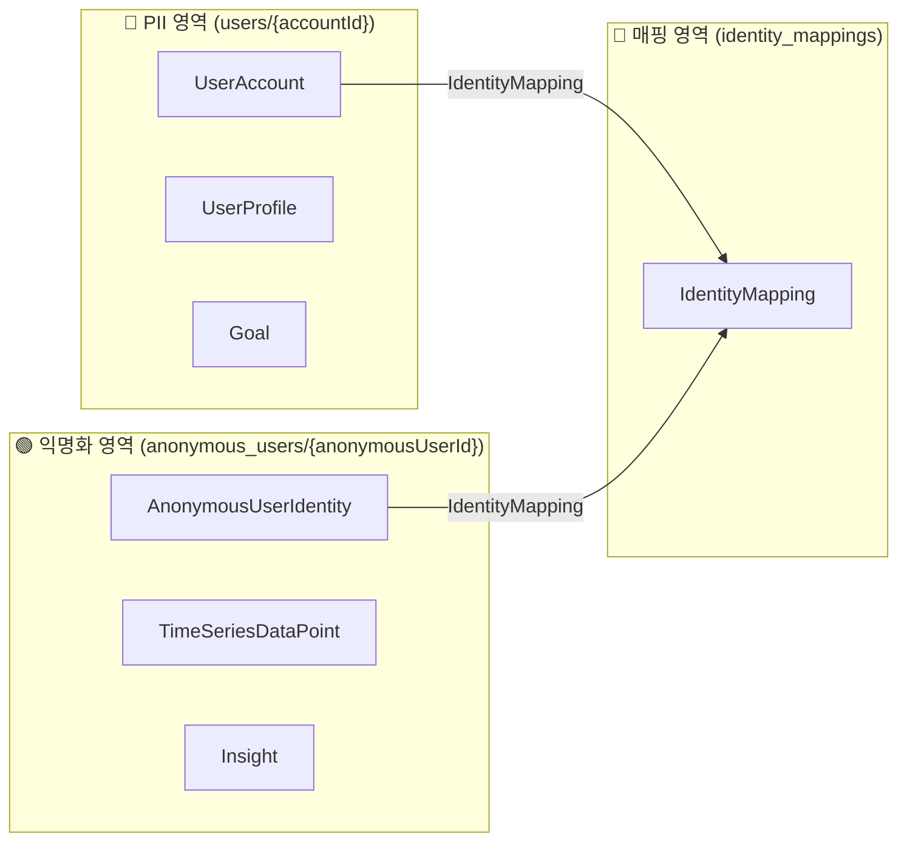
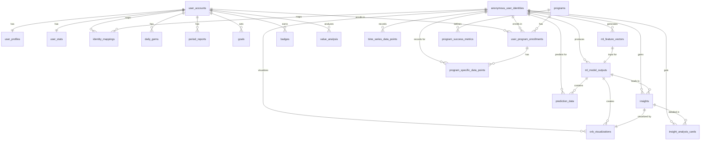

# 🗄️ PIP 프로젝트 DB 설계 (핵심 요약)

이 문서는 PIP 프로젝트의 핵심 데이터 모델과 구조를 간결하게 설명합니다. 현재 DB 스키마는 **21개의 핵심 테이블**로 구성되어 있습니다.

상세한 필드 정보와 전체 스키마는 `01_Planning/DATABASE_SCHEMA_DBDIAGRAM.sql` 파일을 참조하세요.

## 1. 핵심 아키텍처: 개인정보 보호 설계

우리 앱은 사용자의 개인정보(PII)와 분석 데이터를 물리적으로 분리하여 프라이버시를 최우선으로 보호합니다.

-   **🔴 PII 영역 (User-specific):** 사용자 계정에 직접 연결되는 데이터 (프로필, 목표 등)
-   **🟢 익명 영역 (Anonymous):** 개인을 식별할 수 없는 순수 분석/머신러닝용 데이터 (시계열 데이터, 인사이트 등)

## 2. 데이터 모델 ERD (21 Tables)

아래 다이어그램은 현재의 핵심 데이터 모델(21개 테이블) 간의 관계를 보여줍니다.

> **[참고]** 더 상세하고 인터랙티브한 ERD는 [dbdiagram.io](https://dbdiagram.io)에서 `DATABASE_SCHEMA_DBDIAGRAM.sql` 파일을 열어 확인하세요.

## 3. 데이터 영역 및 캐시 전략

| 계층 (Layer) | 🔴 PII 영역 (개인식별) | 🟢 익명 영역 (익명) | 🌐 공유 & 🔐 보안 영역 |
| :--- | :--- | :--- | :--- |
| **🔐 Identity** | `user_accounts` (캐시 안 함) | `anonymous_user_identities` (서버 전용) | `identity_mappings` (서버 전용) |
| **👤 User Profile** | `user_profiles` (적극적 캐시) | | |
| **🔬 Time Series Data** | | `time_series_data_points` (쓰기 후 동기화) `ml_feature_vectors` (서버 전용) `ml_model_outputs` (서버 전용) | |
| **📊 Aggregation** | `daily_gems` (시간 기반 캐시) `period_reports` (시간 기반 캐시) | | |
| **💡 Insight & Viz** | | `insights` (서버 우선 조회) `orb_visualizations` (서버 우선 조회) `insight_analysis_cards` (서버 우선 조회) `prediction_data` (서버 우선 조회) | |
| **🎯 Goal & Program** | `goals` (상태 기반 캐시) `user_program_enrollments` (상태 기반 캐시) | `program_specific_data_points` (쓰기 후 동기화) | `programs` (적극적 캐시) `program_success_metrics` (적극적 캐시) |
| **🏆 Achievement & Status** | `user_stats` (적극적 캐시) `badges` (적극적 캐시) `value_analysis` (적극적 캐시) | | |

## 4. 주요 모델 설명 (21개)

-   **user_accounts**: 사용자 인증 및 계정 정보
-   **anonymous_user_identities**: 개인 식별이 불가능한 익명 ID
-   **identity_mappings**: `user_accounts`와 `anonymous_user_identities`를 연결하는 보안 매핑
-   **user_profiles**: 이름, 사진 등 사용자 프로필 및 개인 설정
-   **time_series_data_points**: 모든 측정 데이터(마음, 행동, 신체)가 기록되는 핵심 시계열 데이터
-   **ml_feature_vectors**: 시계열 데이터로부터 추출된 머신러닝 특징 벡터
-   **ml_model_outputs**: ML 모델 실행 결과 (재생성 성능, 예측 정확도 등)
-   **daily_gems**: 하루의 데이터를 요약하여 보여주는 시각적 요소
-   **period_reports**: 주간/월간 등 기간별 리포트
-   **insights**: 시계열 데이터를 분석하여 도출된 통찰 또는 패턴
-   **orb_visualizations**: 주간/월간 데이터 패턴을 시각화하는 요소
-   **insight_analysis_cards**: 인사이트를 스토리 형식으로 보여주는 카드뉴스
-   **prediction_data**: 특정 지표에 대한 미래 예측 데이터
-   **goals**: 사용자가 설정한 개인 목표
-   **programs**: 목표 달성을 돕는 추천 프로그램 (글로벌 카탈로그)
-   **user_program_enrollments**: 사용자가 참여중인 프로그램의 진행 상태
-   **program_specific_data_points**: 특정 프로그램 진행 중에만 수집되는 데이터
-   **program_success_metrics**: 프로그램의 성공 여부를 판단하는 기준 지표
-   **user_stats**: 총 기록 수, 연속 기록일 등 사용자의 전반적인 통계
-   **badges**: 특정 조건을 달성했을 때 얻는 뱃지
-   **value_analysis**: 사용자가 추구하는 가치를 월별로 분석한 데이터

## 5. 앞으로의 작업 (To-Do)

-   [ ] Firestore 실제 컬렉션/도큐먼트 구조 설계 및 문서화
-   [ ] 주요 엔티티별 최소 필드 정의 (UserAccount, TimeSeriesDataPoint 등)
-   [ ] 데이터 수집/집계/인사이트 생성 플로우 간단 도식화
-   [ ] Cloud Functions 자동화 설계 (예: 집계, 익명화, 삭제)
-   [ ] 데이터 마이그레이션/초기화 전략 수립
-   [ ] (선택) dbdiagram.io 등 외부 ERD 툴로 시각화
