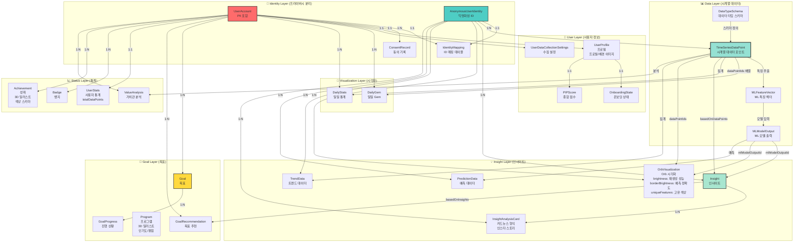
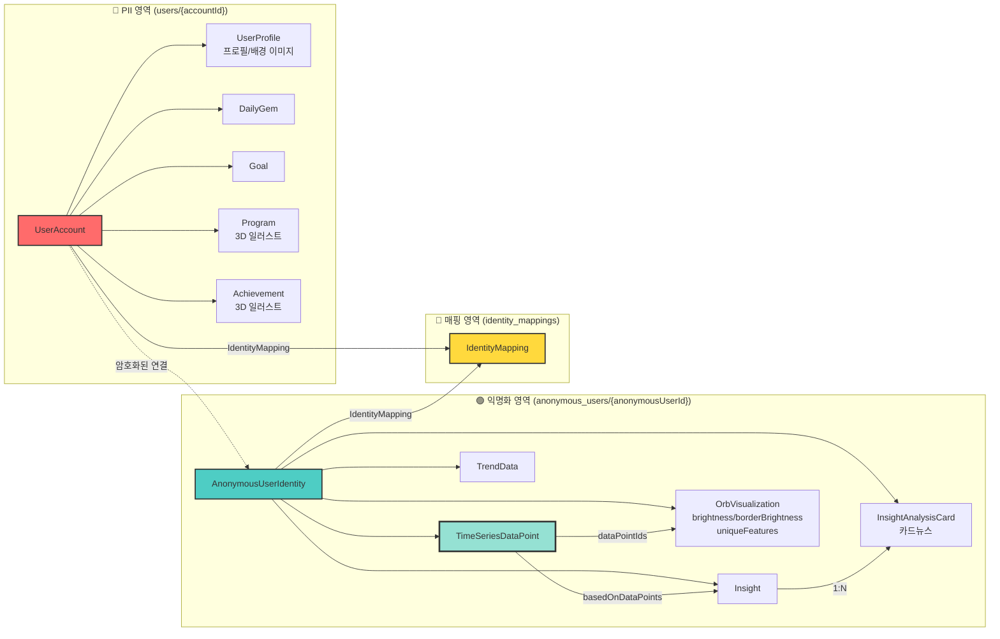
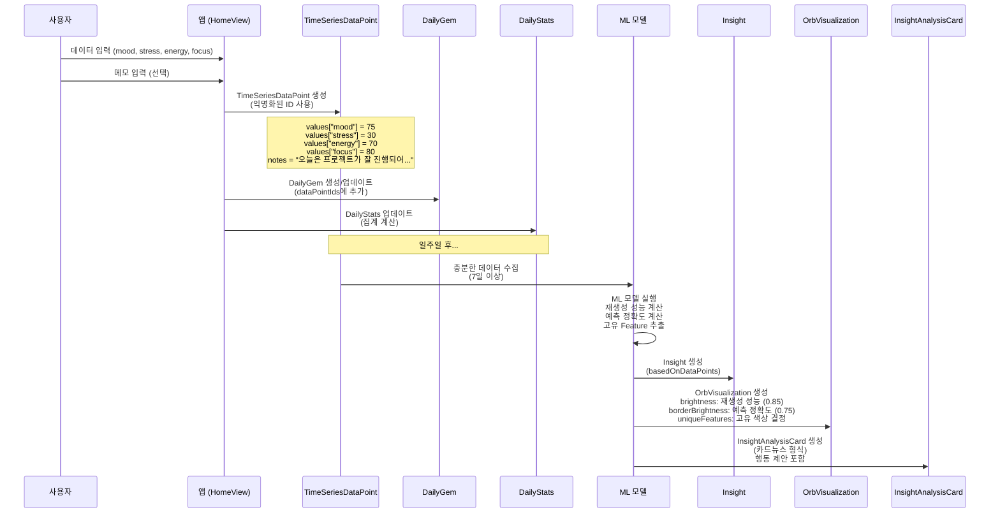
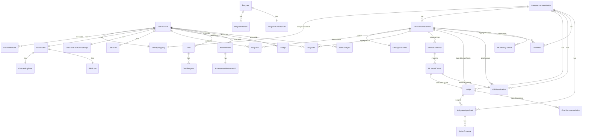
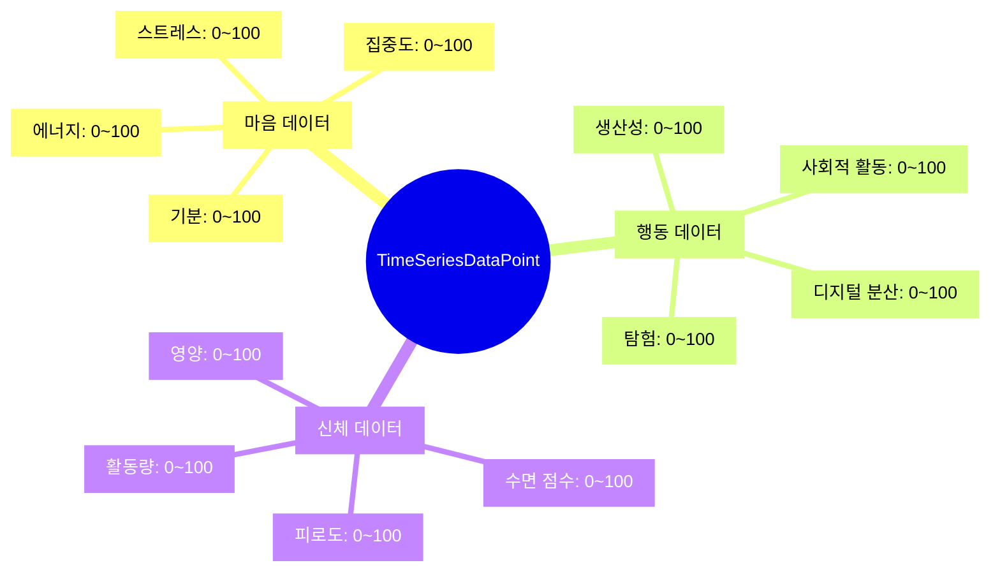

# 🗄️ PIP 프로젝트 DB 모델 설계 기획안

**작성일**: 2025.12  
**버전**: 2.0  
**상태**: 설계 완료

---

## 📋 목차

1. [개요](#1-개요)
2. [데이터 모델 아키텍처](#2-데이터-모델-아키텍처)
3. [Models 디렉토리 구조](#3-models-디렉토리-구조)
4. [핵심 데이터 모델 상세](#4-핵심-데이터-모델-상세)
5. [Firebase Firestore 통합 설계](#5-firebase-firestore-통합-설계)
6. [데이터 수집 시나리오](#6-데이터-수집-시나리오)
7. [재설계 요약](#7-재설계-요약)
8. [마이그레이션 고려사항](#8-마이그레이션-고려사항)
9. [dbdiagram.io 스키마 가이드](#9-dbdiagramio-스키마-가이드)

---

## 1. 개요

### 1.1. 설계 원칙

1. **Identity Separation (프라이버시 분리)**
   - PII (개인 식별 정보)와 분석 데이터 완전 분리
   - `UserAccount` (PII) ↔ `AnonymousUserIdentity` (익명화)
   - `IdentityMapping`으로 암호화된 연결

2. **TimeSeriesDataPoint 중심 설계**
   - 모든 데이터 수집의 핵심 엔티티
   - 동적 `values` 딕셔너리로 확장 가능
   - ML/AI 모델 입력으로 직접 사용

3. **오컴의 면도날 원칙**
   - `JournalEntry` 제거 → `TimeSeriesDataPoint.notes`로 통합
   - 불필요한 복잡성 제거

4. **Responsible & Ethical AI**
   - 데이터 최소화
   - 명시적 동의
   - 삭제 권리 보장

### 1.2. 주요 변경사항 (v2.0)

- ✅ `JournalEntry` 완전 제거
- ✅ `TimeSeriesDataPoint.notes`로 메모 통합
- ✅ `DailyGem.journalEntries` → `DailyGem.dataPointIds`
- ✅ `DailyStats.totalEntries` → `DailyStats.totalDataPoints`
- ✅ `Goal.relatedJournalEntries` → `Goal.relatedDataPointIds`

---

## 2. 데이터 모델 아키텍처

### 2.1. 전체 데이터 모델 관계도



### 2.2. Identity Separation 구조



### 2.3. 데이터 수집 → 인사이트 생성 플로우



### 2.4. 모델 간 참조 관계 (ER Diagram)



### 2.5. Cloud Functions 처리 흐름 (자동화 레이어)

**Cloud Functions의 역할**:

```
┌─────────────────────────────────────────────────────────┐
│ 1. Daily Aggregation (Cloud Scheduler: 매일 00:00 KST)  │
├─────────────────────────────────────────────────────────┤
│ TimeSeriesDataPoint (어제) →                            │
│   집계 계산 (마음, 행동, 신체 점수)                      │
│   → DailyStats 생성                                     │
│   → DailyGem 업데이트                                   │
└─────────────────────────────────────────────────────────┘

┌─────────────────────────────────────────────────────────┐
│ 2. Weekly ML Model Execution                            │
│    (Cloud Scheduler: 매주 일요일 10:00 KST)             │
├─────────────────────────────────────────────────────────┤
│ TimeSeriesDataPoint (최근 7일) →                        │
│   MLFeatureVector 추출                                  │
│   → ML 모델 실행 (재생성 성능, 예측 정확도)             │
│   → MLModelOutput 저장                                  │
│   → Insight 생성                                        │
│   → OrbVisualization 생성                              │
│   → InsightAnalysisCard 생성                           │
│   → 선택사항: Firebase Cloud Messaging 푸시             │
└─────────────────────────────────────────────────────────┘

┌─────────────────────────────────────────────────────────┐
│ 3. PII Cleanup (Cloud Scheduler: 매월 1일 00:00 KST)   │
├─────────────────────────────────────────────────────────┤
│ DataDeletionRequest (요청 완료됨) →                     │
│   관련 TimeSeriesDataPoint 삭제                         │
│   → Goal, Achievement 삭제                             │
│   → IdentityMapping 비활성화                           │
└─────────────────────────────────────────────────────────┘
```

---

### 2.6. 데이터 카테고리별 구조



---

## 3. Models 디렉토리 구조

### 3.1. 최종 Models 구조

```
Models/
├── Identity/
│   └── IdentityModels.swift
│       - UserAccount
│       - AnonymousUserIdentity
│       - IdentityMapping
│       - ConsentRecord
│       - DataDeletionRequest
│
├── User/
│   └── UserProfileModels.swift
│       - UserProfile
│       - UserPreferences
│       - AnonymousUserProfile
│       - OnboardingState
│       - UserDataCollectionSettings
│       - PIPScore
│
├── Data/
│   ├── DataSchemaModels.swift
│   │   - DataTypeSchema
│   │   - DataValue
│   │   - ValueRange
│   │
│   ├── TimeSeriesModels.swift
│   │   - TimeSeriesDataPoint ⭐ (핵심 데이터 모델)
│   │   - MLFeatureVector
│   │   - MLModelOutput
│   │   - MLTrainingDataset
│   │   - MLModelMetadata
│   │
│   └── DataModels.swift
│       - DailyGem
│       - DailyStats
│       - GemType
│       - ColorTheme
│
└── Features/
    ├── InsightModels.swift
    │   - Insight
    │   - OrbVisualization ⭐ (brightness, borderBrightness, uniqueFeatures)
    │   - TrendData
    │   - PredictionData
    │   - InsightAnalysisCard (카드뉴스 형식)
    │   - AnalysisCardPage
    │   - ActionProposal
    │
    ├── GoalModels.swift
    │   - Goal
    │   - Program ⭐ (3D 일러스트, 인기도, 평점)
    │   - ProgramIllustration3D
    │   - ProgramReview
    │   - GoalProgress
    │   - GoalRecommendation
    │
    └── StatusModels.swift
        - UserStats ⭐ (totalDataPoints)
        - Badge
        - Achievement ⭐ (3D 일러스트, 색상 스키마)
        - AchievementIllustration3D
        - ValueAnalysis
```

### 3.2. 주요 변경사항

**✅ 제거된 것**:
- `Journal/JournalModels.swift` (파일 삭제)
- `JournalEntry` 구조체
- `JournalCategory` enum (필요시 `DataCategory` 사용)

**✅ 변경된 것**:
- `DailyGem.journalEntries` → `DailyGem.dataPointIds`
- `DailyStats.totalEntries` → `DailyStats.totalDataPoints`
- `DailyStats.categories` → `DailyStats.notesByCategory`
- `Goal.relatedJournalEntries` → `Goal.relatedDataPointIds`
- `TimeSeriesDataPoint`에 `category` 필드 추가

**✅ 추가된 것**:
- `DataModels.swift` (DailyGem, DailyStats 포함)
- `DailyStats.notesCount` (메모가 있는 데이터 포인트 수)
- `OrbVisualization.brightness` (재생성 성능)
- `OrbVisualization.borderBrightness` (예측 정확도)
- `OrbVisualization.uniqueFeatures` (고유 색상 결정)
- `InsightAnalysisCard` (카드뉴스 형식 인사이트)
- `Program.illustration3D` (3D 일러스트)
- `Program.popularity`, `rating`, `reviewCount` (인기도 및 평가)
- `UserProfile.profileImageURL`, `backgroundImageURL` (프로필 이미지)
- `Achievement.illustration3D` (3D 일러스트)
- `Achievement.colorScheme` (달성 패턴별 색상)

---

## 4. 핵심 데이터 모델 상세

### 4.1. TimeSeriesDataPoint (핵심 모델)

```swift
struct TimeSeriesDataPoint: Identifiable, Codable {
    let id: UUID
    var anonymousUserId: UUID         // ✅ 익명화된 ID만 사용
    
    // 시계열 메타데이터
    var timestamp: Date               // 정확한 시각
    var date: Date                    // 날짜 (일자 기준)
    var timeOfDay: TimeOfDay?
    var dayOfWeek: Int?               // 1=일요일, 7=토요일
    var weekOfYear: Int?
    var month: Int?
    
    // 데이터 값 (동적 구조)
    var values: [String: DataValue]   // "mood": 75, "sleep_score": 80 등
    
    // 메타데이터 (PII 제거된)
    var notes: String?                // 사용자 메모 (PII 제거 로직 적용)
    var tags: [String]                // 일반 태그만
    var context: [String: String]?    // PII 없는 컨텍스트
    var category: DataCategory?       // 데이터 카테고리 (메모 분류용)
    
    // 데이터 소스 및 품질
    var source: DataSource
    var confidence: Double            // 0.0 ~ 1.0 (데이터 신뢰도)
    var completeness: Double          // 0.0 ~ 1.0 (해당 시점의 데이터 완성도)
    
    // ML/AI 관련
    var features: [String: Double]?   // ML 모델용 추출된 특징값
    var predictions: [String: Double]? // 예측값
    var anomalies: [String]?          // 이상 징후
    
    var createdAt: Date
    var updatedAt: Date
    
    var anonymousUserIdString: String {
        anonymousUserId.uuidString
    }
    
    var dataPointIdString: String {
        id.uuidString
    }
}
```

**주요 특징**:
- 모든 데이터 수집의 중심 엔티티
- `values` 딕셔너리로 동적 데이터 저장
- `notes` 필드로 메모 통합 (PII 제거 후)
- ML/AI 모델 입력으로 직접 사용 가능

### 4.2. DailyGem (일일 Gem 시각화)

```swift
struct DailyGem: Identifiable, Codable {
    let id: UUID
    var accountId: UUID
    var date: Date
    var gemType: GemType           // Gem의 기하학적 형태
    var brightness: Double         // 0.0 ~ 1.0 (데이터 완성도)
    var uncertainty: Double        // 0.0 ~ 1.0 (AI 모델 불확실성)
    var dataPointIds: [String]     // ✅ 해당 날짜의 TimeSeriesDataPoint ID 배열
    var colorTheme: ColorTheme      // Gem의 색상 테마
    var createdAt: Date
}
```

**변경사항**: `journalEntries` → `dataPointIds`로 변경

### 4.3. DailyStats (일일 통계)

```swift
struct DailyStats: Codable {
    var accountId: UUID
    var date: Date
    var totalDataPoints: Int        // ✅ 해당 날짜의 총 데이터 포인트 수
    var notesCount: Int             // ✅ 메모가 있는 데이터 포인트 수
    
    // 마음/행동/신체 점수
    var mindScore: Double?          // 0.0 ~ 1.0 (마음 평균 점수)
    var behaviorScore: Double?     // 0.0 ~ 1.0 (행동 평균 점수)
    var physicalScore: Double?     // 0.0 ~ 1.0 (신체 평균 점수)
    var overallScore: Double?       // 0.0 ~ 1.0 (종합 점수)
    
    // 데이터 완성도
    var mindCompleteness: Double    // 0.0 ~ 1.0 (마음 데이터 완성도)
    var behaviorCompleteness: Double // 0.0 ~ 1.0 (행동 데이터 완성도)
    var physicalCompleteness: Double // 0.0 ~ 1.0 (신체 데이터 완성도)
    var overallCompleteness: Double  // 0.0 ~ 1.0 (전체 데이터 완성도)
    
    // 카테고리별 기록 수 (TimeSeriesDataPoint의 notes 기반)
    var notesByCategory: [String: Int]  // ✅ 카테고리별 메모 수
    
    // 데이터 수집 소스별 통계
    var dataSourceCounts: [String: Int]  // DataSource.rawValue를 키로 사용
}
```

**변경사항**:
- `totalEntries` → `totalDataPoints`
- `notesCount` 추가
- `categories` → `notesByCategory`

### 4.4. OrbVisualization (Orb 시각화)

```swift
struct OrbVisualization: Identifiable, Codable {
    let id: UUID
    var anonymousUserId: UUID
    var date: Date
    
    // ML 모델에서 계산된 값
    var brightness: Double              // 모델의 예측 정확도 (0.0 ~ 1.0)
    var borderBrightness: Double        // 예측 불확실성 (0.0 ~ 1.0)
    
    // 색상 (uniqueFeatures로부터 생성된 3개 색상)
    var colorGradient: [String]         // 선형 그라데이션 + 테두리 색상
                                        // ["#RRGGBB", "#RRGGBB", "#RRGGBB"]
    
    // 기타 정보
    var dataPointIds: [String]
    var mlModelOutputId: UUID?
    
    var createdAt: Date
}
```

**Orb 시각화 의미** (InsightView 최상단 표시):

1. **brightness (방사형 그라데이션 opacity)**: 모델의 예측 정확도
   - **시각화 방식**: 중심(흰색) → 가장자리(검은색)의 방사형 그라데이션
   - **밝을수록** (opacity 높음): 예측이 정확함 → 신뢰할 수 있는 예측
   - **어두울수록** (opacity 낮음): 예측이 부정확함 → 불확실성이 높음

2. **borderBrightness (테두리 stroke opacity)**: 예측 불확실성
   - **시각화 방식**: liquid_orb 이미지 테두리보다 살짝 바깥쪽의 색상 stroke
   - **밝을수록** (opacity 높음): 불확실성이 낮음 (신뢰도 높음)
   - **어두울수록** (opacity 낮음): 불확실성이 높음 (신뢰도 낮음)

3. **colorGradient (선형 그라데이션)**: 사용자의 고유 특징
   - **시각화 방식**: 3개 색상의 선형 그라데이션 (위/아래 또는 대각선)
   - **의미**: 각 사용자마다 다른 색상 조합으로 고유성 표현
   - **적용**: 선형 그라데이션 오버레이 + 테두리 stroke 색상으로도 사용

**시각화 구조**:
```
┌─────────────────────────────┐
│   liquid_orb 이미지          │
│  ┌───────────────────────┐  │
│  │ 방사형 그라데이션:     │  │
│  │ ○ (밝음) → ● (어두움) │  │ ← opacity = brightness
│  └───────────────────────┘  │   (예측 정확도)
│  ┌───────────────────────┐  │
│  │ 선형 그라데이션:       │  │
│  │ 3개 색상 blend        │  │ ← 고유 특징 표현
│  └───────────────────────┘  │
└─────────────────────────────┘
   ═════════════════════════    ← 색상 테두리 stroke
   (colorGradient 색상)         (opacity = borderBrightness)
```

### 4.5. Goal (목표)

```swift
struct Goal: Identifiable, Codable {
    let id: UUID
    var accountId: UUID
    var title: String
    var description: String?
    var category: GoalCategory
    var targetDate: Date?
    var startDate: Date
    var status: GoalStatus
    var progress: Double           // 0.0 ~ 1.0 (진행률)
    var gemVisualization: GemVisualization
    var milestones: [Milestone]
    var relatedDataPointIds: [String]    // ✅ 관련 TimeSeriesDataPoint ID 배열
    var createdAt: Date
    var updatedAt: Date
}
```

**변경사항**: `relatedJournalEntries` → `relatedDataPointIds`

### 4.6. Program (프로그램)

```swift
struct Program: Identifiable, Codable {
    let id: UUID
    var name: String
    var description: String
    var category: GoalCategory
    var duration: Int              // 일 단위
    var difficulty: DifficultyLevel
    var gemVisualization: GemVisualization
    
    // 3D 일러스트 정보
    var illustration3D: ProgramIllustration3D?
    
    // 인기도 및 평가
    var popularity: Double          // 0.0 ~ 1.0 (인기도 점수)
    var rating: Double?             // 1.0 ~ 5.0 (평균 평점)
    var reviewCount: Int            // 리뷰 수
    var userCount: Int             // 사용자 수
    
    // 프로그램 상세
    var steps: [ProgramStep]
    var prerequisites: [String]?
    var tags: [String]
    var expectedEffects: [String]   // 기대 효과 목록
    var requiredDataTypes: [String] // 필요한 데이터 타입 ID 배열
    
    // 사용자 평가
    var userReviews: [ProgramReview]?  // 최근 리뷰들
    
    var isRecommended: Bool        // AI 추천 여부
    var createdAt: Date
}
```

### 4.7. InsightAnalysisCard (인사이트 분석 카드)

```swift
struct InsightAnalysisCard: Identifiable, Codable {
    let id: UUID
    var insightId: UUID
    var anonymousUserId: UUID
    
    // 카드 내용
    var title: String
    var subtitle: String?
    var cardType: AnalysisCardType  // explanation, prediction, control
    
    // 여러 페이지 (인스타 스토리 형식)
    var pages: [AnalysisCardPage]
    
    // 행동 제안
    var actionProposals: [ActionProposal]
    
    // 사용자 반응
    var isLiked: Bool              // 하트 버튼 클릭 여부
    var likedAt: Date?
    var acceptedActions: [String]  // 수락한 ActionProposal ID 배열
    
    var createdAt: Date
}
```

**특징**:
- 인스타그램 스토리처럼 여러 페이지로 구성
- 각 페이지에 그래프, 수치, 만트라 등 포함
- 행동 제안을 캘린더, 알람 등으로 실행 가능

---

## 5. Firebase Firestore 통합 설계

### 5.1. Firestore 컬렉션 구조

#### 5.1.1. 사용자 계정 (PII 포함)

```
users/
  {accountId}/
    account/
      - UserAccount
    profile/
      - UserProfile
    settings/
      dataCollection/
        - UserDataCollectionSettings
      consentStatus/
        - UserConsentStatus
    consents/
      {consentId}/
        - ConsentRecord
    daily_gems/
      {gemId}/
        - DailyGem
    daily_stats/
      {date}/
        - DailyStats
    goals/
      {goalId}/
        - Goal
        progress/
          {progressId}/
            - GoalProgress
    goal_recommendations/
      {recommendationId}/
        - GoalRecommendation
    badges/
      {badgeId}/
        - Badge
    achievements/
      {achievementId}/
        - Achievement
    stats/
      - UserStats
    value_analysis/
      {analysisId}/
        - ValueAnalysis
    deletion_requests/
      {requestId}/
        - DataDeletionRequest
```

#### 5.1.2. 익명화된 사용자 데이터 (분석용)

```
anonymous_users/
  {anonymousUserId}/
    profile/
      - AnonymousUserProfile
    data_points/
      {dataPointId}/
        - TimeSeriesDataPoint  ⭐ (notes 포함)
    ml_features/
      {featureId}/
        - MLFeatureVector
    ml_outputs/
      {outputId}/
        - MLModelOutput
    insights/
      {insightId}/
        - Insight
        analysis_cards/
          {cardId}/
            - InsightAnalysisCard
    orbs/
      {orbId}/
        - OrbVisualization
    trends/
      {trendId}/
        - TrendData
    predictions/
      {predictionId}/
        - PredictionData
```

#### 5.1.3. ID 매핑 (보안)

```
identity_mappings/
  {mappingId}/
    - IdentityMapping
    (보안 규칙으로 접근 제어 필요)
```

#### 5.1.4. 글로벌 데이터

```
programs/
  {programId}/
    - Program

ml_datasets/
  {datasetId}/
    - MLTrainingDataset

ml_models/
  {modelId}/
    - MLModelMetadata

data_type_schemas/
  {schemaId}/
    - DataTypeSchema
```

### 5.2. 인덱싱 전략

#### 필수 인덱스

**anonymous_users/{anonymousUserId}/data_points**
- `date` (descending)
- `timestamp` (descending)
- `category`
- `source`

**users/{accountId}/daily_gems**
- `date` (descending)

**users/{accountId}/goals**
- `status`
- `targetDate`
- `progress`

**anonymous_users/{anonymousUserId}/insights**
- `type`
- `createdAt` (descending)
- `confidence`

#### 복합 인덱스

- `date` + `category` (data_points)
- `status` + `targetDate` (goals)
- `timestamp` + `source` (data_points)
- `type` + `createdAt` (insights)

### 5.3. 보안 규칙 (Firestore Security Rules)

```javascript
rules_version = '2';
service cloud.firestore {
  match /databases/{database}/documents {
    // 사용자는 자신의 데이터만 접근 가능
    match /users/{accountId}/{document=**} {
      allow read, write: if request.auth != null && request.auth.uid == accountId;
    }
    
    // 익명화된 사용자 데이터는 본인만 접근
    match /anonymous_users/{anonymousUserId}/{document=**} {
      allow read, write: if request.auth != null && 
        get(/databases/$(database)/documents/identity_mappings/$(mappingId)).data.accountId == request.auth.uid;
    }
    
    // ID 매핑은 읽기 전용 (서버에서만 쓰기)
    match /identity_mappings/{mappingId} {
      allow read: if request.auth != null;
      allow write: if false; // Cloud Functions에서만 쓰기
    }
    
    // ML 데이터셋은 읽기 전용 (서버에서만 쓰기)
    match /ml_datasets/{datasetId} {
      allow read: if request.auth != null;
      allow write: if false; // Cloud Functions에서만 쓰기
    }
    
    // 프로그램은 모든 인증된 사용자가 읽기 가능
    match /programs/{programId} {
      allow read: if request.auth != null;
      allow write: if false; // 관리자만 쓰기
    }
  }
}
```

### 5.4. Firebase 호환성 고려사항

#### ✅ 호환되는 부분

1. **Codable 프로토콜**: 모든 모델이 `Codable` 준수
2. **Date 타입**: Firestore의 `Timestamp`로 자동 변환
3. **Enum 타입**: `String` 기반 Enum은 `.rawValue`로 저장
4. **Optional 필드**: `nil` 값은 저장되지 않음

#### ⚠️ 주의해야 할 부분

1. **UUID 타입**: Firestore는 UUID를 직접 지원하지 않음
   - **해결책**: 모든 모델에 `*String` 프로퍼티 추가
   - Firestore 문서 ID로 사용하거나, 필드에 저장할 때는 String으로 변환

2. **중첩된 Dictionary**: `[String: DataValue]` 같은 복잡한 구조는 Map으로 저장됨
   - **주의**: `DataValue` enum의 커스텀 인코딩 필요

3. **배열 크기 제한**: Firestore는 배열 크기에 제한이 없지만, 성능 고려 필요
   - 큰 배열은 서브컬렉션으로 분리 고려

---

## 6. 데이터 수집 시나리오

### 6.1. 시나리오 1: 첫 사용자 - 온보딩부터 첫 데이터 입력까지

#### Step 1: 앱 실행 및 온보딩 체크

**상황**: 사용자가 앱을 처음 실행

**데이터 상태**:
```swift
UserProfile.onboardingState = nil  // 또는 isCompleted = false
```

**액션**: `OnboardingCheckView`에서 `UserProfile.onboardingState` 확인

#### Step 2: 온보딩 플로우

**2.1. GoalSelectionView**
- 사용자 액션: 목표 선택 (예: "웰니스 & 마음의 평온", "생산성 향상")
- 데이터 생성:
```swift
OnboardingState(
    isCompleted: false,
    completedSteps: ["welcome", "goalSelection"],
    selectedGoals: ["wellness", "productivity"],
    completedAt: nil,
    skippedSteps: []
)
```

**2.2. DataCollectionIntroView**
- 권한 요청: 스크린타임, HealthKit 권한 동의
- 데이터 생성:
```swift
UserDataCollectionSettings(
    accountId: accountId,
    enabledDataTypes: ["mood", "stress", "energy", "focus"],
    permissions: DataPermissions(
        screenTime: .granted,
        healthKit: .granted
    ),
    collectionFrequency: .daily,
    anonymizationLevel: .pseudonymized,
    allowMLTraining: true
)
```

#### Step 3: 첫 데이터 입력 (HomeView - Write Sheet)

**UI 표시**:
- 카드 1: 기분 (mood: 0~100)
- 카드 2: 스트레스 (stress: 0~100)
- 카드 3: 에너지 (energy: 0~100)
- 카드 4: 집중도 (focus: 0~100)
- 선택적: 메모 입력

**"기록 완료" 버튼 클릭 시 데이터 생성**:

**3.1. AnonymousUserIdentity 생성 (최초 1회)**
```swift
let anonymousUserId = UUID()
let anonymousIdentity = AnonymousUserIdentity(
    id: anonymousUserId,
    accountId: accountId,  // 암호화된 참조
    createdAt: Date()
)

// IdentityMapping 생성
let mapping = IdentityMapping(
    id: UUID(),
    accountId: accountId,
    anonymousUserId: anonymousUserId,
    encryptedKey: encrypt(accountId, anonymousUserId),
    createdAt: Date(),
    isActive: true,
    deletionRequestedAt: nil
)
```

**3.2. TimeSeriesDataPoint 생성**
```swift
let now = Date()
let calendar = Calendar.current
let hour = calendar.component(.hour, from: now)

// 메모 PII 제거 (예시)
let rawMemo = "오늘은 프로젝트가 잘 진행되어 기분이 좋았다"
let sanitizedMemo = sanitizeNotes(rawMemo)  // PII 제거 로직 적용

let dataPoint = TimeSeriesDataPoint(
    id: UUID(),
    anonymousUserId: anonymousUserId,  // ✅ 익명화된 ID 사용
    timestamp: now,
    date: calendar.startOfDay(for: now),
    timeOfDay: hour >= 18 ? .evening : .afternoon,
    dayOfWeek: calendar.component(.weekday, from: now),
    weekOfYear: calendar.component(.weekOfYear, from: now),
    month: calendar.component(.month, from: now),
    values: [
        "mood": .integer(75),
        "stress": .integer(30),
        "energy": .integer(70),
        "focus": .integer(80)
    ],
    notes: sanitizedMemo,  // ✅ 메모 포함 (PII 제거 후)
    tags: ["긍정", "성취"],
    category: .mind,
    source: .manual,
    confidence: 0.9,
    completeness: 0.4,  // 마음 데이터 4개 / 전체 10개 예상
    context: nil,
    features: nil,
    predictions: nil,
    anomalies: nil,
    createdAt: now,
    updatedAt: now
)
```

**3.3. DailyGem 생성**
```swift
let dailyGem = DailyGem(
    id: UUID(),
    accountId: accountId,
    date: calendar.startOfDay(for: now),
    gemType: .crystal,
    brightness: dataPoint.completeness,  // 0.4
    uncertainty: 1.0 - dataPoint.confidence,  // 0.1
    dataPointIds: [dataPoint.id.uuidString],  // ✅ TimeSeriesDataPoint ID
    colorTheme: .teal,
    createdAt: now
)
```

**3.4. DailyStats 생성/업데이트**
```swift
// 마음 점수 계산
let mindScore = (75.0 + (100.0 - 30.0) + 70.0 + 80.0) / 400.0  // 0.72

let dailyStats = DailyStats(
    accountId: accountId,
    date: calendar.startOfDay(for: now),
    totalDataPoints: 1,
    notesCount: dataPoint.notes != nil ? 1 : 0,  // 메모가 있는 경우
    mindScore: mindScore,
    behaviorScore: nil,
    physicalScore: nil,
    overallScore: mindScore,
    mindCompleteness: 1.0,
    behaviorCompleteness: 0.0,
    physicalCompleteness: 0.0,
    overallCompleteness: 0.4,
    notesByCategory: dataPoint.notes != nil ? ["mind": 1] : [:],
    dataSourceCounts: ["manual": 1]
)
```

### 6.2. 시나리오 2: 일주일 후 - 다양한 데이터 수집

#### 자동 수집 (스크린타임)

**시간**: 매일 자정 또는 사용자가 앱을 열 때

**데이터 생성**:
```swift
// 스크린타임 데이터로 digitalDistraction 계산
let screenTimeMinutes = 420  // 7시간
let digitalDistraction = min(100, screenTimeMinutes / 6)  // 70

// 기존 TimeSeriesDataPoint 업데이트 또는 새로 생성
let updatedDataPoint = TimeSeriesDataPoint(
    // ... 기존 필드들
    values: [
        "mood": .integer(75),
        "stress": .integer(30),
        "energy": .integer(70),
        "focus": .integer(80),
        "digitalDistraction": .integer(70)  // ✅ 추가
    ],
    source: .screenTime,
    completeness: 0.5,  // 5개 수집
    // ...
)
```

#### 자동 수집 (HealthKit)

**시간**: 매일 자정

**데이터 생성**:
```swift
// HealthKit에서 수면 데이터 가져오기
let sleepHours = 7.5
let sleepScore = calculateSleepScore(hours: sleepHours)  // 70

let updatedDataPoint = TimeSeriesDataPoint(
    // ... 기존 필드들
    values: [
        // ... 기존 값들
        "sleepScore": .integer(sleepScore),
        "fatigue": .integer(25),
        "activityLevel": .integer(65)  // 걸음 수 기반
    ],
    source: .healthKit,
    completeness: 0.8,  // 8개 수집
    // ...
)
```

### 6.3. 시나리오 3: 인사이트 생성 (7일 후)

#### Step 1: 인사이트 생성 조건 확인

**조건**:
- 최소 7일 이상 데이터 수집
- 최소 데이터 포인트: 7개
- 최소 완성도: 0.6 (60%)

**체크 로직**:
```swift
let dataPoints = fetchDataPoints(anonymousUserId: anonymousUserId)
let recentDataPoints = dataPoints.filter { $0.date >= sevenDaysAgo }

guard recentDataPoints.count >= 7,
      recentDataPoints.allSatisfy({ $0.completeness >= 0.6 }) else {
    return  // 인사이트 생성 불가
}
```

#### Step 2: ML 모델 실행 (Cloud Functions)

**입력**:
```swift
let mlInput = MLFeatureVector(
    id: UUID(),
    anonymousUserId: anonymousUserId,
    timestamp: Date(),
    features: [
        "mood_avg": 0.72,
        "stress_avg": 0.30,
        "energy_avg": 0.70,
        "focus_avg": 0.80,
        "productivity_avg": 0.75,
        "sleep_score_avg": 0.68,
        "trend_mood": 0.05,  // 상승 추세
        "trend_stress": -0.10  // 하락 추세
    ],
    labels: nil,
    metadata: nil,
    createdAt: Date()
)
```

**ML 모델 실행**:
```swift
// Cloud Functions에서 실행
let mlOutput = await runMLModel(input: mlInput)

// 결과
let mlModelOutput = MLModelOutput(
    id: UUID(),
    anonymousUserId: anonymousUserId,
    modelId: "pip_score_v1",
    timestamp: Date(),
    predictions: [
        "next_week_mind": 0.75,
        "next_week_behavior": 0.78,
        "next_week_physical": 0.70
    ],
    probabilities: nil,
    confidence: 0.82,
    uncertainty: 0.18,
    features: mlInput.features,
    explanation: "최근 일주일간 긍정적인 트렌드를 보이고 있습니다.",
    createdAt: Date()
)
```

#### Step 3: Insight 및 OrbVisualization 생성

```swift
// Insight 생성
let insight = Insight(
    id: UUID(),
    anonymousUserId: anonymousUserId,
    type: .trend,
    title: "이번 주 감정 패턴 분석",
    description: "최근 일주일간 전반적으로 긍정적인 감정이 증가했습니다.",
    confidence: 0.82,
    dataCompleteness: 0.85,
    basedOnDataPoints: recentDataPoints.map { $0.id.uuidString },
    basedOnTimeRange: DateInterval(start: sevenDaysAgo, end: Date()),
    mlModelOutputId: mlModelOutput.id,
    findings: [
        InsightFinding(
            metric: "mood",
            value: 0.72,
            trend: .increasing,
            significance: 0.8,
            explanation: "기분 점수가 평균 0.72로, 이전 주 대비 5% 상승했습니다."
        )
    ],
    recommendations: [
        "수요일의 긍정적인 패턴을 유지하기 위해 비슷한 활동을 계획해보세요."
    ],
    visualizations: ["line_chart", "orb"],
    createdAt: Date()
)

// OrbVisualization 생성 (ML 모델 출력 기반)
// 재생성 성능 계산: 기존 시계열 데이터를 얼마나 잘 재구성할 수 있는지
let reconstructionPerformance = calculateReconstructionPerformance(
    dataPoints: recentDataPoints,
    mlOutput: mlModelOutput
)  // 예: 0.85

// 예측 정확도 계산: 오늘 예측의 신뢰도
let predictionAccuracy = mlModelOutput.confidence  // 예: 0.75

// 고유 Feature 추출: 다른 사용자들과 구분되는 특징
let uniqueFeatures = extractUniqueFeatures(
    dataPoints: recentDataPoints,
    allUsersFeatures: globalUserFeatures
)  // 예: ["morning_energy": 0.8, "evening_stress": 0.6]

// 고유 Feature 기반 색상 그라데이션 생성
let colorGradient = generateColorGradient(from: uniqueFeatures)
// 예: ["#82EBEB", "#40DBDB", "#31B0B0"]

let orb = OrbVisualization(
    id: UUID(),
    anonymousUserId: anonymousUserId,
    date: Date(),
    brightness: reconstructionPerformance,  // 0.85 (재생성 성능)
    borderBrightness: predictionAccuracy,   // 0.75 (예측 정확도)
    complexity: 7,
    uncertainty: mlModelOutput.uncertainty,  // 0.18
    uniqueFeatures: uniqueFeatures,  // 고유 Feature
    timeSeriesFeatures: mlModelOutput.features,
    categoryWeights: calculateCategoryWeights(dataPoints: recentDataPoints),
    gemType: .crystal,
    colorTheme: .teal,
    size: 1.2,
    colorGradient: colorGradient,  // 고유 Feature 기반
    dataPointIds: recentDataPoints.map { $0.id.uuidString },
    mlModelOutputId: mlModelOutput.id,
    createdAt: Date()
)

// InsightAnalysisCard 생성 (카드뉴스 형식)
let analysisCard = InsightAnalysisCard(
    id: UUID(),
    insightId: insight.id,
    anonymousUserId: anonymousUserId,
    title: "이번 주 감정 패턴 분석",
    subtitle: "설명, 예측, 제어",
    cardType: .explanation,
    pages: [
        AnalysisCardPage(
            id: UUID(),
            pageNumber: 1,
            contentType: .mixed,
            content: PageContent(
                text: "최근 일주일간 전반적으로 긍정적인 감정이 증가했습니다.",
                headline: "긍정적 트렌드",
                body: "기분 점수가 평균 0.72로, 이전 주 대비 5% 상승했습니다.",
                mantra: "수요일의 긍정적인 패턴을 유지하세요"
            ),
            visualizations: [
                PageVisualization(
                    type: .lineChart,
                    data: ["mood": AnyCodable([0.65, 0.70, 0.75, 0.68, 0.70, 0.72, 0.74])],
                    chartType: .line
                )
            ]
        )
    ],
    actionProposals: [
        ActionProposal(
            id: UUID(),
            title: "명상 시간",
            description: "수요일의 긍정적인 패턴을 유지하기 위해",
            actionType: .calendar,
            targetDate: nil,
            calendarEvent: CalendarEvent(
                title: "명상",
                description: "10분 명상",
                startDate: Calendar.current.date(byAdding: .day, value: 3, to: Date())!,
                endDate: nil,
                location: nil,
                notes: nil
            ),
            alarm: nil,
            isAccepted: false,
            acceptedAt: nil
        )
    ],
    isLiked: false,
    likedAt: nil,
    acceptedActions: [],
    createdAt: Date()
)
```

### 6.4. 데이터 흐름 요약

```
사용자 입력
  ↓
TimeSeriesDataPoint 생성
  - values: 데이터 값
  - notes: 메모 (PII 제거 후)
  - category: 데이터 카테고리
  ↓
DailyGem 생성
  - dataPointIds: [TimeSeriesDataPoint.id]
  ↓
DailyStats 업데이트
  - totalDataPoints: 카운트
  - notesCount: 메모가 있는 데이터 포인트 수
  ↓
(7일 후)
  ↓
ML 모델 실행
  - TimeSeriesDataPoint 배열 → MLFeatureVector
  - ML 모델 → MLModelOutput
  ↓
Insight 생성
  - basedOnDataPoints: [TimeSeriesDataPoint.id 배열]
  - mlModelOutputId: MLModelOutput.id
```

### 6.5. 구체적인 사용자 시나리오

#### 시나리오 1: 목표 선택 (틴더 스타일)

**UI/UX**:
- 틴더처럼 카드를 좌우로 스와이프하여 목표 선택
- 한 두개의 목표 선택 가능
- 선택한 목표에 따라 프로그램 추천

**데이터 생성**:
```swift
OnboardingState(
    isCompleted: false,
    completedSteps: ["welcome", "goalSelection"],
    selectedGoals: ["wellness", "productivity"],  // 틴더 스타일로 선택
    completedAt: nil,
    skippedSteps: []
)
```

#### 시나리오 2: 프로그램 선택 및 데이터 동의

**UI/UX**:
- 선택한 목표에 맞는 프로그램 목록 표시
- 프로그램 클릭 시 상세 정보:
  - 간단한 설명
  - 기대 효과
  - 필요한 데이터 목록
- 민감 정보 동의 페이지:
  - 날씨, 스크린타임, 위치, 심박수, 걸음수, 건강 등

**데이터 생성**:
```swift
UserDataCollectionSettings(
    accountId: accountId,
    enabledDataTypes: ["mood", "stress", "energy", "focus", "weather", "location", "heartRate", "steps"],
    permissions: DataPermissions(
        screenTime: .granted,
        healthKit: .granted,
        location: .granted,
        // ...
    ),
    // ...
)
```

#### 시나리오 3: 홈 화면 - RailRoad 및 카드 기반 입력

**UI/UX**:
- 상단: 총 기록수, 최근 연속 기록 수
- RailRoad: 상하 스크롤로 과거 기록 확인
  - 개별 기록은 오픈소스 gem 애셋으로 시각화
- 우측 하단 버튼: 새로운 데이터 기록
- 카드 기반 입력 (틴더 스타일):
  - 여러 장의 카드에서 간단한 데이터 기록
  - 슬라이더로 점수 구체화
  - 텍스트 상자로 저널링 기록
  - 카드마다 마음, 행동, 신체로 구분
  - 설정한 목표에 따라 프로그램 카드 포함
  - 작성 완료 시 좌측으로 슬라이딩 또는 체크 버튼
  - 되돌리기 버튼으로 이전 카드 수정

**데이터 생성**:
```swift
// 각 카드 입력마다 TimeSeriesDataPoint 생성
let dataPoint = TimeSeriesDataPoint(
    // ... 기존 필드들
    values: [
        "mood": .integer(75),      // 마음 카드
        "productivity": .integer(85),  // 행동 카드
        "sleepScore": .integer(70)     // 신체 카드
    ],
    notes: "오늘은 프로젝트가 잘 진행되어...",  // 텍스트 상자 입력
    category: .mind,  // 카드 타입에 따라
    // ...
)

// DailyGem 생성 (오픈소스 gem 애셋으로 시각화)
let dailyGem = DailyGem(
    // ... 기존 필드들
    gemType: .crystal,  // gem 애셋 타입
    // ...
)
```

#### 시나리오 4: InsightView - Orb 및 분석

**UI/UX**:
- **Orb (최상단)**:
  - 색상 밝기 = 사용자 모델의 재생성 성능
  - 테두리 밝기 = 오늘 예측의 정확도
  - 내부 색상 = 고유 Feature 기반
- **Dashboard (Orb 하단)**:
  - 수집한 데이터의 예측 값과 신뢰도
  - 슬라이딩으로 마음/행동/신체 카테고리별 예측 확인
- **Analysis (하단)**:
  - 카드뉴스 형식 인사이트
  - 인스타그램 스토리처럼 여러 페이지
  - 그래프, 수치, 만트라 포함
  - 우측 하단 하트 버튼: 좋아요
  - 수락 버튼: 캘린더, 알람 등 실행

**데이터 생성**:
```swift
// Orb 생성
let orb = OrbVisualization(
    // ... 기존 필드들
    brightness: 0.85,  // 사용자 모델 재생성 성능
    borderBrightness: 0.75,  // 오늘 예측 정확도
    uniqueFeatures: [
        "feature1": 0.8,
        "feature2": 0.6
    ],  // 고유 Feature (색상 결정)
    colorGradient: ["#82EBEB", "#40DBDB"],  // 고유 Feature 기반
    // ...
)

// InsightAnalysisCard 생성
let analysisCard = InsightAnalysisCard(
    // ... 기존 필드들
    cardType: .explanation,  // 또는 .prediction, .control
    pages: [
        AnalysisCardPage(
            pageNumber: 1,
            contentType: .mixed,
            content: PageContent(
                text: "설명 텍스트",
                mantra: "행동 제안 만트라"
            ),
            visualizations: [
                PageVisualization(
                    type: .lineChart,
                    chartType: .line
                )
            ]
        )
    ],
    actionProposals: [
        ActionProposal(
            title: "명상 시간",
            actionType: .calendar,
            calendarEvent: CalendarEvent(
                title: "명상",
                startDate: Date()
            )
        )
    ],
    // ...
)
```

#### 시나리오 5: GoalView - 프로그램 진행

**UI/UX**:
- **Program List (최상단)**:
  - 현재 진행 중 프로그램의 3D 일러스트
- **Progress (중간)**:
  - BarLineChart: 기대 진행 상황 vs 현재 진행 상황
  - RadarChart: 초기 시작 시와의 변화
- **Programs (하단)**:
  - 다양한 프로그램 카드뉴스
  - 클릭 시 인스타 스토리 형식:
    - 프로그램 설명
    - 인기도
    - 사용자 평가

**데이터 생성**:
```swift
// Program 조회 및 표시
let program = Program(
    // ... 기존 필드들
    illustration3D: ProgramIllustration3D(
        modelId: "program_3d_model_1",
        previewImageURL: "https://..."
    ),
    popularity: 0.85,
    rating: 4.5,
    reviewCount: 120,
    userCount: 500,
    userReviews: [
        ProgramReview(
            rating: 5.0,
            comment: "정말 도움이 되었어요!"
        )
    ],
    // ...
)

// GoalProgress 생성
let progress = GoalProgress(
    goalId: goalId,
    progress: 0.65,  // BarLineChart용
    // ...
)
```

#### 시나리오 6: StatusView - 프로필 및 성취

**UI/UX**:
- **Profile (상단)**:
  - 배경 및 프로필 사진
  - 달성한 프로그램 수, 기록 수, 연속 기록 수
  - 우측 상단 설정 아이콘:
    - 서비스 정보
    - 저작권
    - 수집 중인 데이터 목록
- **Achievement (중간)**:
  - 달성한 프로그램의 3D 일러스트
  - 달성 패턴에 따른 색상 다양화
  - 뱃지로 전시
- **Value (하단)**:
  - RadarChart: 다른 사용자들과 비교
  - BarChart: 독립적인 상태와 추구하는 가치관
  - 아비투스 시각화

**데이터 생성**:
```swift
// UserProfile 업데이트
userProfile.profileImageURL = "https://..."
userProfile.backgroundImageURL = "https://..."

// Achievement 생성
let achievement = Achievement(
    programId: programId,
    illustration3D: AchievementIllustration3D(
        modelId: "achievement_3d_model_1",
        colorScheme: ["#FF8A00", "#D94800"]  // 달성 패턴에 따른 색상
    ),
    colorScheme: ["#FF8A00", "#D94800"],  // 뱃지 전시용
    // ...
)

// ValueAnalysis 생성
let valueAnalysis = ValueAnalysis(
    topValues: [
        ValueItem(name: "개인 성장", score: 0.85),
        ValueItem(name: "건강", score: 0.78)
    ],
    valueDistribution: [
        "personalGrowth": 0.85,
        "health": 0.78
    ],
    comparisonData: ComparisonData(
        userPercentile: 75.5,
        averageScore: 0.65,
        uniqueAspects: ["개인 성장에 대한 관심이 높음"]
    ),
    // ...
)
```

---

## 7. 재설계 요약

### 7.1. JournalEntry 제거

**이전 구조**:
- `JournalEntry`: 메모 저장 (PII 영역)
- `TimeSeriesDataPoint`: 데이터 저장 (익명화 영역)
- `JournalEntry.dataPointId`로 연결

**변경 후**:
- `JournalEntry` 완전 제거
- `TimeSeriesDataPoint.notes`에 메모 저장 (PII 제거 후)
- 단일 엔티티로 통합

### 7.2. 모델 변경사항

| 모델 | 이전 필드 | 변경 후 필드 |
|------|----------|-------------|
| `DailyGem` | `journalEntries: [String]` | `dataPointIds: [String]` |
| `DailyStats` | `totalEntries: Int`<br/>`categories: [JournalCategory: Int]` | `totalDataPoints: Int`<br/>`notesCount: Int`<br/>`notesByCategory: [String: Int]` |
| `Goal` | `relatedJournalEntries: [String]` | `relatedDataPointIds: [String]` |
| `TimeSeriesDataPoint` | - | `category: DataCategory?` 추가<br/>`notes: String?` (기존에도 있었으나 역할 강화) |

### 7.3. 새로운 데이터 흐름

```
사용자 입력
  ↓
TimeSeriesDataPoint 생성
  - values: 데이터 값
  - notes: 메모 (PII 제거 후)
  ↓
DailyGem 생성
  - dataPointIds: [TimeSeriesDataPoint.id]
  ↓
DailyStats 업데이트
  - totalDataPoints: 카운트
  - notesCount: 메모가 있는 데이터 포인트 수
```

### 7.4. 메모 처리

```swift
// 사용자 메모 입력
let rawMemo = "오늘은 프로젝트가 잘 진행되어 기분이 좋았다"

// PII 제거 (필요시)
let sanitizedMemo = sanitizeNotes(rawMemo)

// TimeSeriesDataPoint에 저장
dataPoint.notes = sanitizedMemo
```

---

## 8. 마이그레이션 고려사항

### 8.1. 기존 데이터 마이그레이션

기존 데이터가 있는 경우:

1. **JournalEntry → TimeSeriesDataPoint.notes**
   - 모든 `JournalEntry`를 조회
   - `JournalEntry.dataPointId`로 연결된 `TimeSeriesDataPoint` 찾기
   - `JournalEntry.content`를 `TimeSeriesDataPoint.notes`로 복사 (PII 제거 후)
   - `JournalEntry` 삭제

2. **DailyGem.journalEntries → DailyGem.dataPointIds**
   - 모든 `DailyGem` 조회
   - `journalEntries` 배열의 각 `JournalEntry.id`로 `TimeSeriesDataPoint` 찾기
   - `dataPointIds` 배열로 변환
   - `journalEntries` 필드 제거

3. **DailyStats.totalEntries → DailyStats.totalDataPoints**
   - 모든 `DailyStats` 조회
   - `totalEntries` 값을 `totalDataPoints`로 복사
   - `categories`를 `notesByCategory`로 변환 (메모 기반)
   - `notesCount` 계산 및 추가

### 8.2. Firebase 컬렉션 구조 변경

**이전**:
```
users/{accountId}/
  journal_entries/{entryId}/  (제거됨)
  daily_gems/{gemId}/
```

**변경 후**:
```
users/{accountId}/
  daily_gems/{gemId}/
    - dataPointIds: [TimeSeriesDataPoint.id]

anonymous_users/{anonymousUserId}/
  data_points/{dataPointId}/
    - notes: String?  (메모 포함)
```

### 8.3. 마이그레이션 스크립트 예시

```swift
// Cloud Functions에서 실행
func migrateJournalEntriesToNotes() async throws {
    let users = try await db.collection("users").getDocuments()
    
    for userDoc in users.documents {
        let accountId = userDoc.documentID
        let journalEntries = try await db
            .collection("users")
            .document(accountId)
            .collection("journal_entries")
            .getDocuments()
        
        for entryDoc in journalEntries.documents {
            let entry = try entryDoc.data(as: JournalEntry.self)
            
            // IdentityMapping으로 anonymousUserId 찾기
            let mapping = try await findIdentityMapping(accountId: accountId)
            let anonymousUserId = mapping.anonymousUserId
            
            // TimeSeriesDataPoint 찾기
            if let dataPointId = entry.dataPointId {
                let dataPointRef = db
                    .collection("anonymous_users")
                    .document(anonymousUserId.uuidString)
                    .collection("data_points")
                    .document(dataPointId.uuidString)
                
                // notes 업데이트 (PII 제거 후)
                let sanitizedNotes = sanitizeNotes(entry.content)
                try await dataPointRef.updateData([
                    "notes": sanitizedNotes,
                    "category": entry.category.rawValue
                ])
            }
            
            // JournalEntry 삭제
            try await entryDoc.reference.delete()
        }
    }
}
```

---

## 9. dbdiagram.io 스키마 가이드

### 9.1. 개요

PIP 프로젝트의 완전한 데이터베이스 스키마가 `DATABASE_SCHEMA_DBDIAGRAM.sql` 파일로 제공됩니다. 이 파일은 dbdiagram.io의 DSL 형식으로 작성되어 있어 다음을 지원합니다:

- ✅ **자동 시각화**: SQL 코드 → 다이어그램 자동 생성
- ✅ **관계 표시**: 모든 Foreign Key 자동 감지 및 시각화
- ✅ **필드 상세정보**: 데이터 타입, 제약조건, 인덱스 표시
- ✅ **주석**: 각 테이블/필드의 설명 및 Firestore 경로 명시
- ✅ **내보내기**: PNG, PDF, SQL, JSON 등 다양한 형식 지원

### 9.2. 포함된 내용

#### 32개 테이블 정의

**1. Identity Layer (프라이버시 분리) - 7 테이블**
```
- user_accounts: PII 사용자 계정 정보
- anonymous_user_identities: 익명화된 분석 ID
- identity_mappings: 암호화된 ID 매핑
- consent_records: 데이터 사용 동의 기록
- data_deletion_requests: GDPR 삭제권 요청
```

**2. User Profile Layer (사용자 정보) - 4 테이블**
```
- user_profiles: 프로필 정보 (프로필/배경 이미지)
- user_data_collection_settings: 데이터 수집 설정
- onboarding_states: 온보딩 진행 상황
- pip_scores: 종합 점수
```

**3. Time Series Data Layer (시계열 데이터) - 4 테이블**
```
- data_type_schemas: 데이터 타입 정의
- time_series_data_points: ⭐ 핵심 데이터 포인트
- ml_feature_vectors: ML 특징 벡터
- ml_model_outputs: ML 모델 실행 결과
```

**4. Aggregation Layer (집계 데이터) - 3 테이블**
```
- daily_gems: 일일 Gem 시각화
- daily_stats: 일일 통계 (Cloud Functions 자동 생성)
- trend_data: 트렌드 분석
```

**5. Insight Layer (인사이트) - 5 테이블**
```
- insights: 생성된 인사이트
- orb_visualizations: Orb 시각화
  - brightness: 재생성 성능 (0.0~1.0)
  - border_brightness: 예측 정확도 (0.0~1.0)
  - color_gradient: 고유 특징 기반 색상
- insight_analysis_cards: 카드뉴스 형식
- prediction_data: 예측 데이터
```

**6. Goal & Program Layer (목표 & 프로그램) - 5 테이블**
```
- goals: 사용자 목표
- goal_progress: 목표 진행 기록
- goal_recommendations: AI 기반 목표 추천
- programs: 프로그램 카탈로그
- program_reviews: 프로그램 리뷰
```

**7. Achievement & Status Layer (성취 & 통계) - 4 테이블**
```
- user_stats: 사용자 통계
- achievements: 달성 배지
- badges: 뱃지 시스템
- value_analysis: 개인 핵심 가치 분석
```

#### 250+ 필드 정의

각 필드마다 다음이 명시되어 있습니다:
- **데이터 타입**: uuid, string, double, integer, timestamp, date, boolean
- **제약조건**: pk (Primary Key), fk (Foreign Key), unique, not null
- **기본값**: default 값 지정
- **주석**: 필드 설명 및 예시

#### 30+ 외래키 관계

모든 테이블 간 참조 관계가 명시적으로 정의되어 있어 다이어그램에서 자동으로 연결선이 그려집니다.

#### 8+ 인덱스 전략

쿼리 성능 최적화를 위한 인덱스가 정의되어 있습니다:
- **복합 인덱스**: `(anonymous_user_id, date)`, `(account_id, date)` 등
- **단일 인덱스**: `timestamp`, `category`, `source` 등

### 9.3. 사용 방법

#### Step 1: dbdiagram.io 접속
```
https://dbdiagram.io 접속
→ "New Diagram" 클릭
```

#### Step 2: DATABASE_SCHEMA_DBDIAGRAM.sql 복사
```bash
# 로컬에서 전체 파일 내용 복사
cat DATABASE_SCHEMA_DBDIAGRAM.sql | pbcopy

# 또는 에디터에서 직접 복사
```

#### Step 3: dbdiagram.io에 붙여넣기
```
좌측 에디터 선택 → 기존 텍스트 삭제
→ DATABASE_SCHEMA_DBDIAGRAM.sql 내용 붙여넣기
```

#### Step 4: 자동 시각화 확인
```
우측에 자동으로 다이어그램 생성됨
→ 32개 테이블 + 모든 관계 표시
→ 색상, 레이아웃 자동 조정
```

#### Step 5: 내보내기 및 공유
```
우측 상단 "Export" 메뉴 클릭
├── PNG: 문서/슬라이드에 삽입 (권장)
├── PDF: 회의 자료 또는 인쇄용
├── SQL: 데이터베이스 초기화 스크립트
└── JSON: 자동화 도구용 구조 데이터
```

### 9.4. 주요 특징

#### Firestore 경로 명시
각 테이블 주석에 Firestore 저장 경로가 명시되어 있습니다:
```
users/{accountId}/*             - PII 영역
anonymous_users/{anonymousUserId}/*  - 익명화 영역
identity_mappings/*              - 매핑 영역
programs/*                        - 공유 영역
```

#### JSON 필드 구조 설명
복잡한 JSON 필드의 구조가 상세히 설명되어 있습니다:
```
values: JSON: {
  "mood": {"type": "double", "value": 75},
  "stress": {"type": "double", "value": 30},
  ...
}

color_theme: JSON: {
  "primary": "#RRGGBB",
  "secondary": "#RRGGBB"
}
```

#### Cloud Functions 자동화 표기
어떤 테이블이 Cloud Functions로 자동 생성되는지 명시:
```
daily_stats: "Cloud Functions 자동 생성"
insights: "Cloud Functions 자동 생성"
orb_visualizations: "Cloud Functions 생성"
```

#### 데이터 보안 정책
각 테이블의 보안 특성이 명시되어 있습니다:
```
읽기 전용 (읽기 권한만):
- IdentityMapping

쓰기 제한 (Cloud Functions만):
- DailyStats, MLModelOutput, Insight, ...

사용자 접근 제한:
- PII 영역은 본인 accountId만 접근
```

### 9.5. 활용 시나리오

#### 시나리오 1: 새로운 기능 추가 계획

**상황**: "사용자 환경설정을 추가하고 싶어요"

1. dbdiagram.io에서 다이어그램 확인
2. UserProfile 또는 UserDataCollectionSettings 테이블 확인
3. 새로운 필드 추가 시 Database_Schema_DBDIAGRAM.sql 업데이트
4. dbdiagram.io에 다시 복사하여 관계 검증
5. Swift 모델에 새 필드 추가

#### 시나리오 2: 쿼리 성능 최적화

**상황**: "TimeSeriesDataPoint 쿼리가 느려요"

1. DATABASE_SCHEMA_DBDIAGRAM.sql에서 인덱스 확인
   - `(anonymous_user_id, date)` 복합 인덱스 있음
   - `timestamp` 단일 인덱스 있음
2. Firestore 쿼리 작성 시 이 인덱스 활용
3. 필요시 추가 인덱스 추가

#### 시나리오 3: 팀 온보딩

**상황**: "새로운 개발자가 왔어요"

1. DATABASE_SCHEMA_DBDIAGRAM.sql을 dbdiagram.io에서 시각화
2. PNG 내보내기 → 팀 문서에 삽입
3. "여기가 PII 영역, 여기가 익명화 영역" 설명
4. 각 섹션의 역할 설명
5. 2시간 내에 완전한 이해 가능!

### 9.6. 주의사항

#### 1. 파일 업데이트 시
DATABASE_SCHEMA_DBDIAGRAM.sql을 수정한 후:
```
1. dbdiagram.io에서 "Update" 클릭
2. 좌측 에디터 모두 삭제
3. 새로운 내용 붙여넣기
4. 자동으로 리렌더링됨
```

#### 2. Firestore 구조와의 동기화
- SQL 스키마는 개념적 설계
- 실제 Firestore는 다음을 고려:
  - 서브컬렉션 vs 배열 (배열은 크기 제한 고려)
  - 문서 크기 제한 (1MB)
  - 읽기 성능 (정규화 vs 역정규화)

#### 3. 보안 규칙과의 조화
- DATABASE_SCHEMA_DBDIAGRAM.sql은 구조만 정의
- 실제 Firestore 보안 규칙은 별도로 작성 필요
- Identity Separation은 보안 규칙으로 강제

### 9.7. 다음 단계

1. **즉시**: dbdiagram.io에서 시각화 → PNG 내보내기
2. **1주일 내**: 팀과 함께 검증 및 피드백 수집
3. **2주일 내**: Models 구현 시 이 스키마 참고
4. **3주일 내**: Firebase 실제 연동 및 테스트
5. **1개월 내**: Cloud Functions 배포 및 자동화

---

## 11. 구현 체크리스트

### Phase 1: 기본 구조
- [x] 모델 파일 생성
- [ ] Firebase 프로젝트 생성
- [ ] Firestore 데이터베이스 생성
- [ ] 보안 규칙 초기 설정
- [ ] 기본 인덱스 생성

### Phase 2: 사용자 인증
- [ ] Firebase Auth 연동
- [ ] UserAccount 생성 로직
- [ ] AnonymousUserIdentity 생성 로직
- [ ] IdentityMapping 생성 로직

### Phase 3: 데이터 수집
- [ ] TimeSeriesDataPoint 저장 로직
- [ ] DailyGem 생성/업데이트 로직
- [ ] DailyStats 계산 및 저장 로직
- [ ] 데이터 수집 설정 저장

### Phase 4: ML/AI 연동
- [ ] MLFeatureVector 저장 로직
- [ ] MLModelOutput 저장 로직
- [ ] Cloud Functions에서 ML 모델 호출
- [ ] Insight 생성 로직

### Phase 5: 인사이트 생성
- [ ] Insight 생성 로직
- [ ] OrbVisualization 생성 로직
- [ ] TrendData 계산 및 저장

---

## 12. 주의사항

### 12.1. 비용 관리
- Firestore는 읽기/쓰기/저장에 따라 과금
- 불필요한 읽기 최소화
- 인덱스 생성 시 비용 고려

### 12.2. 데이터 일관성
- 트랜잭션 사용 (필요시)
- 배치 쓰기 활용
- 오프라인 캐시 활용

### 12.3. 성능 최적화
- 페이지네이션: 큰 컬렉션은 `limit()` 사용
- 캐싱: 자주 읽는 데이터는 로컬 캐시 활용
- 서브컬렉션 vs 배열: 작은 데이터는 배열, 큰 데이터는 서브컬렉션

### 12.4. 보안
- Identity Separation 유지
- PII 제거 로직 검증
- 보안 규칙 정기 검토

---

**작성일**: 2025.12  
**버전**: 3.0  
**상태**: 설계 + dbdiagram.io 스키마 완료  
**다음 단계**: MockData 생성 및 ViewModel 구현
