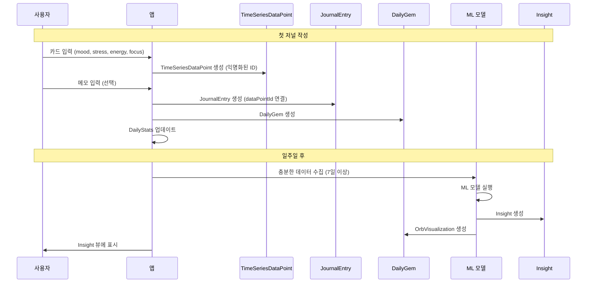

# 📋 상세 데이터 수집 시나리오

이 문서는 온보딩부터 데이터 수집, 인사이트 생성까지의 구체적인 시나리오를 단계별로 상세히 설명합니다.

---

## 시나리오 1: 첫 사용자 - 온보딩부터 첫 저널 작성까지

### Step 1: 앱 실행 및 온보딩 체크

**상황**: 사용자가 앱을 처음 실행

**데이터 상태**:
```swift
// 아직 데이터 없음
UserProfile.onboardingState = nil  // 또는 isCompleted = false
```

**액션**: `OnboardingCheckView`에서 `UserProfile.onboardingState` 확인

---

### Step 2: 온보딩 플로우

#### 2.1. WelcomeView
- **데이터 생성**: 없음 (정보 표시만)
- **소요 시간**: 10-15초

#### 2.2. GoalSelectionView
- **사용자 액션**: 목표 선택 (예: "웰니스 & 마음의 평온", "생산성 향상")
- **데이터 생성**:
```swift
OnboardingState(
    isCompleted: false,
    completedSteps: ["welcome", "goalSelection"],
    selectedGoals: ["wellness", "productivity"],
    completedAt: nil,
    skippedSteps: []
)
```
- **저장 위치**: `UserProfile.onboardingState.selectedGoals`

#### 2.3. DataCollectionIntroView
- **내용**: 선택한 목표에 맞춘 데이터 수집 방법 안내
  - "웰니스" 선택 시: 마음 데이터 (mood, stress, energy, focus) 수집 안내
  - "생산성" 선택 시: 행동 데이터 (productivity, digitalDistraction) 수집 안내
- **권한 요청**: 스크린타임, HealthKit 권한 동의
- **데이터 생성**:
```swift
UserDataCollectionSettings(
    accountId: accountId,
    enabledDataTypes: ["mood", "stress", "energy", "focus"],  // 선택한 목표 기반
    permissions: DataPermissions(
        screenTime: .granted,
        healthKit: .granted,
        // ...
    ),
    collectionFrequency: .daily,
    anonymizationLevel: .pseudonymized,
    allowMLTraining: true,
    // ...
)
```

#### 2.4. InsightPreviewView
- **내용**: 인사이트 미리보기 (시뮬레이션)
- **데이터 생성**: 없음 (표시만)

#### 2.5. OnboardingCompleteView
- **액션**: "첫 기록 시작하기" 버튼 클릭
- **데이터 생성**:
```swift
OnboardingState(
    isCompleted: true,
    completedSteps: ["welcome", "goalSelection", "dataCollectionIntro", "insightPreview", "onboardingComplete"],
    selectedGoals: ["wellness", "productivity"],
    completedAt: Date(),
    skippedSteps: []
)
```

---

### Step 3: 첫 저널 작성 (HomeView - Write Sheet)

#### 3.1. UI 표시

**카드 1: 기분**
```
┌─────────────────────────────┐
│ 오늘 기분은 어땠나요?       │
│                             │
│  😢 ──────●─────── 😊     │
│  0       75       100       │
│                             │
│  [슬라이더 조작]            │
└─────────────────────────────┘
```

**카드 2: 스트레스**
```
┌─────────────────────────────┐
│ 오늘 스트레스는?            │
│                             │
│  😌 ──────●─────── 😰     │
│  0       30       100       │
└─────────────────────────────┘
```

**카드 3: 에너지**
```
┌─────────────────────────────┐
│ 오늘 에너지 레벨은?         │
│                             │
│  😴 ──────●─────── ⚡     │
│  0       70       100       │
└─────────────────────────────┘
```

**카드 4: 집중도**
```
┌─────────────────────────────┐
│ 오늘 집중도는?              │
│                             │
│  🌀 ──────●─────── 🎯     │
│  0       80       100       │
└─────────────────────────────┘
```

**선택적: 메모**
```
┌─────────────────────────────┐
│ 오늘의 한 줄 (선택사항)     │
│ ┌─────────────────────────┐ │
│ │ 오늘은 프로젝트가 잘    │ │
│ │ 진행되어 기분이 좋았다  │ │
│ └─────────────────────────┘ │
└─────────────────────────────┘
```

#### 3.2. "기록 완료" 버튼 클릭 시 데이터 생성

**3.2.1. AnonymousUserIdentity 생성 (최초 1회)**
```swift
let anonymousUserId = UUID()
let anonymousIdentity = AnonymousUserIdentity(
    id: anonymousUserId,
    accountId: accountId,  // 암호화된 참조
    createdAt: Date()
)

// IdentityMapping 생성
let mapping = IdentityMapping(
    id: UUID(),
    accountId: accountId,
    anonymousUserId: anonymousUserId,
    encryptedKey: encrypt(accountId, anonymousUserId),
    createdAt: Date(),
    isActive: true,
    deletionRequestedAt: nil
)
```

**3.2.2. TimeSeriesDataPoint 생성**
```swift
let now = Date()
let calendar = Calendar.current
let hour = calendar.component(.hour, from: now)

let dataPoint = TimeSeriesDataPoint(
    id: UUID(),
    anonymousUserId: anonymousUserId,  // ✅ 익명화된 ID 사용
    timestamp: now,
    date: calendar.startOfDay(for: now),
    timeOfDay: hour >= 18 ? .evening : .afternoon,
    dayOfWeek: calendar.component(.weekday, from: now),
    weekOfYear: calendar.component(.weekOfYear, from: now),
    month: calendar.component(.month, from: now),
    values: [
        "mood": .integer(75),
        "stress": .integer(30),
        "energy": .integer(70),
        "focus": .integer(80)
    ],
    source: .manual,
    confidence: 0.9,  // 사용자 직접 입력
    completeness: 0.4,  // 마음 데이터 4개 / 전체 10개 예상
    notes: nil,
    tags: [],
    context: nil,
    features: nil,
    predictions: nil,
    anomalies: nil,
    createdAt: now,
    updatedAt: now
)
```

**3.2.3. JournalEntry 생성 (메모 입력 시)**
```swift
let journalEntry = JournalEntry(
    id: UUID(),
    accountId: accountId,  // PII 영역
    date: now,
    title: nil,
    content: "오늘은 프로젝트가 잘 진행되어 기분이 좋았다",
    dataPointId: dataPoint.id,  // ✅ TimeSeriesDataPoint 연결
    category: .emotion,
    tags: [],
    gemId: nil,
    createdAt: now,
    updatedAt: now
)
```

**3.2.4. DailyGem 생성**
```swift
// 데이터 패턴 분석
let moodValue = 75.0 / 100.0
let gemType: GemType = moodValue > 0.7 ? .crystal : .diamond

let stressValue = 30.0 / 100.0
let colorTheme: ColorTheme = stressValue < 0.3 ? .amber : .teal

let dailyGem = DailyGem(
    id: UUID(),
    accountId: accountId,
    date: calendar.startOfDay(for: now),
    gemType: gemType,
    brightness: dataPoint.completeness,  // 0.4
    uncertainty: 1.0 - dataPoint.confidence,  // 0.1
    journalEntries: [journalEntry.id.uuidString],
    colorTheme: colorTheme,
    createdAt: now
)
```

**3.2.5. DailyStats 생성/업데이트**
```swift
// 마음 점수 계산
let mindScore = (75.0 + (100.0 - 30.0) + 70.0 + 80.0) / 400.0  // 0.72

let dailyStats = DailyStats(
    accountId: accountId,
    date: calendar.startOfDay(for: now),
    totalEntries: 1,
    totalDataPoints: 1,
    mindScore: mindScore,
    behaviorScore: nil,  // 아직 수집 안 됨
    physicalScore: nil,  // 아직 수집 안 됨
    overallScore: mindScore,
    mindCompleteness: 1.0,  // 마음 데이터 4개 모두 수집
    behaviorCompleteness: 0.0,
    physicalCompleteness: 0.0,
    overallCompleteness: 0.4,  // 전체 10개 중 4개
    categories: ["emotion": 1],
    dataSourceCounts: ["manual": 1]
)
```

**3.2.6. UserProfile 업데이트**
```swift
userProfile.firstJournalDate = now
userProfile.onboardingState?.isCompleted = true
userProfile.onboardingState?.completedAt = now
```

---

## 시나리오 2: 일주일 후 - 다양한 데이터 수집

### Step 1: 추가 데이터 수집 (권한 동의 후)

#### 1.1. 자동 수집 (스크린타임)

**시간**: 매일 자정 또는 사용자가 앱을 열 때

**데이터 생성**:
```swift
// 스크린타임 데이터로 digitalDistraction 계산
let screenTimeMinutes = 420  // 7시간
let digitalDistraction = min(100, screenTimeMinutes / 6)  // 70

// 기존 TimeSeriesDataPoint 업데이트 또는 새로 생성
let updatedDataPoint = TimeSeriesDataPoint(
    // ... 기존 필드들
    values: [
        "mood": .integer(75),
        "stress": .integer(30),
        "energy": .integer(70),
        "focus": .integer(80),
        "digitalDistraction": .integer(70)  // ✅ 추가
    ],
    source: .screenTime,
    completeness: 0.5,  // 5개 수집
    // ...
)
```

#### 1.2. 자동 수집 (HealthKit)

**시간**: 매일 자정

**데이터 생성**:
```swift
// HealthKit에서 수면 데이터 가져오기
let sleepHours = 7.5
let sleepScore = calculateSleepScore(hours: sleepHours)  // 70

let updatedDataPoint = TimeSeriesDataPoint(
    // ... 기존 필드들
    values: [
        // ... 기존 값들
        "sleepScore": .integer(sleepScore),
        "fatigue": .integer(25),
        "activityLevel": .integer(65)  // 걸음 수 기반
    ],
    source: .healthKit,
    completeness: 0.8,  // 8개 수집
    // ...
)
```

#### 1.3. 수동 입력 (행동 데이터)

**사용자 액션**: Write Sheet에서 추가 질문에 답변

**카드 5: 생산성**
```
┌─────────────────────────────┐
│ 오늘 생산성은?              │
│                             │
│  📉 ──────●─────── 📈     │
│  0       85       100       │
└─────────────────────────────┘
```

**데이터 업데이트**:
```swift
dataPoint.values["productivity"] = .integer(85)
dataPoint.completeness = 0.9  // 9개 수집
dataPoint.updatedAt = Date()
```

---

### Step 2: 일주일 후 - DailyStats 집계

**시간**: 매일 자정 또는 사용자가 앱을 열 때

**계산 로직**:
```swift
// 최근 7일의 TimeSeriesDataPoint 조회
let last7Days = calendar.date(byAdding: .day, value: -7, to: Date())!
let dataPoints = fetchDataPoints(
    anonymousUserId: anonymousUserId,
    from: last7Days,
    to: Date()
)

// 집계 계산
let mindScores = dataPoints.compactMap { dp in
    guard let mood = dp.values["mood"]?.toMLFeature(),
          let stress = dp.values["stress"]?.toMLFeature(),
          let energy = dp.values["energy"]?.toMLFeature(),
          let focus = dp.values["focus"]?.toMLFeature() else {
        return nil
    }
    return (mood + (1.0 - stress) + energy + focus) / 4.0
}

let averageMindScore = mindScores.reduce(0, +) / Double(mindScores.count)
```

---

## 시나리오 3: 인사이트 생성 (7일 후)

### Step 1: 인사이트 생성 조건 확인

**조건**:
- 최소 7일 이상 데이터 수집
- 최소 데이터 포인트: 7개
- 최소 완성도: 0.6 (60%)

**체크 로직**:
```swift
let dataPoints = fetchDataPoints(anonymousUserId: anonymousUserId)
let recentDataPoints = dataPoints.filter { $0.date >= sevenDaysAgo }

guard recentDataPoints.count >= 7,
      recentDataPoints.allSatisfy({ $0.completeness >= 0.6 }) else {
    return  // 인사이트 생성 불가
}
```

### Step 2: ML 모델 실행 (Cloud Functions)

**입력**:
```swift
let mlInput = MLFeatureVector(
    id: UUID(),
    anonymousUserId: anonymousUserId,
    timestamp: Date(),
    features: [
        "mood_avg": 0.72,
        "stress_avg": 0.30,
        "energy_avg": 0.70,
        "focus_avg": 0.80,
        "productivity_avg": 0.75,
        "sleep_score_avg": 0.68,
        "trend_mood": 0.05,  // 상승 추세
        "trend_stress": -0.10  // 하락 추세
    ],
    labels: nil,
    metadata: nil,
    createdAt: Date()
)
```

**ML 모델 실행** (Cloud Functions):
```swift
// Cloud Functions에서 실행
let mlOutput = await runMLModel(input: mlInput)

// 결과
let mlModelOutput = MLModelOutput(
    id: UUID(),
    anonymousUserId: anonymousUserId,
    modelId: "pip_score_v1",
    timestamp: Date(),
    predictions: [
        "next_week_mind": 0.75,
        "next_week_behavior": 0.78,
        "next_week_physical": 0.70
    ],
    probabilities: nil,
    confidence: 0.82,
    uncertainty: 0.18,
    features: mlInput.features,
    explanation: "최근 일주일간 긍정적인 트렌드를 보이고 있습니다.",
    createdAt: Date()
)
```

### Step 3: Insight 생성

```swift
let insight = Insight(
    id: UUID(),
    anonymousUserId: anonymousUserId,
    type: .trend,
    title: "이번 주 감정 패턴 분석",
    description: "최근 일주일간 전반적으로 긍정적인 감정이 증가했습니다.",
    confidence: 0.82,
    dataCompleteness: 0.85,
    basedOnDataPoints: recentDataPoints.map { $0.id.uuidString },
    basedOnTimeRange: DateInterval(start: sevenDaysAgo, end: Date()),
    mlModelOutputId: mlModelOutput.id,
    findings: [
        InsightFinding(
            metric: "mood",
            value: 0.72,
            trend: .increasing,
            significance: 0.8,
            explanation: "기분 점수가 평균 0.72로, 이전 주 대비 5% 상승했습니다."
        ),
        InsightFinding(
            metric: "stress",
            value: 0.30,
            trend: .decreasing,
            significance: 0.7,
            explanation: "스트레스 수준이 평균 0.30으로, 이전 주 대비 10% 감소했습니다."
        )
    ],
    recommendations: [
        "수요일의 긍정적인 패턴을 유지하기 위해 비슷한 활동을 계획해보세요.",
        "스트레스 관리에 효과적인 방법을 찾았습니다. 이를 지속해보세요."
    ],
    visualizations: ["line_chart", "orb"],
    createdAt: Date()
)
```

### Step 4: OrbVisualization 생성

```swift
let orb = OrbVisualization(
    id: UUID(),
    anonymousUserId: anonymousUserId,
    date: Date(),
    brightness: 0.85,  // 데이터 완성도
    complexity: 7,  // 데이터 다양성
    uncertainty: 0.18,  // ML 모델 불확실성
    timeSeriesFeatures: [
        "trend_strength": 0.75,
        "seasonality": 0.3,
        "volatility": 0.2
    ],
    categoryWeights: [
        "mind": 0.4,
        "behavior": 0.35,
        "physical": 0.25
    ],
    gemType: .crystal,
    colorTheme: .amber,  // 긍정적인 트렌드
    size: 1.2,
    colorGradient: ["#82EBEB", "#40DBDB", "#31B0B0"],
    dataPointIds: recentDataPoints.map { $0.id.uuidString },
    mlModelOutputId: mlModelOutput.id,
    createdAt: Date()
)
```

---

## 시나리오 4: 목표 추천 (인사이트 기반)

### Step 1: GoalRecommendation 생성

**조건**: Insight가 생성되고, 사용자의 목표와 연관성이 있을 때

**로직**:
```swift
// Insight 분석
let insights = fetchInsights(anonymousUserId: anonymousUserId)
let relevantInsight = insights.first { $0.type == .trend }

// 목표 추천 생성
let recommendation = GoalRecommendation(
    id: UUID(),
    accountId: accountId,
    goalId: nil,  // 새로 생성할 목표
    title: "스트레스 관리 강화",
    description: "최근 스트레스가 감소하는 추세입니다. 이를 지속하기 위한 프로그램을 추천합니다.",
    category: .wellness,
    confidence: 0.75,
    reasoning: "인사이트 분석 결과, 스트레스 관리에 효과적인 패턴을 발견했습니다.",
    expectedImpact: 0.8,
    basedOnInsights: [relevantInsight.id.uuidString],
    createdAt: Date()
)
```

### Step 2: Goal 생성 (사용자가 추천 수락 시)

```swift
let goal = Goal(
    id: UUID(),
    accountId: accountId,
    title: recommendation.title,
    description: recommendation.description,
    category: recommendation.category,
    targetDate: Calendar.current.date(byAdding: .day, value: 30, to: Date()),
    startDate: Date(),
    status: .active,
    progress: 0.0,
    gemVisualization: GemVisualization(
        gemType: .crystal,
        colorTheme: .teal,
        brightness: 0.0,
        size: 1.0,
        customShape: nil
    ),
    milestones: [],
    relatedJournalEntries: [],
    createdAt: Date(),
    updatedAt: Date()
)
```

---

## 시나리오 5: 데이터 수집 확장 (사용자가 새 데이터 타입 활성화)

### Step 1: 사용자가 설정에서 새 데이터 타입 활성화

**상황**: 사용자가 "수면 점수" 자동 수집을 활성화

**액션**:
```swift
// UserDataCollectionSettings 업데이트
settings.enabledDataTypes.append("sleep_score")
settings.typeSettings["sleep_score"] = DataTypeSettings(
    schemaId: sleepScoreSchemaId,
    isEnabled: true,
    collectionMethod: .healthKit,
    sensitivityOverride: nil,
    customRange: nil,
    notes: nil
)
```

### Step 2: 다음 날부터 자동 수집 시작

**시간**: 매일 자정 또는 HealthKit 데이터 업데이트 시

**데이터 생성**:
```swift
// HealthKit에서 수면 데이터 가져오기
let sleepData = fetchHealthKitSleepData(date: Date())

let dataPoint = TimeSeriesDataPoint(
    // ... 기존 필드들
    values: [
        // ... 기존 값들
        "sleepScore": .integer(sleepData.score)  // ✅ 새로 추가
    ],
    completeness: 0.9,  // 완성도 증가
    // ...
)
```

---

## 데이터 흐름 요약 다이어그램



---

## 주요 포인트

1. **Identity Separation**: 모든 분석 데이터는 `anonymousUserId` 사용
2. **TimeSeriesDataPoint 중심**: 모든 데이터 수집의 핵심
3. **점진적 데이터 수집**: 처음엔 마음 데이터만, 점차 확장
4. **인사이트 생성 조건**: 최소 7일, 최소 완성도 60%
5. **ML 모델 연동**: Cloud Functions에서 실행, 결과를 MLModelOutput으로 저장

---

**작성일**: 2025.12  
**버전**: 1.0  
**상태**: 설계 완료
