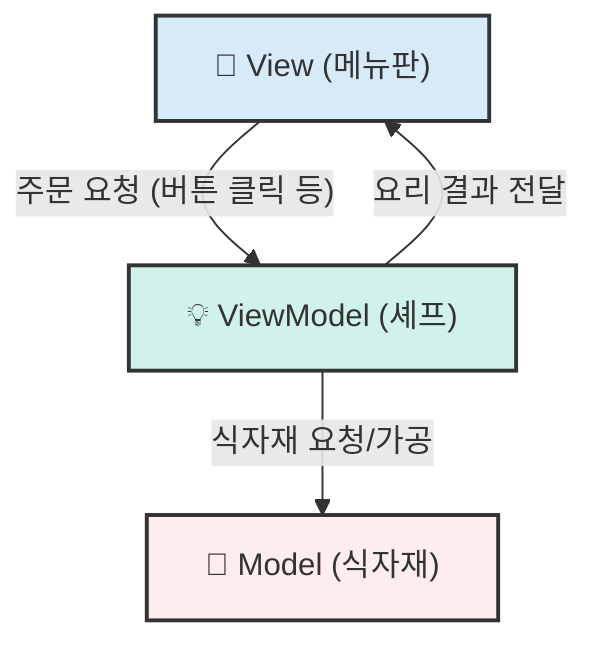

# 💻 DEVELOPMENT GUIDE: PIP iOS App (SwiftUI)

안녕하세요! 이 문서는 우리가 함께 만들어갈 PIP 앱의 iOS 개발을 위한 나침반입니다. 데이터 분석의 세계에서 앱 개발의 세계로 오신 것을 환영합니다! 모든 것이 낯설게 느껴질 수 있지만, 이 가이드가 든든한 길잡이가 되어줄 것입니다.

우리의 목표는 Figma로 디자인한 아름답고 직관적인 경험을 실제 작동하는 앱으로 완벽하게 구현하는 것입니다. 이 문서는 그 여정을 위한 기술적인 약속과 지도를 담고 있습니다.

---

## 1. 🍽️ 우리 앱의 주방: MVVM 아키텍처 이해하기

우리 앱은 **MVVM (Model-View-ViewModel)** 이라는 방식으로 만들어집니다. 어려운 단어처럼 보이지만, '레스토랑 주방'을 생각하면 아주 간단합니다. 코드를 역할에 따라 나누어, 주방을 체계적으로 운영하는 것과 같습니다.

*   **🎨 View (메뉴판 & 서빙)**: 손님(사용자)이 보고 주문하는 메뉴판입니다. 예쁘게 디자인된 실제 앱 화면이죠. 손님의 주문(터치, 스와이프)을 받아서 주방(ViewModel)에 전달하는 역할만 합니다.
    *   *(예: `HomeView.swift`는 오늘의 질문 카드를 보여주는 메뉴판)*
*   **🧠 ViewModel (총괄 셰프)**: 주방의 총괄 셰프입니다. 메뉴판(`View`)에서 "스테이크 주문이요!" 하는 요청을 받으면, 창고(`Model`)에서 재료를 가져와 요리법에 맞게 조리하고, 완성된 요리를 서빙(`View`)에 내보냅니다. 모든 실질적인 두뇌 활동은 여기서 일어납니다.
    *   *(예: `HomeViewModel.swift`는 "카드를 오른쪽으로 넘겼네? '긍정'으로 기록하고 다음 질문을 준비해!" 같은 모든 판단을 담당)*
*   **📦 Model (식자재 창고)**: 요리에 필요한 순수한 '식자재'입니다. 사용자 데이터의 모양과 종류를 정의합니다. 예를 들어 '감정 기록'이라는 식자재 상자에는 '날짜', '내용', '감정 점수'가 들어있습니다.
    *   *(예: `JournalEntry.swift`는 감정 기록이라는 식자재의 규격)*



**왜 이렇게 나눌까요?** 메뉴판 디자이너는 메뉴판만 바꾸고, 셰프는 레시피 개발에만 집중할 수 있습니다. 각자 역할이 명확해서 일이 꼬이지 않고, 어떤 요리(기능)에 문제가 생겼을 때 원인을 찾기 훨씬 쉬워집니다.

---

## 2. 🧰 기술 도구함 (Tech Stack)

우리 주방에서 사용할 핵심 도구들입니다. 파이썬 세계의 `pip`, `pandas`, `jupyter notebook`처럼, Swift 세계에도 훌륭한 도구들이 있습니다.

| 영역 | 주요 도구 | 역할 (쉽게 말해) |
| :--- | :--- | :--- |
| **UI 프레임워크** | **SwiftUI** | Figma 디자인을 실제 코드로 구현하는 '앱 디자인 도구'입니다. |
| **백엔드/데이터베이스**| **Firebase**| 모든 사용자 데이터를 보관하고 관리하는 '클라우드 창고/서버'입니다. |
| **의존성 관리** | **Swift Package Manager**| `pip`처럼 Firebase 같은 외부 도구를 쉽게 설치/관리하는 '설치 매니저'입니다. |
| **테스트** | **XCTest** | 우리 앱이 계획대로 잘 작동하는지 확인하는 '품질 검사원'입니다. |

---

## 3. 🗺️ Xcode 프로젝트 지도: 어디에 무엇이 있을까?

Xcode 프로젝트(`PIP_Project.xcodeproj`)를 열면 여러 폴더와 파일이 보입니다. 아래 지도를 따라가면 길을 잃지 않을 수 있습니다.

**추천 폴더 구조 (`PIP_Project/PIP_Project/` 내부):**
```
├── Application/         // 앱의 시작점 (PIP_ProjectApp.swift)
├── Views/               // 🎨 메뉴판 (SwiftUI 화면 코드)
│   ├── Home/
│   ├── Insight/
│   ├── Goals/
│   └── Status/
├── ViewModels/          // 🧠 셰프 (화면의 로직/두뇌)
├── Models/              // 📦 식자재 (데이터의 모양 정의)
├── Components/          // 💎 재사용 가능한 부품 (Gems, Orbs, 커스텀 버튼 등)
├── Resources/           // 🖼️ 기타 자원
│   └── Assets.xcassets  // 이미지, 색상, 앱 아이콘 보관소
└── Info.plist           // 📜 앱의 주민등록증 (이름, 버전, 권한 등)
```

*   **`PIP_ProjectTests/`** 와 **`PIP_ProjectUITests/`**: 이곳이 바로 '품질 검사원(XCTest)'이 일하는 곳입니다. `ViewModel`의 계산 로직이 맞는지, 버튼을 눌렀을 때 화면이 잘 넘어가는지 등을 자동으로 검사하는 코드를 작성하여 앱의 안정성을 높입니다.

---

## 4. ✨ 핵심 기능 개발: 어떻게 만들까?

Figma 디자인의 핵심인 **Gems, Orbs, Jewels**는 단순한 이미지가 아닙니다. 데이터에 따라 모습이 변하는 '살아있는' 부품으로 만듭니다.

`Components` 폴더 안에 각각의 SwiftUI `View` 파일을 만들고, 데이터(밝기, 모양, 색상 등)를 넣어주면 그에 맞게 스스로를 그리는 방식으로 구현할 것입니다.

**`OrbView.swift` (가상 코드 예시):**
```swift
import SwiftUI

// OrbView는 이런 식으로 데이터만 넣어주면
// 알아서 모양, 색, 그림자까지 그려주는 부품이 됩니다.
struct OrbView: View {
    let brightness: Double // 데이터 완성도 (0.0 ~ 1.0)
    let complexity: Int    // 데이터 특성 (기하학적 다양성)
    let uncertainty: Double // 모델 불확실성 (네온 섀도우)

    var body: some View {
        ZStack {
            // 1. 기본 도형: complexity 값에 따라 다른 모양을 그림
            // 2. 글래스 효과 적용
            // 3. 밝기 조절: .brightness(brightness)
            // 4. 네온 섀도우 효과: .shadow(color: .tealLogo.opacity(uncertainty), radius: 20)
        }
    }
}
```

---

이 가이드가 당신의 손에 들린 지도가 되길 바랍니다. 막히는 부분이 있거나 더 궁금한 점이 생기면 언제든지 다시 질문해주세요. 함께 멋진 앱을 만들어봅시다!
