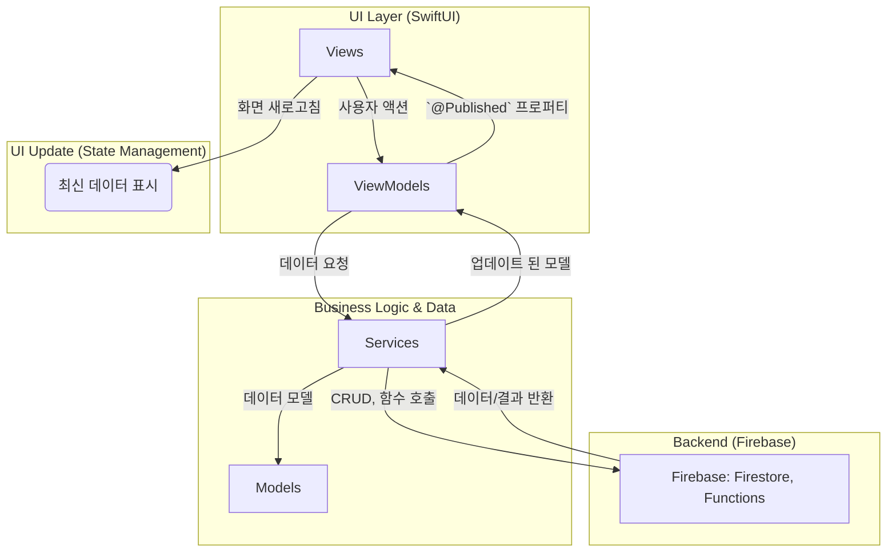

# 💻 DEVELOPMENT GUIDE: PIP iOS App (SwiftUI)

이 문서는 `PIP_Project/` 디렉토리 내의 **네이티브 iOS 앱**을 개발하기 위한 기술 가이드라인을 제공합니다.

> **참고:** AI/ML 모델(`PIP Score` 등) 개발은 별도의 Python 환경에서 진행되며, 이 가이드에서는 다루지 않습니다. 해당 내용은 `03_Development/` 폴더의 다른 문서를 참고하십시오.

---

## 1. 🚀 기술 스택 및 아키텍처 (Tech Stack & Architecture)

### 1.1. 주요 기술

| 영역 | 주요 도구 및 언어 | 역할 |
| :--- | :--- | :--- |
| **UI 프레임워크** | **SwiftUI** | Apple의 최신 선언형 UI 프레임워크. |
| **상태 관리** | **Combine + ObservableObject** | SwiftUI의 내장 반응형 프로그래밍 프레임워크. |
| **백엔드/데이터** | **Firebase Firestore & Storage** | 사용자 데이터 및 파일 저장/관리를 위한 BaaS. |
| **서버 사이드 로직**| **Firebase Cloud Functions** | 복잡한 분석 및 비즈니스 로직 처리. |
| **패키지 관리** | **Swift Package Manager (SPM)** | 의존성 관리. |
| **테스트** | **XCTest** | 단위 테스트(Unit Tests) 및 UI 테스트(UI Tests). |

### 1.2. 앱 내부 아키텍처: MVVM (Model-View-ViewModel)

본 프로젝트는 **MVVM** 아키텍처를 따릅니다. 이는 UI와 비즈니스 로직을 분리하여 코드의 테스트 용이성과 유지보수성을 높입니다.



*   **Views:** SwiftUI 뷰. 오직 UI를 그리고 사용자 입력을 `ViewModel`으로 전달하는 역할만 합니다.
*   **ViewModels:** `View`를 위한 상태와 로직을 가집니다. `Service`를 통해 데이터를 가져오고, `@Published` 프로퍼티를 통해 `View`를 업데이트합니다.
*   **Services:** 비즈니스 로직의 핵심. Firebase와의 통신(데이터 읽기/쓰기, 함수 호출)을 담당합니다.
*   **Models:** `Codable`을 준수하는 Swift 구조체. Firestore의 데이터 구조와 일치합니다.

---

## 2. 🛠️ 개발 환경 설정 (Getting Started)

1.  **저장소 클론:**
    ```bash
    git clone https://github.com/neomakes/PIP_Project.git
    cd PIP_Project
    ```
2.  **Firebase 설정:**
    *   Firebase Console에서 iOS 앱을 생성합니다.
    *   다운로드한 `GoogleService-Info.plist` 파일을 `PIP_Project/PIP_Project/` 디렉토리 안에 위치시킵니다. 이 파일은 `.gitignore`에 의해 버전 관리에서 제외됩니다.

3.  **커스텀 폰트 설치:**
    *   `03_Development/assets/fonts/`에 있는 `Pretendard` 폰트 파일들을 Xcode 프로젝트에 추가합니다.
    *   `Info.plist` 파일에 "Fonts provided by application" 항목을 추가하고, 모든 폰트 파일명(예: `Pretendard-Regular.otf`)을 등록합니다.

4.  **프로젝트 실행:**
    *   `PIP_Project/PIP_Project.xcodeproj` 파일을 Xcode로 엽니다.
    *   상단에서 원하는 시뮬레이터를 선택하고 `Cmd + R` 또는 ▶ 버튼을 눌러 빌드 및 실행합니다.

---

## 3. 🎨 UI 구현 가이드 (Implementing the Design System)

`BRANDING_GUIDE.md`에 정의된 디자인 시스템을 코드로 구현하는 방법입니다. 재사용성을 위해 확장(Extension) 또는 별도 컴포넌트로 만드는 것을 권장합니다.

### 3.1. 컬러 (Colors)

`Assets.xcassets`에 색상을 추가하거나, `Color` 익스텐션을 만들어 사용합니다.

**예시: `Color+Extensions.swift`**
```swift
import SwiftUI

extension Color {
    // Background
    static let primaryBackgroundStart = Color(hex: "#000000")
    static let primaryBackgroundEnd = Color(hex: "#202020")

    // Accent: Teal System
    static let tealBrightest = Color(hex: "#82EBEB")
    static let tealBright = Color(hex: "#40DBDB")
    static let tealDefault = Color(hex: "#31B0B0")
    // ... 나머지 Teal 색상 추가

    // Neutrals
    static let primaryText = Color(hex: "#FFFFFF")
    static let secondaryText = Color(hex: "#A0A0A0")
}

// Hex 색상 코드를 사용하기 위한 헬퍼
extension Color {
    init(hex: String) {
        // Hex to UIColor 변환 로직 구현
    }
}
```

**사용법:**
```swift
Text("Hello, World!")
    .foregroundColor(.primaryText)
    .background(
        LinearGradient(
            gradient: Gradient(colors: [.primaryBackgroundStart, .primaryBackgroundEnd]),
            startPoint: .top,
            endPoint: .bottom
        )
    )
```

### 3.2. 타이포그래피 (Typography)

커스텀 폰트를 쉽게 적용하기 위해 `Font` 익스텐션 또는 `ViewModifier`를 사용합니다.

**예시: `Font+Extensions.swift`**
```swift
import SwiftUI

extension Font {
    static func pretendard(size: CGFloat, weight: PretendardWeight) -> Font {
        return .custom("Pretendard-\(weight.rawValue)", size: size)
    }

    enum PretendardWeight: String {
        case black = "Black"
        case bold = "Bold"
        case medium = "Medium"
        case regular = "Regular"
        // ... 나머지 굵기 추가
    }
}
```

**사용법:**
```swift
Text("Headline")
    .font(.pretendard(size: 24, weight: .medium))
```

### 3.3. 아이콘 (Icons)

*   모든 아이콘은 `BRANDING_GUIDE.md`에 따라 단색의 흰색(` #FFFFFF`)을 기본으로 합니다.
*   `Assets.xcassets`에 아이콘을 추가하고, "Render As" 옵션을 "Template Image"로 설정하여 코드에서 색상을 변경할 수 있도록 합니다.

### 3.4. 핵심 컴포넌트 (Core Components)

*   **네비게이션:** 앱의 메인 구조는 4개의 탭으로 구성됩니다. 최상위 뷰에 `TabView`를 사용하여 `Home`, `Insight`, `Goal`, `Status` 뷰를 연결합니다.
*   **Glass Gems & Orbs:** 이들은 복잡한 시각적 요소이므로, 별도의 재사용 가능한 SwiftUI `View`로 만듭니다. `brightness`, `geometry`, `shadow` 등의 파라미터를 받아 동적으로 뷰를 렌더링하도록 설계합니다.

---

## 4. 📂 프로젝트 구조 (Project Structure)

MVVM 아키텍처에 따라 `PIP_Project/PIP_Project/` 내에 다음과 같은 폴더 구조를 권장합니다.

```
PIP_Project/
├── Views/
│   ├── Home/
│   ├── Insight/
│   ├── Goal/
│   └── Status/
├── ViewModels/
├── Services/
├── Models/
├── Extensions/
├── Components/ (재사용 가능한 뷰)
└── Assets.xcassets/
```

---

## 5. ✅ 테스트 (Testing)

*   **Unit Tests (`PIP_ProjectTests`):** `ViewModel`과 `Service`의 로직을 테스트합니다. Firebase 의존성은 Mock 객체를 만들어 분리합니다.
*   **UI Tests (`PIP_ProjectUITests`):** 주요 사용자 플로우가 정상적으로 동작하는지 검증합니다.
*   **CI/CD:** `main` 브랜치에 코드가 푸시되면 `GitHub Actions`가 자동으로 모든 테스트를 실행합니다.

---

## 6. 🤝 코딩 컨벤션 (Coding Conventions)

*   **스타일:** Apple의 [Swift API Design Guidelines](https://www.swift.org/documentation/api-design-guidelines/)를 따릅니다.
*   **네이밍:**
    *   `View`는 `...View`로 끝납니다. (예: `HomeView`)
    *   `ViewModel`은 `...ViewModel`로 끝납니다. (예: `HomeViewModel`)
*   **주석:** 복잡한 로직이나 비즈니스 결정 배경에 대해서만 간결하게 작성합니다.