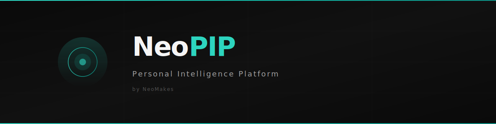
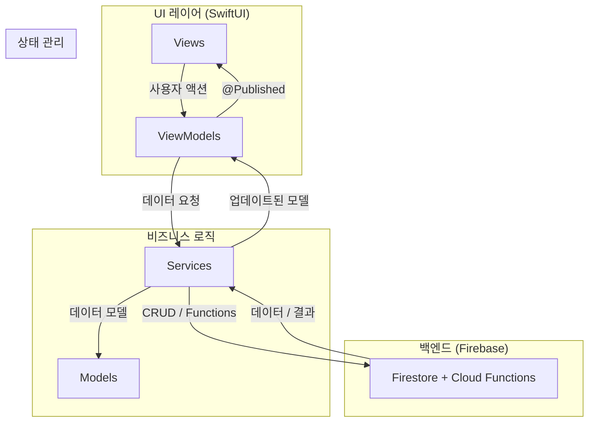

<p align="center">
  
</p>

<p align="center">
  <a href="https://swift.org"></a>
  <a href="https://developer.apple.com/swiftui/"></a>
  <a href="https://developer.apple.com/ios/"></a>
  <a href="LICENSE"></a>
  
</p>

<p align="center">
  <b>NeoPIP</b> — 심리, 행동, 신체 데이터를 통합하여 PIP Score로 맞춤형 웰니스 인사이트를 제공하는 AI 기반 iOS 앱
</p>

<p align="center">
  <a href="README.md">English</a>
</p>

---

## 목차

- [배경 및 동기](#배경-및-동기)
- [주요 기능](#주요-기능)
- [아키텍처](#아키텍처)
- [설치](#설치)
- [사용법](#사용법)
- [프로젝트 구조](#프로젝트-구조)
- [관련 프로젝트](#관련-프로젝트)
- [현재 상태](#현재-상태)
- [로드맵](#로드맵)
- [기여하기](#기여하기)
- [라이선스](#라이선스)

---

## 배경 및 동기

대부분의 웰니스 앱은 걸음 수, 수면, 기분 등 단일 지표만 개별적으로 추적합니다. NeoPIP은 심리 상태, 행동 패턴, 신체 지표를 하나의 **PIP Score**로 통합하여 전반적인 웰빙 상태를 반영하는 총체적 접근 방식을 취합니다.

이 플랫폼은 [neomakes](https://github.com/neomakes) 에이전트 생태계의 사용자 인터페이스 레이어로 설계되었습니다. [NeoSense](https://github.com/neomakes/neosense)의 센서 데이터가 [NeoMind](https://github.com/neomakes/neomind)의 행동 모델로 유입되고, 이를 기반으로 NeoPIP의 개인화된 웰니스 인텔리전스가 작동합니다.

---

## 주요 기능

- **PIP Score** — 심리, 행동, 신체 데이터를 결합한 통합 웰니스 지표
- **AI 딥 인사이트 저널링** — AI 패턴 인식 기반의 구조화된 저널링
- **MVVM 아키텍처** — 9개 ViewModel로 구성된 깔끔한 관심사 분리 (Login, Onboarding, Home, Write, Insight, InsightStory, Goal, Status, ProgramStory)
- **디자인 시스템** — Black & Platinum 기본 테마에 Amber Flame, Tiger Flame, French Blue 악센트 컬러
- **Firebase 백엔드** — Firestore 데이터 영속성, Cloud Functions 분석
- **프라이버시 우선 분석** — 가능한 한 온디바이스 처리, 익명화된 데이터 수집
- **목표 추적** — 개인 웰니스 목표 설정, 추적, 회고
- **인사이트 시각화** — 인터랙티브 오브(Orb) 시각화 및 데이터 탐색 대시보드

---

## 아키텍처



### 화면 구조

| 화면 | ViewModel | 설명 |
|:--|:--|:--|
| LaunchView | — | 앱 실행 및 인증 게이트 |
| OnboardingView | OnboardingViewModel | 최초 실행 설정 플로우 |
| HomeView | HomeViewModel | PIP Score와 Gem이 있는 메인 대시보드 |
| WriteView | WriteViewModel | 카드 기반 저널 작성 |
| InsightView | InsightViewModel | 데이터 시각화 및 오브 표시 |
| InsightStoryView | InsightStoryViewModel | AI 생성 인사이트 내러티브 |
| GoalView | GoalViewModel | 목표 설정 및 진행 추적 |
| StatusView | StatusViewModel | 프로필, 통계, 업적, 가치 |
| SettingsView | — | 앱 설정 |

---

## 설치

### 사전 요구사항

- Xcode 15.0+ 이 설치된 macOS
- iOS 17.0+ 기기 또는 시뮬레이터
- Firebase 프로젝트 (자체 자격 증명 제공 필요)

### 설정

1. 레포지토리 클론:
   ```bash
   git clone https://github.com/neomakes/neopip.git
   cd neopip
   ```

2. Firebase 설정:
   - [console.firebase.google.com](https://console.firebase.google.com)에서 Firebase 프로젝트 생성
   - Firestore 및 Authentication 활성화
   - `GoogleService-Info.plist` 다운로드
   - `PIP_Project/PIP_Project/` 경로에 배치

   > **중요**: `GoogleService-Info.plist`는 gitignore에 포함되어 있습니다. Firebase 자격 증명을 절대 커밋하지 마세요.

3. Xcode에서 `PIP_Project/PIP_Project.xcodeproj`를 엽니다.

4. Signing & Capabilities에서 **Development Team**을 선택합니다.

5. 시뮬레이터 또는 연결된 기기에서 빌드 및 실행 (Cmd+R).

---

## 사용법

### 첫 실행

1. 앱을 실행하면 온보딩 플로우가 나타납니다
2. 초기 설문을 완료하여 기준 PIP Score를 설정합니다
3. 메인 탭을 탐색합니다: Home, Write, Insight, Goal, Status

### 저널링

1. **Write**를 탭하여 새 저널 항목을 작성합니다
2. 활동 유형과 마인드셋을 선택합니다 (커스텀 입력 포함)
3. 앱이 과거 패턴을 기반으로 입력을 분석합니다

### 인사이트

1. **Insight**를 탭하여 데이터 시각화를 확인합니다
2. 오브 시각화는 현재 웰니스 상태를 반영합니다
3. 스토리를 탭하면 AI가 생성한 행동 인사이트를 볼 수 있습니다

---

## 프로젝트 구조

```
neopip/
├── 01_Planning/               # 제품 요구사항, 리서치, 유저 스토리
│   ├── PRD/
│   ├── Research/
│   └── User_Stories/
├── 02_Design_Assets/          # 브랜드 가이드, 아이콘, Figma 내보내기
│   ├── App_Icons/
│   ├── Branding/
│   └── Figma_Exports/
├── 03_Development/            # ML 모델 개발 및 실험
├── 04_Distribution/           # App Store 메타데이터, 릴리즈 노트, 스크린샷
│   ├── AppStore_Metadata/
│   ├── Release_Notes/
│   └── Screenshots/
├── PIP_Project/               # iOS 앱 소스 코드 (Xcode 프로젝트)
│   └── PIP_Project/
│       ├── App/               # 앱 진입점
│       ├── Models/            # 데이터 모델
│       ├── ViewModels/        # MVVM 뷰 모델 (총 9개)
│       ├── Views/             # SwiftUI 뷰
│       │   ├── Home/
│       │   ├── Insights/
│       │   ├── Status/
│       │   └── Shared/
│       ├── Services/          # Firebase 및 비즈니스 로직 서비스
│       └── Resources/         # 에셋, 폰트
├── assets/                    # 레포지토리 에셋 (배너 등)
├── LICENSE
├── CONTRIBUTING.md
├── CODE_OF_CONDUCT.md
└── README.md
```

---

## 관련 프로젝트

- **[NeoMind](https://github.com/neomakes/neomind)** — VRAE 기반 행동 궤적 모델링. NeoPIP 웰니스 인텔리전스의 ML 백본으로, 개인화된 행동 예측을 생성합니다.
- **[NeoSense](https://github.com/neomakes/neosense)** — 멀티모달 센서 로깅. NeoPIP 데이터 파이프라인에 원시 물리 데이터를 제공합니다.
- **[neocog](https://github.com/neomakes/neocog)** — 온디바이스 에이전틱 추론 커널. 로컬 AI 처리를 위한 향후 통합 지점입니다.

---

## 현재 상태

**보류 중** — 프론트엔드가 약 80% 완료되었습니다. neocog/NeoTOC 생태계에 집중하기 위해 개발이 일시 중단되었습니다.

### 구현 완료

- SwiftUI 프론트엔드: 온보딩, 홈 대시보드, 저널(write), 인사이트 시각화, 목표 추적, 상태/프로필
- Firebase 연동: 기본 Firestore 설정, 인증 플로우
- 디자인 시스템: Black & Platinum 테마와 악센트 컬러, 커스텀 컴포넌트
- 프라이버시 우선 분석 노트북 및 가이드

### 미연동 항목

- ML 연동: NeoMind가 연구 백엔드이나 아직 앱에 연결되지 않음
- PIP Score 계산: 설계는 완료되었으나 실제 ML 추론으로 완전 구현되지 않음
- Cloud Functions: 계획되었으나 배포되지 않음

### 중단 사유

웰니스 앱 시장의 경쟁이 심화되면서 개발 초점이 neocog 에이전트 커널과 NeoTOC 플랫폼으로 전환되었습니다. 이들이 더 차별화된 기술적 기여를 나타냅니다. NeoPIP은 iOS + AI + 웰니스 도메인을 아우르는 엔드투엔드 역량 시연으로서 가치를 유지합니다.

---

## 로드맵

- [ ] NeoMind 연결하여 실제 행동 예측 구현
- [ ] ML 추론 기반 PIP Score 계산 구현
- [ ] Firebase Cloud Functions 배포하여 백엔드 분석 구현
- [ ] 나머지 UI 화면 완성 (~20%)
- [ ] 실제 사용자 데이터로 베타 테스트

---

## 기여하기

가이드라인은 [CONTRIBUTING.md](CONTRIBUTING.md)를 참고하세요.

이 프로젝트는 [행동 강령](CODE_OF_CONDUCT.md)을 따릅니다.

---

## 라이선스

이 프로젝트는 MIT 라이선스를 따릅니다 — 자세한 내용은 [LICENSE](LICENSE)를 참고하세요.
