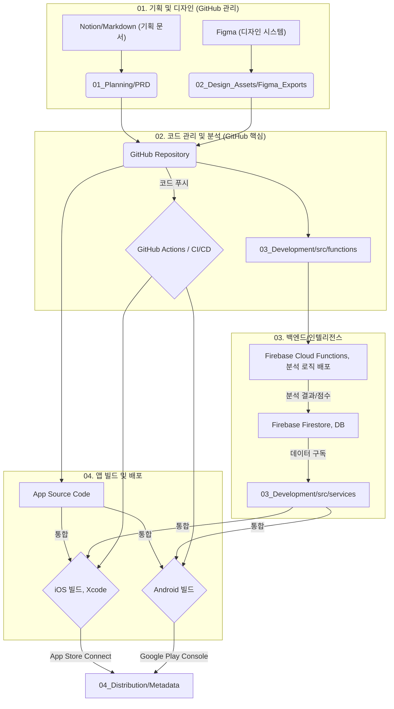
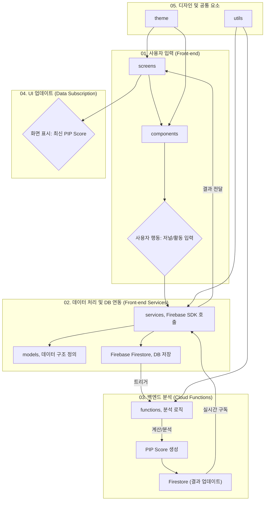

# 🌟 PIP: Personal Intelligence Platform

**"나를 이해하는 가장 스마트한 방법, PIP"**

PIP는 개인의 심리, 행동, 신체 데이터를 통합 분석하여 웰니스 증진과 생산성 향상을 지원하는 AI 기반 종합 솔루션입니다. 본 프로젝트는 1인 개발을 위한 **GitHub 중심의 미니멀하고 체계적인 통합 관리 구조**를 따릅니다.

## 1. 💡 프로젝트 개요 및 핵심 목표

| 항목 | 내용 |
| :--- | :--- |
| **목표** | 개인 데이터 기반의 **PIP Score** 제공 및 AI 기반 **딥 인사이트**를 통한 맞춤형 웰니스/생산성 솔루션 제공. |
| **개발 대상** | iOS (주력) 및 Android (확장 고려) 크로스 플랫폼 앱. |
| **콘셉트** | Black & Platinum 기반의 **지적인 미니멀리즘** (Accent: Amber Flame, Tiger Flame, French Blue). |
| **핵심 기능** | 통합 개인 대시보드(PIP Score), AI 딥 인사이트 저널링, 바이오 리듬 최적화 스케줄러 등 7가지. |

---

## 2. ⚙️ 기술 스택 및 주요 도구

| 영역 | 주요 도구 및 언어 | 역할 |
| :--- | :--- | :--- |
| **버전 관리/협업** | GitHub (Git) | 모든 코드 및 기획 문서의 시계열적 버전 관리 및 CI/CD 연동 허브. |
| **프론트엔드 (App)** | Flutter / React Native (추후 선택 예정) | iOS 및 Android 크로스 플랫폼 앱 개발. |
| **백엔드/데이터베이스** | **Firebase Firestore & Storage** | 사용자 데이터 저장, 오디오/미디어 파일 저장. |
| **인텔리전스 엔진** | **Firebase Cloud Functions (Node.js/TypeScript)** | PIP Score 계산 및 딥 인사이트 분석 로직 실행. |
| **디자인/UI/UX** | **Figma** | 디자인 시스템 구축, 와이어프레임, 최종 화면 디자인. |
| **CI/CD 및 배포** | GitHub Actions (테스트/빌드 자동화), Xcode Cloud (iOS 배포 자동화). | 코드 푸시 시 자동 테스트 및 App Store Connect 연동. |

---

## 3. 🌐 통합 작업 흐름 다이어그램: 시스템 아키텍처

이 다이어그램은 **GitHub를 중심**으로 기획, 백엔드 분석, 그리고 최종적인 iOS 및 Android 배포까지의 데이터 및 코드 흐름을 보여줍니다.

> **핵심:** 기획/코드/백엔드 로직이 모두 GitHub에서 관리되며, Firebase를 데이터 허브 및 분석 플랫폼으로 활용합니다.

## 4. 🧠 앱 내부 코드 흐름 다이어그램: 인텔리전스 처리

이 흐름은 PIP의 핵심인 **데이터 기반 인사이트 제공 과정**을 나타냅니다. 데이터가 앱 내부에서 어떻게 `services`를 거쳐 `functions`(백엔드)로 이동하고, 분석 후 `screens`에 표시되는지를 보여줍니다.

> **핵심:** UI(`screens`, `components`)는 데이터 처리(`services`)와 분리되어 있으며, 복잡한 계산은 **`functions`** (Cloud Functions)에서 처리된 후 **Firestore**를 통해 다시 앱으로 전달됩니다.

---

## 5. 📁 프로젝트 디렉토리 구조 (최적화)

| 경로 | 역할 및 책임 |
| :--- | :--- |
| `01_Planning/` | **[기획]** 프로젝트 기획 관련 모든 문서 관리. |
|     ├── `PRD/` | 제품 요구사항 명세서(PRD) 관리. |
|     ├── `Research/` | 시장 조사, 경쟁 분석 등 리서치 자료 보관. |
|     └── `User_Stories/` | 사용자 스토리 및 요구사항 정의. |
| `02_Design_Assets/` | **[디자인]** 앱 디자인 관련 모든 시각 자산 관리. |
|     ├── `App_Icons/` | 플랫폼별 앱 아이콘 소스 파일. |
|     ├── `Branding/` | 로고, 컬러 팔레트 등 브랜드 아이덴티티 가이드. |
|     └── `Figma_Exports/` | Figma에서 추출된 UI 컴포넌트, 화면 등 디자인 자산. |
| `03_Development/` | **[코드 베이스]** 앱과 백엔드 서비스의 모든 소스 코드. |
|     ├── `assets/` | 앱 내에서 사용되는 이미지, 폰트 등 정적 파일. |
|     └── `src/` | 핵심 소스 코드가 위치하는 디렉토리. |
|         ├── `components/` | 재사용 가능한 UI 위젯 (버튼, 카드 등). |
|         ├── `functions/` | **PIP Score 계산 등 백엔드 분석 로직** (Cloud Functions) 코드. |
|         ├── `models/` | Firestore DB 스키마 및 앱 내 데이터 구조 정의. |
|         ├── `screens/` | 앱의 주요 화면 (홈, 설정, 저널 등). |
|         ├── `services/` | Firebase DB/인증 등 외부 서비스와의 통신 로직. |
|         ├── `theme/` | 앱의 전역 테마(컬러, 폰트, 스타일) 정의. |
|         └── `utils/` | 날짜 포맷팅, 유효성 검사 등 공통 유틸리티 함수. |
| `04_Distribution/` | **[배포]** 앱 스토어 배포와 관련된 모든 자료. |
|     ├── `AppStore_Metadata/` | App Store 제출용 메타데이터 및 정보. |
|     ├── `Release_Notes/` | 각 버전별 변경 사항을 기록하는 릴리즈 노트. |
|     └── `Screenshots/` | 스토어 제출용 앱 스크린샷. |

## 6. ▶️ 개발 시작 가이드

1.  **Figma 설정:** `00_Design System` 페이지에서 확정된 컬러 팔레트와 폰트 스타일을 등록합니다.
2.  **Firebase 초기화:** Firebase 프로젝트를 생성하고, Firestore, Storage, Cloud Functions 환경을 초기 설정합니다.
3.  **코드 클론:** 본 GitHub 저장소를 클론하여 개발을 시작합니다.
4.  **CI/CD 설정:** `.github/workflows/` 파일을 확인하고, GitHub Actions 및 Xcode Cloud와의 연동을 완료합니다.