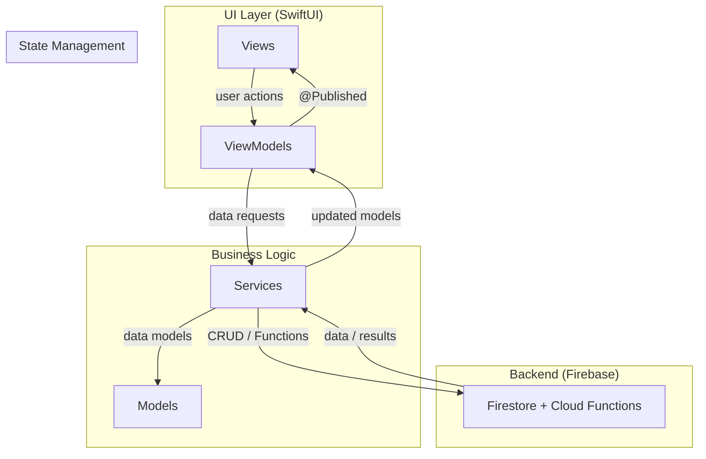

# PIP Project

[](https://swift.org)
[](https://developer.apple.com/swiftui/)
[](https://developer.apple.com/ios/)
[](https://firebase.google.com)
[](LICENSE)
[]()

Personal Intelligence Platform — an AI-powered wellness iOS app that integrates psychological, behavioral, and physical data to deliver personalized insights through a PIP Score.

---

## Table of Contents

- [Background \& Motivation](#background--motivation)
- [Key Features](#key-features)
- [Architecture](#architecture)
- [Installation](#installation)
- [Usage](#usage)
- [Project Structure](#project-structure)
- [Related Projects](#related-projects)
- [Current Status](#current-status)
- [Roadmap](#roadmap)
- [Contributing](#contributing)
- [License](#license)

---

## Background & Motivation

Most wellness apps track a single dimension — steps, sleep, or mood — in isolation. PIP takes a holistic approach: it combines psychological state, behavioral patterns, and physical metrics into a single **PIP Score** that reflects overall well-being.

The platform is designed as the user-facing layer of the [neomakes](https://github.com/neomakes) agent ecosystem. Sensor data from [iphoneLogger](https://github.com/neomakes/iphonelogger) feeds into behavioral models from [humanWorldModel](https://github.com/neomakes/humanWorldModel), which in turn powers PIP's personalized wellness intelligence.

---

## Key Features

- **PIP Score** — Unified wellness metric combining psychological, behavioral, and physical data
- **AI Deep Insight Journaling** — Structured journaling with AI-powered pattern recognition
- **MVVM Architecture** — Clean separation with 9 ViewModels (Login, Onboarding, Home, Write, Insight, InsightStory, Goal, Status, ProgramStory)
- **Design System** — Black & Platinum base with accent colors (Amber Flame, Tiger Flame, French Blue)
- **Firebase Backend** — Firestore for data persistence, Cloud Functions for analysis
- **Privacy-First Analytics** — On-device processing where possible, anonymized data collection
- **Goal Tracking** — Set, track, and reflect on personal wellness goals
- **Insight Visualization** — Interactive orb visualization and dashboard for data exploration

---

## Architecture



### View Structure

| Screen | ViewModel | Description |
|:--|:--|:--|
| LaunchView | — | App launch and authentication gate |
| OnboardingView | OnboardingViewModel | First-run user setup flow |
| HomeView | HomeViewModel | Main dashboard with PIP Score and gems |
| WriteView | WriteViewModel | Journal entry creation with cards |
| InsightView | InsightViewModel | Data visualization and orb display |
| InsightStoryView | InsightStoryViewModel | AI-generated insight narratives |
| GoalView | GoalViewModel | Goal setting and progress tracking |
| StatusView | StatusViewModel | Profile, stats, achievements, values |
| SettingsView | — | App configuration |

---

## Installation

### Prerequisites

- macOS with Xcode 15.0+
- iOS 17.0+ device or simulator
- Firebase project (you provide your own credentials)

### Setup

1. Clone the repository:
   ```bash
   git clone https://github.com/neomakes/PIP_Project.git
   cd PIP_Project
   ```

2. Set up Firebase:
   - Create a Firebase project at [console.firebase.google.com](https://console.firebase.google.com)
   - Enable Firestore and Authentication
   - Download `GoogleService-Info.plist`
   - Place it in `PIP_Project/PIP_Project/`

   > **Important**: `GoogleService-Info.plist` is gitignored. Never commit Firebase credentials.

3. Open `PIP_Project/PIP_Project.xcodeproj` in Xcode.

4. Select your **Development Team** under Signing & Capabilities.

5. Build and run (Cmd+R) on a simulator or connected device.

---

## Usage

### First Run

1. Launch the app — you'll see the onboarding flow
2. Complete the initial questionnaire to establish your baseline PIP Score
3. Navigate the main tabs: Home, Write, Insight, Goal, Status

### Journaling

1. Tap **Write** to create a new journal entry
2. Select your activity type and mindset (including custom inputs)
3. The app processes your entry against historical patterns

### Insights

1. Tap **Insight** to view your data visualization
2. The orb visualization reflects your current wellness state
3. Tap into stories for AI-generated behavioral insights

---

## Project Structure

```
PIP_Project/
├── 01_Planning/               # Product requirements, research, user stories
│   ├── PRD/
│   ├── Research/
│   └── User_Stories/
├── 02_Design_Assets/          # Brand guide, icons, Figma exports
│   ├── App_Icons/
│   ├── Branding/
│   └── Figma_Exports/
├── 03_Development/            # ML model development and experiments
├── 04_Distribution/           # App Store metadata, release notes, screenshots
│   ├── AppStore_Metadata/
│   ├── Release_Notes/
│   └── Screenshots/
├── PIP_Project/               # iOS app source code
│   └── PIP_Project/
│       ├── App/               # App entry point
│       ├── Models/            # Data models
│       ├── ViewModels/        # MVVM view models (9 total)
│       ├── Views/             # SwiftUI views
│       │   ├── Home/
│       │   ├── Insights/
│       │   ├── Status/
│       │   └── Shared/
│       ├── Services/          # Firebase and business logic services
│       └── Resources/         # Assets, fonts
├── LICENSE
├── CONTRIBUTING.md
├── CODE_OF_CONDUCT.md
└── README.md
```

---

## Related Projects

- **[humanWorldModel](https://github.com/neomakes/humanWorldModel)** — VRAE-based behavior trajectory modeling. Serves as the ML backbone for PIP's wellness intelligence, generating personalized behavioral predictions.
- **[iphoneLogger](https://github.com/neomakes/iphonelogger)** — Multi-modal sensor logging. Provides raw physical data that feeds into the PIP data pipeline.
- **[neocog](https://github.com/neomakes/neocog)** — On-device agentic inference kernel. Future integration point for local AI processing.

---

## Current Status

**On Hold** — Frontend is approximately 80% complete. Development paused to focus on the neocog/NeoTOC ecosystem.

### What's Built

- SwiftUI frontend: onboarding, home dashboard, journal (write), insight visualization, goal tracking, status/profile
- Firebase integration: basic Firestore setup, authentication flow
- Design system: Black & Platinum theme with accent colors, custom components
- Privacy-first analytics notebook and guide

### What's Not Connected

- ML integration: humanWorldModel is the research backend but is not yet wired to the app
- PIP Score calculation: designed but not fully implemented with real ML inference
- Cloud Functions: planned but not deployed

### Why Paused

The wellness app market became increasingly crowded. Development focus shifted to the neocog agent kernel and NeoTOC platform, which represent a more differentiated technical contribution. PIP remains valuable as a demonstration of end-to-end iOS + AI + wellness domain capability.

---

## Roadmap

- [ ] Connect humanWorldModel for real behavioral predictions
- [ ] Implement PIP Score calculation with ML inference
- [ ] Deploy Firebase Cloud Functions for backend analysis
- [ ] Complete remaining UI screens (~20%)
- [ ] Beta testing with real user data

---

## Contributing

See [CONTRIBUTING.md](CONTRIBUTING.md) for guidelines.

This project follows the [Code of Conduct](CODE_OF_CONDUCT.md).

---

## License

This project is licensed under the MIT License — see [LICENSE](LICENSE) for details.
