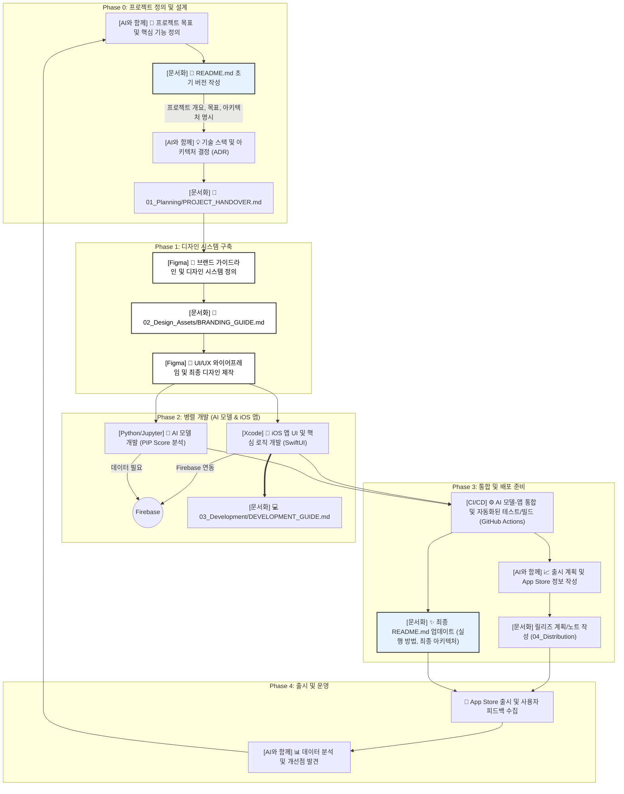
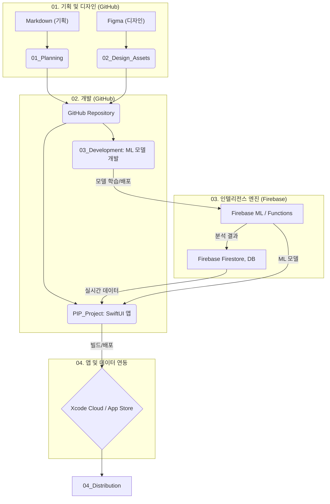
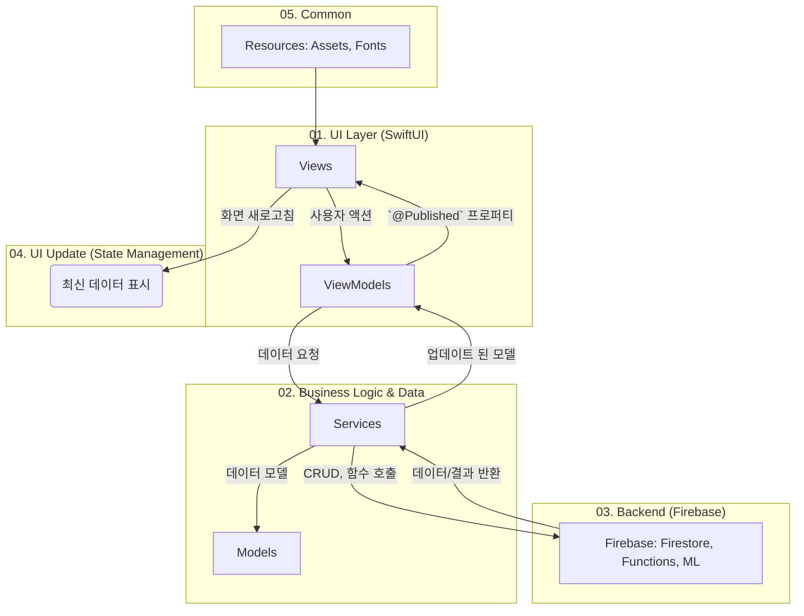
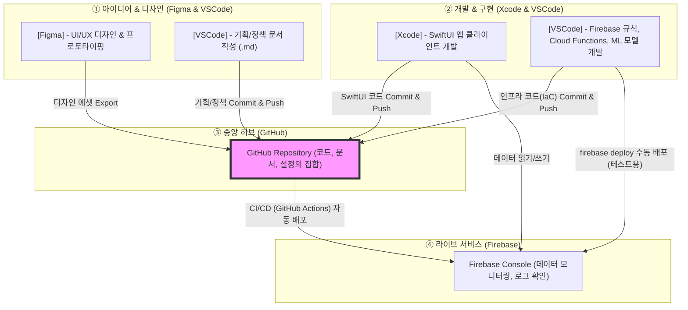

# 🌟 PIP: Personal Intelligence Platform

**"나를 이해하는 가장 스마트한 방법, PIP"**

PIP는 개인의 심리, 행동, 신체 데이터를 통합 분석하여 웰니스 증진과 생산성 향상을 지원하는 AI 기반 종합 솔루션입니다. 본 프로젝트는 1인 개발을 위한 **GitHub 중심의 미니멀하고 체계적인 통합 관리 구조**를 따릅니다.

## 1. 💡 프로젝트 개요 및 핵심 목표

| 항목 | 내용 |
| :--- | :--- |
| **목표** | 개인 데이터 기반의 **PIP Score** 제공 및 AI 기반 **딥 인사이트**를 통한 맞춤형 웰니스/생산성 솔루션 제공. |
| **개발 대상** | iOS (주력) 및 Android (확장 고려) 크로스 플랫폼 앱. |
| **콘셉트** | Black & Platinum 기반의 **지적인 미니멀리즘** (Accent: Amber Flame, Tiger Flame, French Blue). |
| **핵심 기능** | 통합 개인 대시보드(PIP Score), AI 딥 인사이트 저널링, 바이오 리듬 최적화 스케줄러 등 7가지. |

---

## 2. ⚙️ 기술 스택 및 주요 도구

| 영역 | 주요 도구 및 언어 | 역할 |
| :--- | :--- | :--- |
| **버전 관리/협업** | GitHub (Git) | 모든 코드 및 기획 문서의 시계열적 버전 관리 및 CI/CD 연동 허브. |
| **프론트엔드 (App)** | **SwiftUI** (Native iOS) | 네이티브 성능을 극대화하고 최신 iOS 기능을 활용하기 위해 선택. |
| **백엔드/데이터베이스** | **Firebase Firestore & Storage** | 사용자 데이터 저장, 오디오/미디어 파일 저장. |
| **인텔리전스 엔진** | **Firebase Cloud Functions (Node.js/TypeScript)** | PIP Score 계산 및 딥 인사이트 분석 로직 실행. |
| **디자인/UI/UX** | **Figma** | 디자인 시스템 구축, 와이어프레임, 최종 화면 디자인. |
| **CI/CD 및 배포** | GitHub Actions (테스트/빌드 자동화), Xcode Cloud (iOS 배포 자동화). | 코드 푸시 시 자동 테스트 및 App Store Connect 연동. |

---

## 3. 👨‍💻 1인 기업가 개발 프로세스

AI를 활용하는 1인 기업가의 전체 워크플로우입니다. **문서화를 통한 체계적인 관리**와 **AI를 활용한 효율성 증대**가 핵심입니다.

> **핵심:** 기획 단계에서 AI와 함께 아이디어를 구체화하고, 모든 과정을 `README.md`를 중심으로 문서화하며, 개발/분석/운영 전반에 AI를 활용하여 효율을 극대화하는 선순환 구조입니다.

---

## 4. 🌐 통합 작업 흐름 다이어그램: 시스템 아키텍처

이 다이어그램은 **GitHub를 중심**으로 기획, 백엔드 분석, 그리고 최종적인 iOS 및 Android 배포까지의 데이터 및 코드 흐름을 보여줍니다.

> **핵심:** 기획/코드/백엔드 로직이 모두 GitHub에서 관리되며, Firebase를 데이터 허브 및 분석 플랫폼으로 활용합니다.

## 5. 🧠 앱 내부 코드 흐름 다이어그램: 인텔리전스 처리

이 흐름은 PIP의 핵심인 **데이터 기반 인사이트 제공 과정**을 나타냅니다. 데이터가 앱 내부에서 어떻게 `services`를 거쳐 `functions`(백엔드)로 이동하고, 분석 후 `screens`에 표시되는지를 보여줍니다.

> **핵심:** UI(`screens`, `components`)는 데이터 처리(`services`)와 분리되어 있으며, 복잡한 계산은 **`functions`** (Cloud Functions)에서 처리된 후 **Firestore**를 통해 다시 앱으로 전달됩니다.

---

## 6. 상세 워크플로우 및 도구 관리 전략

### 핵심 원칙: "GitHub가 모든 것의 중심이다"

모든 작업(기획, 디자인, 코드, 인프라)의 결과물은 최종적으로 **GitHub 리포지토리**에 기록되어야 합니다. GitHub를 '단일 진실 공급원(Single Source of Truth)'으로 삼아 모든 변경사항을 추적하고 관리합니다.

### 도구 간 상호작용 및 데이터 흐름

아래 다이어그램은 각 도구(Figma, VSCode, Xcode)에서 생성된 산출물이 어떻게 GitHub 리포지토리로 중앙화되고, 최종적으로 Firebase 라이브 서비스에 배포되는지를 보여줍니다.

### 시나리오별 표준 운영 절차 (SOP)

#### **1. 신규 기능 개발 (예: '수면의 질' 추적 기능)**
1.  **기획 (VSCode & GitHub):** GitHub Issue를 생성하고, `01_Planning/` 폴더에 기능 명세(.md)를 작성하여 작업을 시작합니다.
2.  **디자인 (Figma):** Figma에서 신규 화면을 디자인하고, 관련 에셋을 `02_Design_Assets/` 폴더로 추출합니다.
3.  **백엔드/인프라 (VSCode):** `firestore.rules`, Cloud Functions 로직 등 Firebase 관련 설정을 코드로 작성(`IaC`)하고, `firebase deploy`를 통해 개발(dev) 환경에서 테스트합니다.
4.  **앱 개발 (Xcode):** 새로운 Git 브랜치를 생성하고, Xcode에서 UI와 Firebase 연동 로직을 구현합니다.
5.  **통합 (GitHub):** 모든 코드와 문서 변경사항을 포함하여 Pull Request를 생성합니다. 코드 리뷰 후 `main` 브랜치에 병합하면, GitHub Actions가 운영(prod) 환경에 자동으로 배포합니다.

#### **2. Firebase 리소스 관리**
*   **프로젝트 분리:** `pip-project-dev`(개발용)와 `pip-project-prod`(운영용) 2개의 Firebase 프로젝트를 운영하여 안정성을 확보합니다. `.firebaserc` 파일로 두 환경을 쉽게 전환할 수 있습니다.
*   **콘솔 vs 코드:** **Firebase Console**은 데이터 모니터링 및 로그 확인 용도로만 사용하고, **VSCode**를 통해 모든 환경 설정(보안 규칙, 인덱스 등)을 코드로 관리하고 GitHub에 기록합니다.

---

## 7. 📁 프로젝트 디렉토리 구조 (최적화)

| 경로 | 역할 및 책임 | 주요 문서 |
| :--- | :--- | :--- |
| `01_Planning/` | **[기획]** 프로젝트 기획 관련 모든 문서 관리. | `PROJECT_HANDOVER.md` |
|     ├── `PRD/` | 제품 요구사항 명세서(PRD) 관리. | |
|     ├── `Research/` | 시장 조사, 경쟁 분석 등 리서치 자료 보관. | |
|     └── `User_Stories/` | 사용자 스토리 및 요구사항 정의. | |
| `02_Design_Assets/` | **[디자인]** 앱 디자인 관련 모든 시각 자산 관리. | `BRANDING_GUIDE.md` |
|     ├── `App_Icons/` | 플랫폼별 앱 아이콘 소스 파일. | |
|     ├── `Branding/` | 로고, 컬러 팔레트 등 브랜드 아이덴티티 가이드. | |
|     └── `Figma_Exports/` | Figma에서 추출된 UI 컴포넌트, 화면 등 디자인 자산. | |
| `03_Development/` | **[ML 개발]** PIP Score 등 AI/ML 모델 개발 및 실험을 위한 공간. | `DEVELOPMENT_GUIDE.md` |
| `PIP_Project/` | **[iOS 앱 코드]** SwiftUI 기반의 네이티브 iOS 앱 소스 코드. | `PIP_Project.xcodeproj` |
| `04_Distribution/` | **[배포]** 앱 스토어 배포와 관련된 모든 자료. | `RELEASE_PLAN.md` |
|     ├── `AppStore_Metadata/` | App Store 제출용 메타데이터 및 정보. | |
|     ├── `Release_Notes/` | 각 버전별 변경 사항을 기록하는 릴리즈 노트. | |
|     └── `Screenshots/` | 스토어 제출용 앱 스크린샷. | |

## 8. ▶️ 개발 시작 및 실행 가이드

### 시작하기

1.  **코드 클론:** 본 GitHub 저장소를 클론합니다.
2.  **Figma 확인:** `02_Design_Assets` 내의 가이드 및 Figma 원본을 통해 디자인 시스템을 숙지합니다.
3.  **Firebase 초기화:** Firebase 프로젝트를 생성하고, `GoogleService-Info.plist` 파일을 `PIP_Project/PIP_Project/` 디렉토리에 추가합니다. (상세 내용은 `DEVELOPMENT_GUIDE.md` 참고)
4.  **CI/CD 설정:** `.github/workflows/` 파일을 확인하고, GitHub Actions 및 Xcode Cloud와의 연동을 완료합니다.

### 🚀 빌드 및 실행

1.  **Xcode 실행:** `PIP_Project/PIP_Project.xcodeproj` 파일을 Xcode로 엽니다.
2.  **시뮬레이터 선택:** Xcode 상단에서 실행할 iOS 시뮬레이터(예: iPhone 15 Pro)를 선택합니다.
3.  **빌드 및 실행:** `Cmd + R` 또는 ▶ (실행) 버튼을 클릭하여 앱을 빌드하고 시뮬레이터에서 실행합니다.